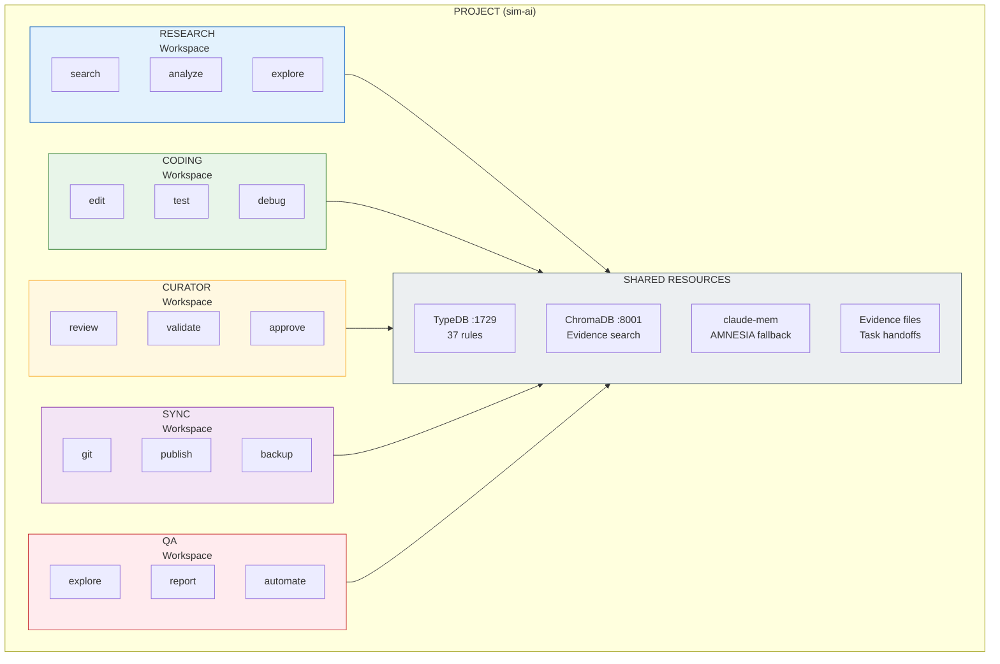
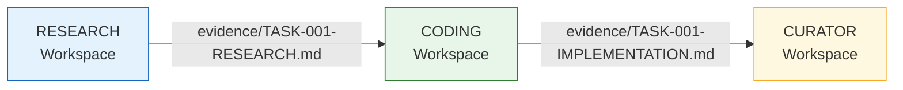
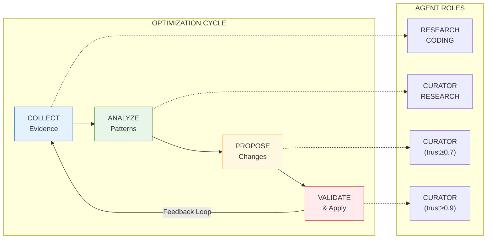
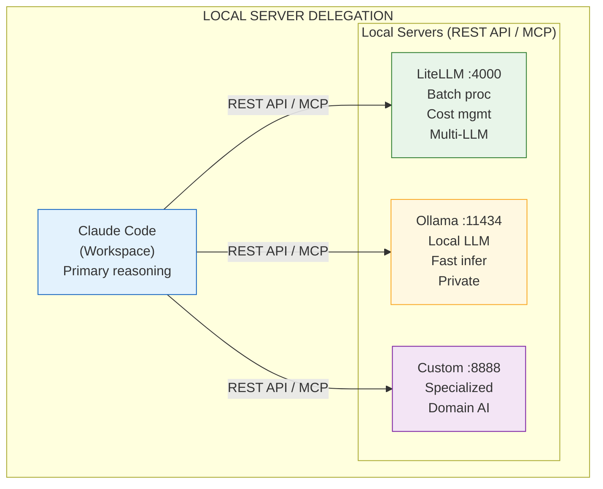

# Multi-Workspace Agent Architecture

**Version:** 2.0.0 | **Updated:** 2026-01-11 | **Status:** PHASE 4 COMPLETE
**Related:** RULE-011 (Multi-Agent Governance), RULE-036 (MCP Split), RULE-024 (AMNESIA)

---

## Summary of Achievements

| Phase | Status | Key Deliverables |
|-------|--------|------------------|
| Phase 1: Foundation | ✅ | MCP split (4 servers), task CRUD, evidence collection |
| Phase 2: Workspace Setup | ✅ | 5 workspaces, per-workspace CLAUDE.md & .mcp.json |
| Phase 3: Skill System | ✅ | Rule tagging, skill composition, 15+ skills |
| **Phase 4: Delegation** | ✅ | TaskHandoff format, workspace launcher, claude-mem fallback |
| Phase 5: Optimization | 🔜 | Evidence pattern analysis, trust-weighted voting |

---

## Overview

Agent delegation via separate Claude Code workspaces, each with composable skills, tools, and wisdom. Inspired by Playwright agent patterns (Planner → Generator → Healer).



---

## Agent Roles & Workspace Structure

### 1. RESEARCH Agent

**Purpose:** Explore codebase, gather context, analyze gaps, prepare evidence for other agents.

**Workspace:** `workspaces/research/`

```
workspaces/research/
├── .mcp.json              # Research-specific MCPs
├── CLAUDE.md              # Research agent instructions
├── skills/
│   ├── explore.md         # Codebase exploration
│   ├── analyze.md         # Gap analysis
│   └── evidence.md        # Evidence collection
└── wisdom/
    └── rules.json         # Tagged rules (category: research)
```

**MCP Tools:**
- `governance-core` (read-only rules)
- `governance-tasks` (claim tasks, report evidence)
- `sequential-thinking` (reasoning chains)
- `playwright` (browser research)

**Rule Tags:** `research`, `analysis`, `exploration`

---

### 2. CODING Agent

**Purpose:** Implement changes, write tests, fix bugs based on research evidence.

**Workspace:** `workspaces/coding/`

```
workspaces/coding/
├── .mcp.json              # Coding-specific MCPs
├── CLAUDE.md              # Coding agent instructions
├── skills/
│   ├── implement.md       # Code implementation
│   ├── test.md            # Test writing
│   └── debug.md           # Debugging
└── wisdom/
    └── rules.json         # Tagged rules (category: coding)
```

**MCP Tools:**
- `governance-core` (rules reference)
- `governance-tasks` (task execution)
- `podman` (container management)
- `rest-api` (API testing)
- `llm-sandbox` (code execution)

**Rule Tags:** `coding`, `testing`, `architecture`

---

### 3. CURATOR Agent

**Purpose:** Review changes, validate evidence, approve rule modifications, maintain quality.

**Workspace:** `workspaces/curator/`

```
workspaces/coding/
├── .mcp.json              # Curator-specific MCPs
├── CLAUDE.md              # Curator agent instructions
├── skills/
│   ├── review.md          # Code review
│   ├── validate.md        # Evidence validation
│   └── approve.md         # Change approval
└── wisdom/
    └── rules.json         # Tagged rules (category: governance)
```

**MCP Tools:**
- `governance-core` (full CRUD)
- `governance-agents` (trust scoring)
- `governance-sessions` (evidence search)
- `playwright` (E2E validation)

**Rule Tags:** `governance`, `quality`, `validation`

---

### 4. SYNC Agent

**Purpose:** Synchronize across workspaces, publish artifacts, backup state.

**Workspace:** `workspaces/sync/`

```
workspaces/sync/
├── .mcp.json              # Sync-specific MCPs
├── CLAUDE.md              # Sync agent instructions
├── skills/
│   ├── git.md             # Git operations
│   ├── publish.md         # Artifact publishing
│   └── backup.md          # State backup
└── wisdom/
    └── rules.json         # Tagged rules (category: sync)
```

**MCP Tools:**
- `governance-tasks` (sync status)
- `podman` (container sync)
- Git via Bash

**Rule Tags:** `sync`, `deployment`, `backup`

---

### 5. QA Agent (Added 2026-01-11)

**Purpose:** Test, validate, and ensure quality across UI, API, DevOps, accessibility, manageability, and resiliency.

**Workspace:** `workspaces/qa/`

```
workspaces/qa/
├── .mcp.json              # QA-specific MCPs
├── CLAUDE.md              # QA agent instructions
├── skills/
│   ├── explore.md         # Exploratory testing
│   ├── report.md          # Bug reporting
│   └── automate.md        # Test automation
└── wisdom/
    └── rules.json         # Tagged rules (category: testing)
```

**MCP Tools:**
- `playwright` (UI testing, screenshots)
- `rest-api` (API testing)
- `governance-tasks` (bug tracking)
- `governance-sessions` (evidence collection)

**Rule Tags:** `testing`, `quality`, `validation`, `accessibility`

**Testing Heuristics:**
- UI: Visual consistency, responsive design, loading states, accessibility
- API: Endpoint validation, error handling, performance
- DevOps: Container health, logging, backup/recovery
- Accessibility: WCAG compliance, keyboard nav, screen readers
- Resiliency: Graceful degradation, error recovery, timeouts

---

## Composable Skills System

### Skill Definition Format

```markdown
# skills/explore.md

## Skill: Codebase Exploration
**ID:** SKILL-EXPLORE-001
**Tags:** research, analysis, codebase
**Requires:** Read, Glob, Grep, Task tools

### When to Use
- New codebase analysis
- Finding implementation patterns
- Understanding architecture

### Procedure
1. Use Glob to find entry points
2. Read key files (CLAUDE.md, README)
3. Grep for patterns
4. Task agent for deep exploration

### Evidence Output
- Architecture diagram (Mermaid)
- Key files list
- Pattern inventory
```

### Skill Composition

Skills compose via tags:

```json
{
  "agent_role": "RESEARCH",
  "skills": [
    {"id": "SKILL-EXPLORE-001", "tags": ["research", "codebase"]},
    {"id": "SKILL-ANALYZE-002", "tags": ["research", "gaps"]},
    {"id": "SKILL-EVIDENCE-003", "tags": ["research", "documentation"]}
  ],
  "rule_filter": {
    "tags": ["research", "analysis", "exploration"],
    "priority": ["CRITICAL", "HIGH"]
  }
}
```

---

## Wisdom System (Tagged Rules)

### Rule Tagging Schema

```json
{
  "rule_id": "RULE-023",
  "name": "Test Before Ship",
  "tags": ["testing", "quality", "validation", "coding"],
  "applicable_roles": ["CODING", "CURATOR"],
  "priority": "CRITICAL",
  "directive": "All code changes MUST pass tests before commit"
}
```

### Wisdom Composition Query

```python
# Get rules applicable to CODING agent
def get_agent_wisdom(agent_role: str) -> List[Rule]:
    return governance_query_rules(
        tags=ROLE_TAG_MAP[agent_role],
        priority=["CRITICAL", "HIGH"],
        status="ACTIVE"
    )
```

---

## Task Delegation Protocol

### Interface Contract

Tasks flow between workspaces via evidence files:



### Evidence Handoff Format

```markdown
# evidence/TASK-001-RESEARCH.md

## Task Handoff: GAP-UI-005 Research
**From:** RESEARCH Agent
**To:** CODING Agent
**Task ID:** TASK-001
**Status:** READY_FOR_CODING

### Context Gathered
- File: agent/governance_ui/views/dialogs.py
- Issue: build_error_dialog() never called
- Evidence: Grep search showed no invocations

### Recommended Action
Add to build_all_dialogs() function

### Constraints
- Per RULE-032: Keep files under 300 lines
- Per RULE-023: Must test after changes

### Linked Rules
- RULE-023 (Test Before Ship)
- RULE-032 (File Size Standards)
```

---

## Launching Agent Workspaces

### Option 1: Manual Launch

```bash
# Terminal 1 - Research Agent
cd workspaces/research
claude --profile research

# Terminal 2 - Coding Agent
cd workspaces/coding
claude --profile coding

# Terminal 3 - Curator Agent
cd workspaces/curator
claude --profile curator
```

### Option 2: Orchestrated Launch

```bash
# scripts/launch-agents.sh
#!/bin/bash

WORKSPACES=("research" "coding" "curator" "sync")

for ws in "${WORKSPACES[@]}"; do
    echo "Launching $ws agent..."
    cd workspaces/$ws
    claude --profile $ws --background &
done

echo "All agents launched. Monitor via governance dashboard."
```

### Option 3: Task-Triggered Launch

```python
# governance/orchestrator/launcher.py
def launch_agent_for_task(task: Task) -> str:
    """Launch appropriate agent workspace for task."""
    role = infer_role_from_task(task)
    workspace = f"workspaces/{role.lower()}"

    # Launch Claude Code in workspace
    process = subprocess.Popen(
        ["claude", "--profile", role.lower()],
        cwd=workspace,
        env={
            "TASK_ID": task.task_id,
            "TASK_CONTEXT": json.dumps(task.context)
        }
    )
    return process.pid
```

---

## Evidence-Driven Rule Optimization Loop



### Phase 1: Evidence Collection

```python
# All agents collect evidence during task execution
session_start(topic="TASK-GAP-UI-005")
# ... work happens ...
session_end(topic="TASK-GAP-UI-005")
# Evidence file created: evidence/SESSION-2026-01-10-TASK-GAP-UI-005.md
```

### Phase 2: Pattern Analysis

```python
# CURATOR agent analyzes evidence patterns
evidence = governance_evidence_search("rule violation")
patterns = analyze_rule_compliance(evidence)
# Output: Rule X violated 5 times this week
```

### Phase 3: Rule Proposal

```python
# CURATOR proposes rule modification
proposal = governance_propose_rule(
    action="modify",
    rule_id="RULE-023",
    hypothesis="Add E2E testing requirement",
    evidence=["SESSION-2026-01-08", "SESSION-2026-01-09"],
    directive="All UI changes MUST include E2E browser tests"
)
```

### Phase 4: Validation & Application

```python
# High-trust agents vote on proposal
governance_vote(
    proposal_id=proposal.id,
    agent_id="curator-001",
    vote="approve",
    reason="Evidence supports stricter testing"
)

# If approved (trust-weighted consensus)
governance_update_rule(
    rule_id="RULE-023",
    directive="All UI changes MUST include E2E browser tests"
)
```

---

## Workspace Directory Structure

```
sim-ai/
├── CLAUDE.md                 # Main project instructions
├── .mcp.json                 # Default MCP config
├── workspaces/
│   ├── research/
│   │   ├── CLAUDE.md         # Research agent persona
│   │   ├── .mcp.json         # Research MCP tools
│   │   ├── skills/           # Research skills
│   │   └── wisdom/           # Research-relevant rules
│   ├── coding/
│   │   ├── CLAUDE.md         # Coding agent persona
│   │   ├── .mcp.json         # Coding MCP tools
│   │   ├── skills/           # Coding skills
│   │   └── wisdom/           # Coding-relevant rules
│   ├── curator/
│   │   ├── CLAUDE.md         # Curator agent persona
│   │   ├── .mcp.json         # Curator MCP tools
│   │   ├── skills/           # Curator skills
│   │   └── wisdom/           # Governance rules
│   └── sync/
│       ├── CLAUDE.md         # Sync agent persona
│       ├── .mcp.json         # Sync MCP tools
│       ├── skills/           # Sync skills
│       └── wisdom/           # Sync-relevant rules
├── evidence/                 # Shared evidence (handoffs)
├── governance/               # Shared TypeDB/ChromaDB access
└── docs/rules/               # Shared rule definitions
```

---

## Implementation Roadmap

### Phase 1: Foundation ✅
- [x] MCP server split (4 servers)
- [x] Task CRUD + linking
- [x] Evidence session collection
- [x] Rule tagging (category field)

### Phase 2: Workspace Setup ✅
- [x] Create workspaces/ directory structure (5 workspaces)
- [x] Define per-workspace CLAUDE.md
- [x] Configure per-workspace .mcp.json
- [x] Create skill definitions (15 skills total)

### Phase 3: Skill System ✅
- [x] Add tags field to rules in TypeDB (rule-tags, applicable-roles)
- [x] Implement rule_filter by tags (governance_query_rules_by_tags)
- [x] Create skill composition engine (governance/skill_composer.py)
- [x] Link skills to agent roles (ROLE_TAG_MAP)

### Phase 4: Delegation Protocol ✅ (2026-01-11)
- [x] Define evidence handoff format (TaskHandoff dataclass)
- [x] Implement workspace launcher (governance/orchestrator/launcher.py)
- [x] Add task routing by role (governance_route_task_to_agent)
- [x] Create MCP tools (governance_create_handoff, governance_get_pending_handoffs)
- [x] Add claude-mem for fallback memory (RULE-024)
- [x] Add QA agent workspace (workspaces/qa/)

### Phase 5: Optimization Loop
- [ ] Evidence pattern analyzer
- [ ] Rule proposal workflow
- [ ] Trust-weighted voting
- [ ] Automated rule updates

---

---

## Model Selection by Task Type

Cost-effective model routing based on task complexity:

| Task Type | Model | Rationale |
|-----------|-------|-----------|
| **R&D Tasks** | Claude Opus 4.5 | Complex reasoning, architecture decisions |
| **Standard Tasks** | Local LLM (Ollama) | Code generation, refactoring, tests |
| **Medium Tasks** | Claude Haiku / GPT-4o-mini | Dataset generation, documentation |
| **Bulk Processing** | LiteLLM Batch API | Cost optimization at scale |

### Model Routing Logic

```python
def select_model(task: Task) -> str:
    """Select model based on task complexity and type."""
    if task.priority == "CRITICAL" or task.phase.startswith("RD"):
        return "claude-opus-4-5-20251101"  # R&D, architecture
    elif task.type in ["dataset", "documentation", "summary"]:
        return "claude-3-5-haiku-20241022"  # Cost-effective
    elif task.type in ["code", "test", "refactor"]:
        return "ollama/codellama"  # Local, fast
    else:
        return "ollama/llama3.2"  # Default local
```

### Task Type Examples

| Category | Tasks | Model |
|----------|-------|-------|
| R&D | Rule optimization, architecture design, gap analysis | Opus 4.5 |
| Standard | Bug fixes, test writing, code refactoring | Ollama |
| Medium | Generate test datasets, summarize evidence, docs | Haiku |
| Bulk | Process 100+ files, batch embeddings | LiteLLM Batch |

---

## Local Server Delegation

The same workspace pattern enables delegating tasks to local LLM servers for specialized processing:



### Delegation Use Cases

| Task Type | Delegate To | Why |
|-----------|-------------|-----|
| Bulk code review | LiteLLM → GPT-4 batch | Cost optimization |
| Local embeddings | Ollama → nomic-embed | Privacy, speed |
| Test generation | Ollama → CodeLlama | Fast iteration |
| Document summarization | LiteLLM → Claude Haiku | Cost efficiency |
| Security scanning | Custom server | Specialized model |

### REST MCP Integration

```json
{
  "rest-api": {
    "type": "stdio",
    "command": "npx",
    "args": ["-y", "dkmaker-mcp-rest-api"],
    "env": {
      "LITELLM_API_BASE": "http://localhost:4000",
      "OLLAMA_API_BASE": "http://localhost:11434"
    }
  }
}
```

### Example: Delegating to Local LLM

```python
# Using REST MCP to call local Ollama
def delegate_to_local_llm(task: str, model: str = "codellama") -> str:
    """Delegate task to local Ollama server."""
    response = rest_api_call(
        method="POST",
        url="http://localhost:11434/api/generate",
        body={
            "model": model,
            "prompt": task,
            "stream": False
        }
    )
    return response["response"]

# Usage in workspace
research_context = delegate_to_local_llm(
    task="Summarize this codebase architecture",
    model="llama3.2"
)
```

### Hybrid Workflow Example

```
Task: Generate and validate 50 test cases

1. Claude Code (Workspace)
   └─► Plan test strategy (reasoning)

2. Delegate to LiteLLM → GPT-4 Batch
   └─► Generate 50 test cases (bulk, cost-efficient)

3. Delegate to Ollama → CodeLlama
   └─► Quick syntax validation (local, fast)

4. Claude Code (Workspace)
   └─► Review, integrate, commit (judgment)
```

### Local Server Configuration

Add to `docker-compose.yml`:

```yaml
services:
  litellm:
    image: ghcr.io/berriai/litellm:main-latest
    ports:
      - "4000:4000"
    environment:
      - OPENAI_API_KEY=${OPENAI_API_KEY}
      - ANTHROPIC_API_KEY=${ANTHROPIC_API_KEY}

  ollama:
    image: ollama/ollama:latest
    ports:
      - "11434:11434"
    volumes:
      - ollama_data:/root/.ollama
```

### Trust Levels for Local Servers

| Server | Trust | Allowed Tasks |
|--------|-------|---------------|
| LiteLLM (managed) | 0.8 | Batch processing, routing |
| Ollama (local) | 0.9 | All local tasks |
| Custom (untrusted) | 0.5 | Sandboxed only |

---

## Related Documentation

- [RULE-011](../rules/RULES-GOVERNANCE.md): Multi-Agent Governance
- [RULE-036](../rules/RULES-TECHNICAL.md): MCP Server Separation
- [delegation.py](../../agent/orchestrator/delegation.py): Delegation Protocol
- [schema.tql](../../governance/schema.tql): TypeDB Schema

---

*Updated: 2026-01-11 | Phase 4 Complete*
*Per RULE-040: Session Reasoning Audit Trail*
*Per RULE-011: Multi-Agent Governance Protocol*
*Per RULE-024: AMNESIA Protocol (claude-mem fallback)*
