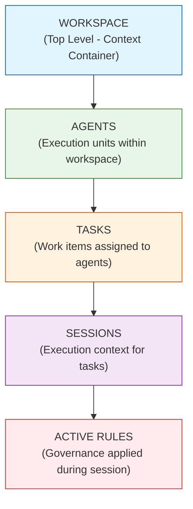
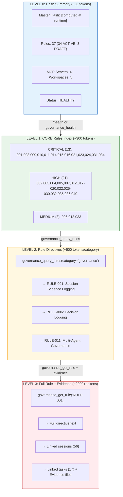
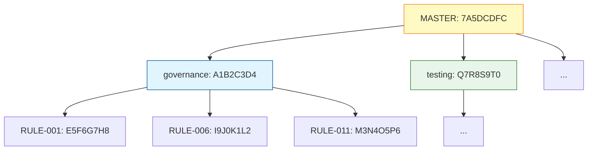
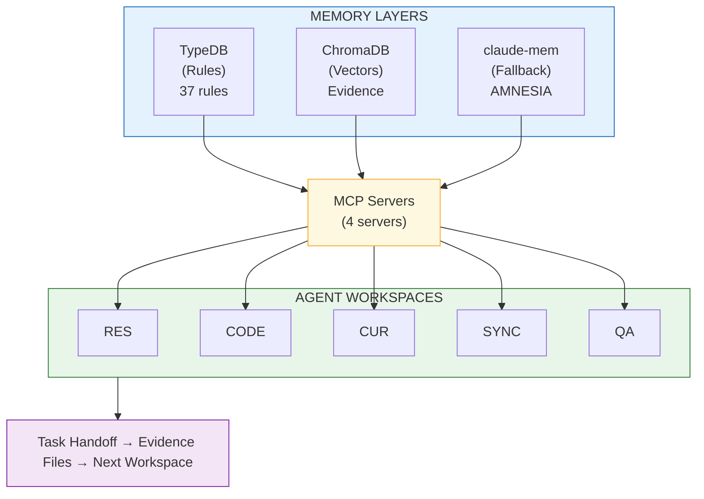

# Holographic Memory Model
**Per RULE-024 (AMNESIA Protocol) + RULE-022 (Frankel Hash)**

**Last Updated:** 2026-01-11 (Phase 4: Multi-Workspace Delegation Complete)

## Purpose

Prevent context window bloat by structuring rules/evidence in TypeDB for tiered access via governance MCP services. Now extended with multi-workspace agent architecture (5 workspaces) and fallback memory via claude-mem.

---

## Data Hierarchy

The holographic memory model follows a strict containment hierarchy. Each level provides summary data; drill down via MCP tools to get full details.



### Hierarchy Navigation

| Level | Entity | Summary Tool | Detail Tool |
|-------|--------|--------------|-------------|
| 1 | Workspace | `list_workspaces()` | `validate_workspace(role)` |
| 2 | Agents | `governance_list_agents()` | `governance_get_agent(id)` |
| 3 | Tasks | `governance_list_all_tasks()` | `governance_get_task(id)` |
| 4 | Sessions | `governance_list_sessions()` | `governance_get_session(id)` |
| 5 | Rules | `governance_query_rules()` | `governance_get_rule(id)` |

### Progressive Disclosure Pattern

Each query returns **minimal context** (IDs + summaries). To get full details:

```python
# Level 1: List all agents (returns IDs + names + trust scores)
agents = governance_list_agents()
# → [{agent_id: "code-agent", name: "Code Agent", trust_score: 0.88}, ...]

# Level 2: Get specific agent details (returns full capabilities + metrics)
agent = governance_get_agent("code-agent")
# → {capabilities: [...], recent_sessions: [...], active_tasks: [...]}

# Level 3: Get task assigned to agent (returns full context)
task = governance_get_task("P12.1")
# → {description: "...", linked_rules: ["RULE-023"], evidence: [...]}

# Level 4: Get session where task was executed
session = governance_get_session("SESSION-2026-01-11-PHASE12")
# → {decisions: [...], checkpoints: [...], intent: {...}, outcome: {...}}

# Level 5: Get rule applied during session
rule = governance_get_rule("RULE-023")
# → {directive: "...", dependencies: [...], linked_sessions: [...]}
```

---

## Access Hierarchy (Depth Levels)



## Rule Classification

### CORE Rules (Always Available in CLAUDE.md)
These are referenced in CLAUDE.md for immediate access without MCP calls:

| Rule | Name | Why CORE |
|------|------|----------|
| RULE-001 | Session Evidence Logging | Every session needs this |
| RULE-007 | MCP Usage Protocol | Every MCP call needs this |
| RULE-011 | Multi-Agent Governance | Agent coordination |
| RULE-012 | Deep Sleep Protocol | Workflow structure |
| RULE-014 | Autonomous Task Sequencing | Task execution |
| RULE-021 | MCP Healthcheck Protocol | Service integrity |
| RULE-024 | AMNESIA Protocol | Context recovery |

### UTILITY Rules (Query via MCP)
These are accessed on-demand via governance MCP:

| Category | Rules | Access Pattern |
|----------|-------|----------------|
| governance | 001,003,006,011,026,029 | governance_query_rules(category="governance") |
| testing | 004,020,025,027,028 | governance_query_rules(category="testing") |
| stability | 005,021 | governance_query_rules(category="stability") |
| strategic | 008,010,017 | governance_query_rules(category="strategic") |
| devops | 009,016 | governance_query_rules(category="devops") |
| autonomy | 014,015 | governance_query_rules(category="autonomy") |
| operational | 030,031,032 | governance_query_rules(category="operational") |
| reporting | 018,019 | governance_query_rules(category="reporting") |
| other | 002,007,012,013,022,023,024 | Various specialized categories |

## Hash-Based Change Detection

**Hash Computation:**
- Master Hash: `SHA256(sorted_rules)[:8]`
- Per-Rule Hash: `SHA256(rule_id + directive)[:8]`



## MCP Access Patterns

### Pattern 1: Session Start (Minimal)
```python
# Level 0 only - just verify hash
governance_health()
→ {"status": "healthy", "master_hash": "7A5DCDFC", "rules": 26}
```

### Pattern 2: Task Context (Targeted)
```python
# Level 2 - get relevant rules for task
governance_query_rules(category="testing")
→ [RULE-004, RULE-020, RULE-025] with directives
```

### Pattern 3: Deep Investigation (Full)
```python
# Level 3 - full rule + evidence chain
governance_get_rule("RULE-001")
governance_get_dependencies("RULE-001")
governance_evidence_search("session logging")
```

---

## Governance Documentation Service

The documentation service enables **attribute-based document retrieval** when you need full context beyond TypeDB summaries.

### Document Retrieval Tools

| Tool | Purpose | Returns |
|------|---------|---------|
| `governance_get_document(path)` | Get document by path | Full markdown content |
| `governance_list_documents(dir, pattern)` | List docs in directory | File paths + metadata |
| `governance_get_rule_document(rule_id)` | Get rule's markdown file | Full rule content |
| `governance_get_task_document(task_id)` | Get task from TODO/backlog | Task details from source |

### Document Search Patterns

```python
# Pattern A: Rule needs full directive text
rule = governance_get_rule("RULE-023")          # Summary from TypeDB
doc = governance_get_rule_document("RULE-023")  # Full markdown with examples

# Pattern B: Task needs implementation context
task = governance_get_task("P12.1")             # Summary from TypeDB
doc = governance_get_task_document("P12.1")     # Full backlog entry

# Pattern C: Session needs evidence details
session = governance_get_session("SESSION-...")  # Summary from TypeDB
doc = governance_get_document("evidence/SESSION-...md")  # Full session log

# Pattern D: Semantic search across all evidence
results = governance_evidence_search("authentication security", top_k=5)
# → Ranked documents by relevance via ChromaDB embeddings
```

### TypeDB → Filesystem Linking

Rules and tasks in TypeDB link to their filesystem documents:

```
TypeDB Entity                    Filesystem Document
─────────────────────────────────────────────────────────
RULE-023 (Test Before Ship)  →  docs/rules/RULES-GOVERNANCE.md
P12.1 (Agent Task Polling)   →  docs/backlog/phases/PHASE-12.md
SESSION-2026-01-11-...       →  evidence/SESSION-2026-01-11-...md
```

Tools for traversing links:
- `workspace_get_document_for_rule(rule_id)` → Get file path for rule
- `workspace_get_rules_for_document(doc_id)` → Get rules in document
- `governance_task_get_evidence(task_id)` → Get evidence files for task

---

## Implementation Status

| Component | Status | Notes |
|-----------|--------|-------|
| TypeDB Rules | ✅ 37 rules | 34 ACTIVE, 3 DRAFT |
| Hash Computation | ✅ Healthcheck | Master hash via governance_health |
| Per-Rule Hashes | ❌ TODO | Need to add to TypeDB schema |
| Category Index | ✅ Working | governance_query_rules(category=...) |
| Evidence Links | ✅ Working | governance_evidence_search |
| Rule Sync | ✅ Complete | TypeDB aligned with markdown docs |
| Conflict Detection | ✅ Working | 6 pairs detected (all false positives) |
| **MCP Split** | ✅ **Complete** | 4 servers: core, agents, sessions, tasks |
| **Agent Workspaces** | ✅ **Complete** | 5 workspaces with skills & MCP configs |
| **Task Handoff** | ✅ **Complete** | TaskHandoff dataclass + MCP tools |
| **Workspace Launcher** | ✅ **Complete** | Validates & launches agent workspaces |
| **Fallback Memory** | ✅ **Complete** | claude-mem for AMNESIA recovery |

## Next Steps

1. **Per-Rule Hash** (TOOL-022 related): Add `rule-hash` attribute to TypeDB schema
2. **Category Hash Index**: Compute category-level hashes for change detection
3. **Change Tree Visualization**: Add to healthcheck output for quick diffs
4. **Directive Compression**: Long directives → summary + hash for context efficiency
5. **Optimization Loop (Phase 5)**: Evidence pattern analyzer, rule proposal workflow, trust-weighted voting

---

## Governance MCP Restructure Status (TOOL-007)

**Status:** ✅ COMPLETE (2026-01-11)

The governance MCP has been split into 4 specialized servers per RULE-036:

| Server | Purpose | Tools |
|--------|---------|-------|
| `governance-core` | Rules, analysis, health | 15 tools |
| `governance-agents` | Trust, proposals, voting | 10 tools |
| `governance-sessions` | Sessions, DSM, evidence | 18 tools |
| `governance-tasks` | Tasks, workspace, gaps | 20 tools |

**Benefits:**
- Reduced context per conversation (load only needed servers)
- Clearer separation of concerns
- Better scalability for agent workspaces

---

## MCP Tools Reference by Entity

### Rules (governance-core)

| Operation | Tool | Depth |
|-----------|------|-------|
| Health check | `governance_health()` | L0 |
| List all | `governance_query_rules(category?, priority?, status?)` | L1 |
| Get one | `governance_get_rule(rule_id)` | L2 |
| Get dependencies | `governance_get_dependencies(rule_id)` | L2 |
| Find conflicts | `governance_find_conflicts()` | L2 |
| Impact analysis | `governance_rule_impact(rule_id)` | L3 |
| Full document | `governance_get_rule_document(rule_id)` | L3 |

### Agents (governance-agents)

| Operation | Tool | Depth |
|-----------|------|-------|
| List all | `governance_list_agents()` | L1 |
| Get one | `governance_get_agent(agent_id)` | L2 |
| Trust score | `governance_get_trust_score(agent_id)` | L2 |
| Update trust | `governance_update_agent_trust(agent_id, score)` | L2 |
| Propose rule | `governance_propose_rule(...)` | L3 |
| Vote | `governance_vote(proposal_id, agent_id, vote)` | L3 |

### Tasks (governance-tasks)

| Operation | Tool | Depth |
|-----------|------|-------|
| List all | `governance_list_all_tasks()` | L1 |
| Get backlog | `governance_get_backlog(limit)` | L1 |
| Get one | `governance_get_task(task_id)` | L2 |
| Get dependencies | `governance_get_task_deps(task_id)` | L2 |
| Get evidence | `governance_task_get_evidence(task_id)` | L2 |
| Full document | `governance_get_task_document(task_id)` | L3 |
| Sync status | `governance_sync_status()` | L2 |

### Sessions (governance-sessions)

| Operation | Tool | Depth |
|-----------|------|-------|
| List all | `governance_list_sessions(limit, type?)` | L1 |
| Get one | `governance_get_session(session_id)` | L2 |
| Get tasks | `session_get_tasks(session_id)` | L2 |
| Start session | `session_start(topic, type)` | L2 |
| Capture intent | `session_capture_intent(goal, source)` | L2 |
| Capture outcome | `session_capture_outcome(status, ...)` | L2 |
| End session | `session_end(topic)` | L2 |
| Evidence search | `governance_evidence_search(query, top_k)` | L2 |

### Documents (governance-sessions)

| Operation | Tool | Depth |
|-----------|------|-------|
| Get document | `governance_get_document(path)` | L3 |
| List documents | `governance_list_documents(dir, pattern)` | L2 |
| Get rule doc | `governance_get_rule_document(rule_id)` | L3 |
| Get task doc | `governance_get_task_document(task_id)` | L3 |

### Depth Legend

- **L0**: Hash/status only (~50 tokens)
- **L1**: List with summaries (~300 tokens)
- **L2**: Full entity details (~500-1000 tokens)
- **L3**: Full document + linked entities (~2000+ tokens)

---

## Multi-Workspace Memory Architecture



### Workspace Memory Access

Each workspace accesses only the memory layers it needs:

| Workspace | TypeDB | ChromaDB | claude-mem |
|-----------|--------|----------|------------|
| RESEARCH | read | search | fallback |
| CODING | read | - | fallback |
| CURATOR | read/write | search | fallback |
| SYNC | read | - | - |
| QA | read | - | fallback |

---

## Related Documentation

- [AGENT-WORKSPACES.md](AGENT-WORKSPACES.md): Multi-workspace architecture
- [RULES-DIRECTIVES.md](../RULES-DIRECTIVES.md): All 37 rules
- [DEVOPS.md](../DEVOPS.md): Infrastructure setup

---

*Updated per Phase 4: Multi-Workspace Delegation (2026-01-11)*
*Enhanced with data hierarchy, MCP tools reference, and documentation service (2026-01-11)*
