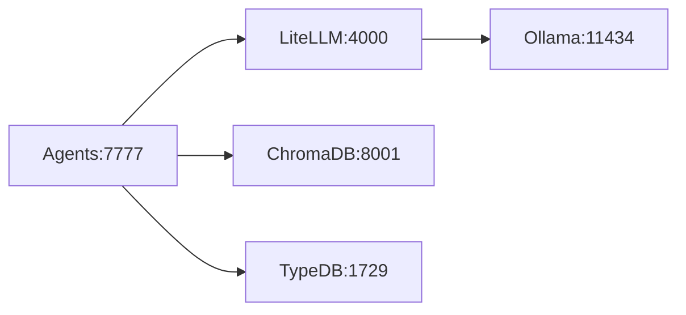
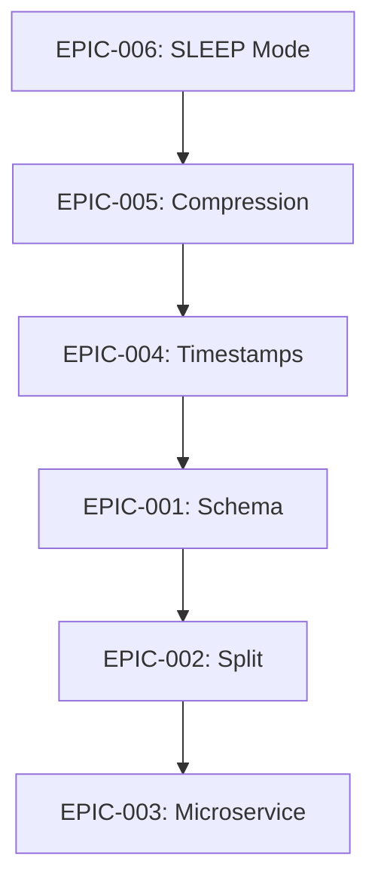
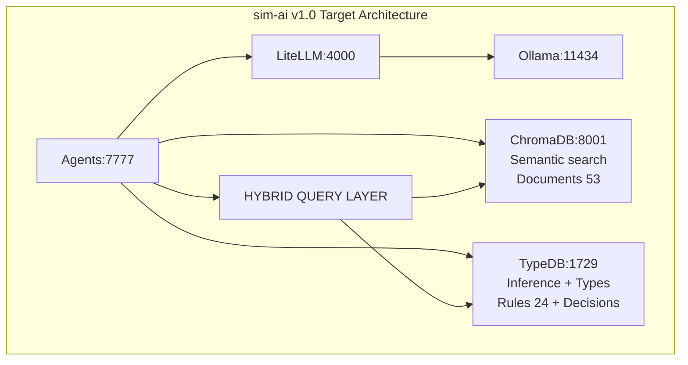
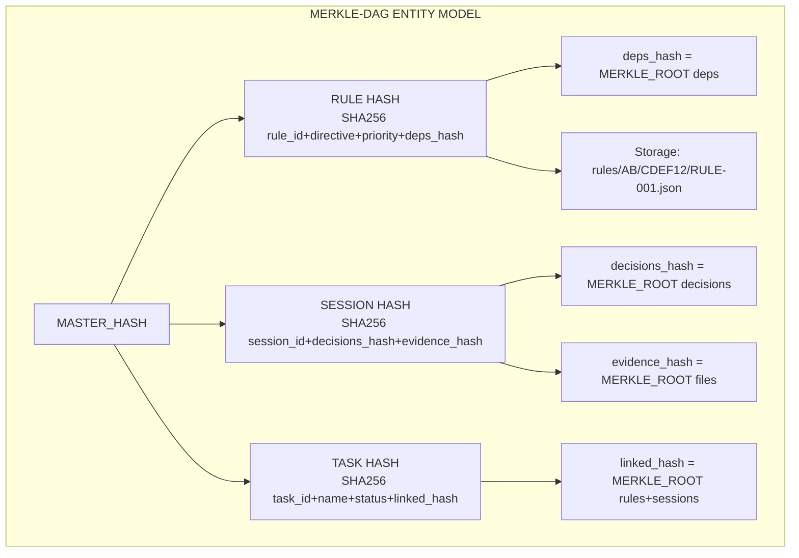
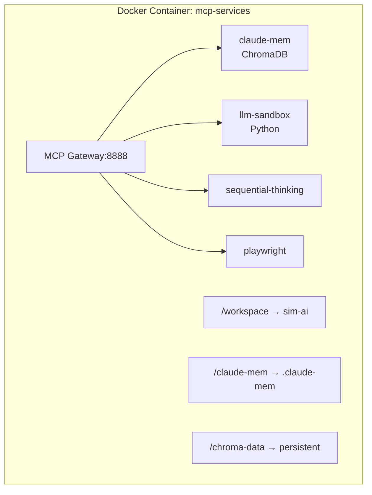
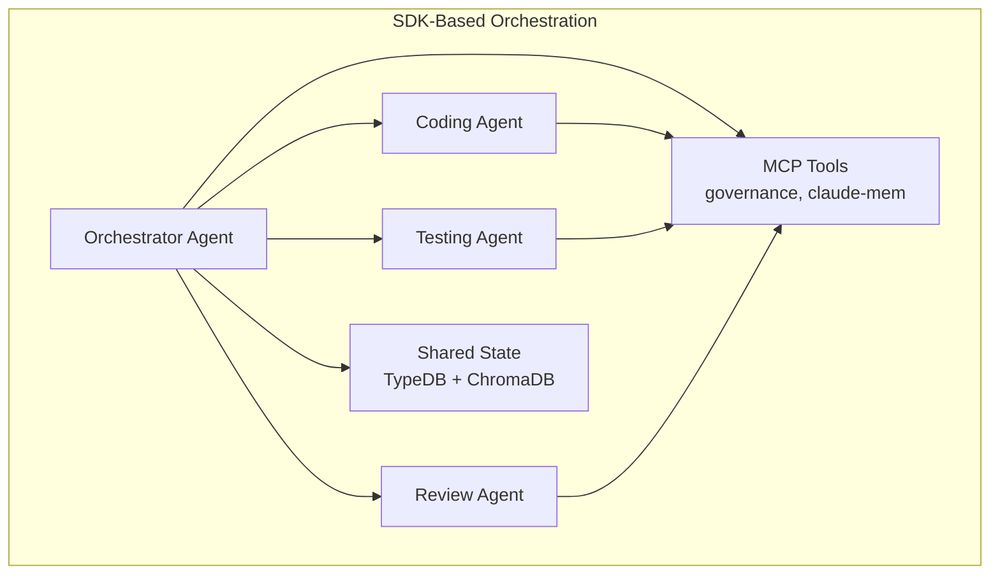
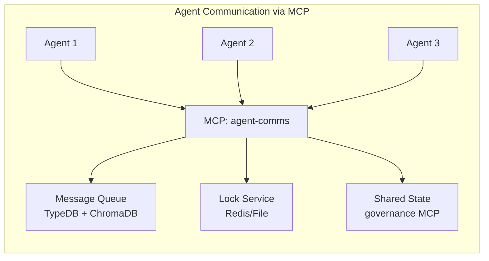
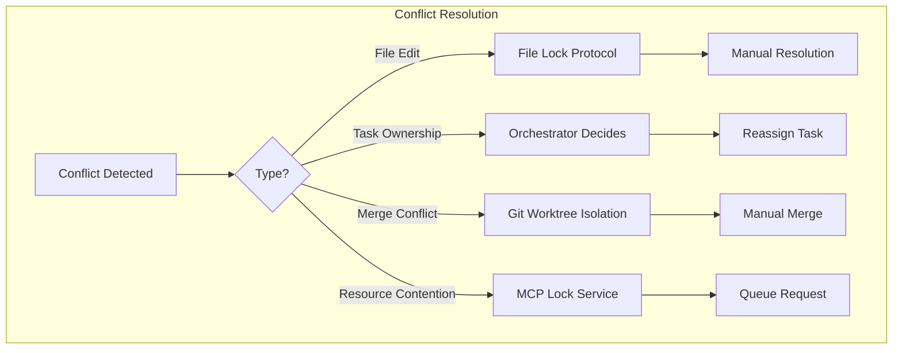

# R&D Backlog - Sim.ai PoC

**Last Updated:** 2026-01-03
**Status:** Active Development
**Pattern:** Table-of-Contents → Individual Documents

---

## Document Structure

This is the **root document** for R&D backlog. Each section links to detailed individual files for lazy content loading and TypeDB tracking.

### Document Index

| Category | Document | Status | Priority |
|----------|----------|--------|----------|
| **Platform Roadmap** | [../../ROADMAP.md](../../ROADMAP.md) | ACTIVE | **CRITICAL** |
| **Phase 10** | [phases/PHASE-10.md](phases/PHASE-10.md) | ✅ COMPLETE | HIGH |
| **Phase 11** | [phases/PHASE-11.md](phases/PHASE-11.md) | ✅ COMPLETE | CRITICAL |
| **Phase 12** | [phases/PHASE-12.md](phases/PHASE-12.md) | ✅ COMPLETE | **CRITICAL** |
| **Agent Orchestration** | [rd/RD-AGENT-ORCHESTRATION.md](rd/RD-AGENT-ORCHESTRATION.md) | IN_PROGRESS | CRITICAL |
| **Kanren Context Engineering** | [rd/RD-KANREN-CONTEXT.md](rd/RD-KANREN-CONTEXT.md) | IN_PROGRESS | HIGH |
| **Haskell MCP** | [rd/RD-HASKELL-MCP.md](rd/RD-HASKELL-MCP.md) | ON HOLD | FUTURE |
| **Frankel Hash** | [rd/RD-FRANKEL-HASH.md](rd/RD-FRANKEL-HASH.md) | PARTIAL | HIGH |
| **Testing Strategy** | [rd/RD-TESTING-STRATEGY.md](rd/RD-TESTING-STRATEGY.md) | IN_PROGRESS | CRITICAL |
| **Document Viewer** | [rd/RD-DOCUMENT-VIEWER.md](rd/RD-DOCUMENT-VIEWER.md) | TODO | HIGH |
| **Enterprise Architecture EPIC** | (inline below) | 📋 TODO | **CRITICAL** |

---

## EPIC: Enterprise Architecture Maturity (2026-01-03)

> **Goal:** Assess and implement enterprise-grade patterns for safe microservice evolution
> **Priority:** CRITICAL | **Status:** 📋 TODO
> **Trigger:** Successful 4-Server MCP Split (P11.3) demonstrates need for systematic architecture patterns

### EPIC Overview

| ID | Question | Status | Outcome |
|----|----------|--------|---------|
| EPIC-001 | Do we use OpenAPI + enterprise OOP patterns for schema reuse? | ✅ RESOLVED | Architecture already sound (2026-01-03) |
| EPIC-002 | Do we split tasks as part of workflow? | 📋 TODO | RULE-037 proposal |
| EPIC-003 | Are we ready for domain-based microservice migration? | 📋 TODO | Migration checklist |
| EPIC-004 | Why use dates only? Where is time + millisecond precision? | 📋 TODO | Timestamp standard |
| EPIC-005 | Context compression: diagrams, rules, entropy reduction | ✅ DONE | 8 diagrams converted (2026-01-03) |
| EPIC-006 | SLEEP mode automation: pre-session save prompts | ✅ DONE | Entropy monitoring (2026-01-03) |
| EPIC-007 | Architecture consolidation: TypeDB, Pydantic, Streamlit, bottom-up | ✅ DONE | Hybrid confirmed (2026-01-03) |

---

### EPIC-005: Context Compression Strategy

**Status:** ✅ DONE | **Priority:** CRITICAL | **Complexity:** MEDIUM
**Resolution Date:** 2026-01-03
**Source:** [GitHub #8](https://github.com/drlegreid/platform-gai/issues/8), [GitHub #9](https://github.com/drlegreid/platform-gai/issues/9)

**Problem Statement:**
- ASCII diagrams consume ~500 tokens, Mermaid.js equivalent ~50 tokens (10x reduction)
- Rule text is verbose, not compressed for LLM context efficiency
- Entropy accumulates over sessions → context window exhaustion
- No systematic approach to context-aware documentation

**CRITICAL:** Compression preserves meaning & value. No deletion - only semantic density improvement.

**GitHub Issues:**

| Issue | Title | Solution |
|-------|-------|----------|
| #8 | Diagrams: compression of diagram knowledge | Mermaid.js syntax |
| #9 | Rule text: compression | Structured YAML/concise prose |

**Compression Example (Issue #9 - Rule Text):**

```
BEFORE (~400 tokens, 50 lines):
## RULE-001: Session Evidence Logging
**Category:** governance | **Priority:** CRITICAL | **Status:** ACTIVE
### Directive
All agent sessions MUST produce evidence logs that include:
1. **Thought Chain Documentation**
   - Every decision point with rationale
   - Alternatives considered and why rejected
   - Assumptions made and their basis
2. **Artifact Tracking**
   - Files created/modified with timestamps
   - Dependencies introduced
   - Configuration changes
... [30 more lines of prose + code examples]

AFTER (~80 tokens, 10 lines - 80% reduction):
## RULE-001: Session Evidence Logging
governance | CRITICAL | ACTIVE

Sessions → `./docs/SESSION-{date}-{topic}.md` with:
- Thought chain: decisions + rationale + alternatives
- Artifacts: files + timestamps + deps
- Metadata: session_id, models, tools, tokens

Schema: `TypeDB:session_log` | Validation: `tests/test_session_evidence.py`
```

**Compression Techniques (preserve meaning):**
1. **Tables > Prose**: Replace numbered lists with compact tables
2. **Schema refs > Inline code**: Point to TypeDB/Pydantic instead of inline examples
3. **Symbols > Words**: `→` not "exported to", `+` not "and"
4. **Single source**: Details in TypeDB, docs show summary only

**Current vs Target (Issue #8 - Diagrams):**

```
CURRENT (ASCII ~500 tokens):
┌─────────────────────────────────────────────────────────────┐
│                 Sim.ai v1.0 Stack (5 containers)            │
├─────────────────────────────────────────────────────────────┤
│  Agents (7777)  │  LiteLLM (4000)  │  Ollama (11434)       │
└─────────────────────────────────────────────────────────────┘

TARGET (Mermaid ~50 tokens):


**Tasks:**

| ID | Task | Status | Evidence |
|----|------|--------|----------|
| EPIC-005.1 | Audit ASCII diagrams in docs (count, tokens) | ✅ DONE | 29 files, 155 lines in GAP-INDEX |
| EPIC-005.2 | Convert CLAUDE.md diagrams to Mermaid | ✅ DONE | 4 diagrams converted |
| EPIC-005.3 | Convert RULES-*.md diagrams to Mermaid | 🚧 PARTIAL | Rule files split, diagrams in thematic files |
| EPIC-005.4 | Convert R&D-BACKLOG.md diagrams to Mermaid | ✅ DONE | 3 diagrams + PHASE-12.md converted |
| EPIC-005.5 | Create diagram compression guidelines | 📋 TODO | RULE-039 draft |
| EPIC-005.6 | Audit rule text verbosity (Issue #9) | 📋 TODO | Token analysis |
| EPIC-005.7 | Compress rule directives to structured YAML | 📋 TODO | PR |
| EPIC-005.8 | Measure token reduction (before/after) | 📋 TODO | Metrics report |

**Proposed: RULE-039 Context Compression Standard**

```yaml
RULE-039:
  name: "Context Compression Standard"
  category: "operational"
  priority: "HIGH"
  status: "DRAFT"
  directive: |
    Documentation MUST minimize context window consumption:
    1. **Diagrams**: Mermaid.js syntax, NOT ASCII art
    2. **Rules**: Structured YAML + 1-line summary
    3. **Tables**: Prefer over verbose prose
    4. **Links**: Reference vs inline content
    5. **Target**: <100 tokens per diagram, <50 tokens per rule summary
```

**Success Criteria:**
- [ ] All ASCII diagrams converted to Mermaid
- [ ] Rule token count reduced by 50%
- [ ] RULE-039 approved and active
- [ ] Context window usage measurably improved

---

### EPIC-006: SLEEP Mode Automation

**Status:** ✅ DONE | **Priority:** HIGH | **Complexity:** HIGH
**Resolution Date:** 2026-01-03
**Evidence:** [EPIC-006-SLEEP-MODE-AUTOMATION-2026-01-03.md](../../evidence/EPIC-006-SLEEP-MODE-AUTOMATION-2026-01-03.md)
**Source:** DSM Finding FINDING-001 (2026-01-03)

**Problem Statement:**
- healthcheck.py detects AMNESIA indicators but only suggests `/remember`
- No automatic `/save` prompt before session ends
- Context entropy not monitored → surprise truncation
- User must manually trigger DSM (Deep Sleep Mode)

**Current Gaps:**

| Gap | Current | Target |
|-----|---------|--------|
| Pre-session save | Manual `/save` | Auto-prompt when context >80% |
| Entropy monitoring | None | Token count tracking |
| DSM trigger | User-initiated | Auto-trigger on context limit |
| Session handoff | Lost context | Compressed handoff summary |

**Tasks:**

| ID | Task | Status | Evidence |
|----|------|--------|----------|
| EPIC-006.1 | Research Claude Code context limit detection | 📋 TODO | API docs review |
| EPIC-006.2 | Design entropy monitoring hook | 📋 TODO | Architecture doc |
| EPIC-006.3 | Implement UserPromptSubmit hook for save prompt | 📋 TODO | Hook code |
| EPIC-006.4 | Add context % tracking to healthcheck | 📋 TODO | PR |
| EPIC-006.5 | Create session handoff template | 📋 TODO | Template |
| EPIC-006.6 | Update RULE-024 with automation | 📋 TODO | Rule update |

**Proposed Hook Flow:**

```
UserPromptSubmit → Check context % →
  If >80%: "⚠️ Context 85% full. Run /save before complex task?"
  If >95%: "🛑 Context critical. Running /save automatically..."
```

**Success Criteria:**
- [ ] Context % visible in healthcheck output
- [ ] Auto-prompt at 80% context usage
- [ ] Auto-save at 95% context usage
- [ ] Session handoff preserves critical state

---

### EPIC-007: Architecture Consolidation R&D

**Status:** ✅ DONE | **Priority:** CRITICAL | **Complexity:** HIGH
**Resolution Date:** 2026-01-03
**Evidence:** [EPIC-007-ARCHITECTURE-CONSOLIDATION-2026-01-03.md](../../evidence/EPIC-007-ARCHITECTURE-CONSOLIDATION-2026-01-03.md)

**Research Questions Answered:**

| Question | Answer |
|----------|--------|
| TypeDB for vector embeddings? | NO - Not supported, no roadmap plans |
| Pydantic v2 / OpenAPI compatible? | YES - With documented workarounds |
| Switch Trame to Streamlit? | NO - Keep Trame, add Streamlit for new tools |
| Bottom-up schema architecture? | YES - Already implemented |

**Key Findings:**

1. **TypeDB Vector Support**: TypeDB 3.7.2 has NO vector features. Hybrid architecture (TypeDB + ChromaDB) is PERMANENT.
2. **Pydantic/OpenAPI**: Known issues with discriminated unions, recursive models. Solutions documented.
3. **Streamlit**: Better Pydantic integration via streamlit-pydantic. Consider for new admin tools.
4. **Architecture**: Bottom-up already implemented per EPIC-001 audit.

**Tasks:**

| ID | Task | Status | Evidence |
|----|------|--------|----------|
| EPIC-007.1 | TypeDB vector capability analysis | ✅ DONE | No support confirmed |
| EPIC-007.2 | Pydantic/OpenAPI compatibility doc | ✅ DONE | Issues documented |
| EPIC-007.3 | Streamlit UI evaluation | ✅ DONE | Keep Trame decision |
| EPIC-007.4 | Bottom-up architecture validation | ✅ DONE | EPIC-001 confirms |
| EPIC-007.5 | Update DECISION-005 | ✅ DONE | Corrected vector assumptions |

---

### EPIC-001: OpenAPI Schema Reuse Assessment

**Status:** ✅ RESOLVED | **Priority:** CRITICAL | **Complexity:** HIGH
**Resolution Date:** 2026-01-03
**Evidence:** [EPIC-001-SCHEMA-AUDIT-2026-01-03.md](../../evidence/EPIC-001-SCHEMA-AUDIT-2026-01-03.md)

**Audit Finding: Architecture Already Sound**

The codebase already has centralized models. Problem statement was based on outdated assumptions.

| Layer | Uses Shared Models? | Reason |
|-------|---------------------|--------|
| **API Routes** | YES | Import from governance/models.py (26 Pydantic models) |
| **MCP Tools** | NO | FastMCP requires simple types (by design) |
| **UI State** | NO | Trame requires Dict[str, Any] (by design) |

**Tasks:**

| ID | Task | Status | Evidence |
|----|------|--------|----------|
| EPIC-001.1 | Audit schema duplication across API/MCP/UI | ✅ DONE | EPIC-001-SCHEMA-AUDIT-2026-01-03.md |
| EPIC-001.2 | Document current OpenAPI spec coverage | ✅ SKIP | FastAPI auto-generates at /docs |
| EPIC-001.3 | Design shared models architecture | ✅ SKIP | Already exists: governance/models.py |
| EPIC-001.4 | Create `governance/models/` package | ✅ SKIP | governance/models.py already exists |
| EPIC-001.5 | Migrate API endpoints to shared models | ✅ SKIP | Already using shared models |
| EPIC-001.6 | Migrate MCP tools to shared models | ✅ SKIP | FastMCP constraint (by design) |
| EPIC-001.7 | Migrate UI state to shared models | ✅ SKIP | Trame constraint (by design) |

**Existing Architecture (Already Implemented):**

```
governance/models.py         # Central Pydantic models (26 models, 311 lines)
governance/routes/*.py       # Import from governance.models ✅
governance/mcp_tools/*.py    # Simple types (FastMCP requirement)
agent/governance_ui/state/   # Dict types (Trame requirement)
```

**Success Criteria:**
- [x] Audit completed - minimal duplication found
- [x] OpenAPI spec auto-generated by FastAPI at /docs
- [x] Architecture already sound
- [x] No migration required

---

### EPIC-002: Task Splitting Workflow Protocol

**Status:** 📋 TODO | **Priority:** HIGH | **Complexity:** MEDIUM

**Problem Statement:**
- Complex tasks often exceed initial estimates (e.g., P11.3 grew from 1 to 12 subtasks)
- No systematic protocol for splitting oversized work
- Gaps, bugs, R&D items balloon without decomposition triggers

**Research Questions:**

| Question | Evidence Needed |
|----------|-----------------|
| 1. What triggers a task split? | Lines of code, file count, time estimate? |
| 2. How to track parent→child? | TypeDB `subtask-of` relation exists? |
| 3. What's the right granularity? | "2-hour rule", "single responsibility"? |
| 4. How to update TODO/GAP when splitting? | Automated or manual? |

**Proposed: RULE-037 Task Decomposition Protocol**

```yaml
RULE-037:
  name: "Task Decomposition Protocol"
  category: "operational"
  priority: "HIGH"
  status: "DRAFT"
  directive: |
    Tasks exceeding complexity thresholds MUST be decomposed:
    1. **File Threshold**: >3 files modified → split by file
    2. **Line Threshold**: >300 lines changed → split by function
    3. **Time Threshold**: >4 hours estimated → split into 2-hour chunks
    4. **Dependency Threshold**: >2 blocking dependencies → sequence subtasks

    Decomposition creates:
    - Parent task: PARTIAL status with subtask links
    - Child tasks: Individual trackable units
    - TypeDB: subtask-of relation for graph queries
```

**Tasks:**

| ID | Task | Status | Evidence |
|----|------|--------|----------|
| EPIC-002.1 | Analyze P11.3 split as case study | 📋 TODO | Metrics report |
| EPIC-002.2 | Review existing RULE-033 (PARTIAL status) | 📋 TODO | Gap analysis |
| EPIC-002.3 | Draft RULE-037 proposal | 📋 TODO | PR to RULES-OPERATIONAL.md |
| EPIC-002.4 | Add `subtask-of` relation to TypeDB schema | 📋 TODO | Schema migration |
| EPIC-002.5 | Update TODO.md template with split guidance | 📋 TODO | Template update |
| EPIC-002.6 | Create task decomposition MCP tool | 📋 TODO | `governance_decompose_task` |

**Success Criteria:**
- [ ] RULE-037 approved and active
- [ ] TypeDB tracks subtask relationships
- [ ] Workflow includes decomposition checkpoints

---

### EPIC-003: Microservice Migration Readiness

**Status:** 📋 TODO | **Priority:** CRITICAL | **Complexity:** HIGH

**Problem Statement:**
- Current monolith: `governance/` package with 50+ modules
- 4-Server MCP Split (P11.3) proved domain separation works
- Need systematic checklist before full microservice migration

**Research Questions:**

| Question | Evidence Needed |
|----------|-----------------|
| 1. Which domains are independently deployable? | Dependency graph |
| 2. What's the data coupling between domains? | TypeDB relation analysis |
| 3. How to handle cross-domain transactions? | Saga pattern evaluation |
| 4. What's the safe migration sequence? | Dependency-ordered rollout |

**Domain Analysis (from 4-Server Split):**

| Domain | Dependencies | Coupling Level | Migration Risk |
|--------|--------------|----------------|----------------|
| **core** (rules, health) | TypeDB only | LOW | ✅ Safe first |
| **agents** (trust, proposals) | Rules, TypeDB | MEDIUM | Needs rules |
| **sessions** (DSM, evidence) | Rules, ChromaDB | MEDIUM | Needs rules |
| **tasks** (workspace, gaps) | Sessions, Rules | HIGH | Last to migrate |

**Migration Checklist:**

```
PRE-MIGRATION GATES:
□ EPIC-001 complete (shared models)
□ EPIC-002 complete (task decomposition)
□ All domains have independent test suites
□ Inter-domain communication via well-defined APIs
□ TypeDB connection pooling implemented
□ Health checks per domain
□ Rollback procedure documented

SAFE MIGRATION SEQUENCE:
1. governance-core → Standalone container
2. governance-agents → Depends on core API
3. governance-sessions → Depends on core API
4. governance-tasks → Depends on sessions + core APIs

ROLLBACK TRIGGERS:
- Any domain test failure
- Cross-domain latency >200ms
- Transaction consistency errors
- Memory usage spike >150%
```

**Tasks:**

| ID | Task | Status | Evidence |
|----|------|--------|----------|
| EPIC-003.1 | Generate TypeDB dependency graph | 📋 TODO | Visualization |
| EPIC-003.2 | Analyze cross-domain data coupling | 📋 TODO | Coupling matrix |
| EPIC-003.3 | Design inter-domain API contracts | 📋 TODO | OpenAPI specs |
| EPIC-003.4 | Implement health checks per domain | 📋 TODO | `/health` endpoints |
| EPIC-003.5 | Create migration runbook | 📋 TODO | Runbook document |
| EPIC-003.6 | Containerize governance-core (pilot) | 📋 TODO | Dockerfile + tests |
| EPIC-003.7 | Document rollback procedure | 📋 TODO | Recovery playbook |

**Success Criteria:**
- [ ] All pre-migration gates passed
- [ ] Pilot domain (core) runs independently
- [ ] Zero cross-domain consistency errors
- [ ] Rollback tested and documented

---

### EPIC-004: Timestamp Precision Standard

**Status:** 📋 TODO | **Priority:** CRITICAL | **Complexity:** MEDIUM

**Problem Statement:**
- Current timestamps use date-only format (`2026-01-03`) or inconsistent precision
- No millisecond precision for audit trails, healthchecks, session evidence
- Can't correlate events that happen within the same second
- Sorting/ordering unreliable for rapid operations (MCP calls, TypeDB writes)

**Current State Audit:**

| Location | Current Format | Issue |
|----------|----------------|-------|
| Session IDs | `SESSION-2026-01-03-PHASE11` | Date only, no time |
| Evidence files | `2026-01-03/` directories | Day granularity only |
| Healthcheck state | ISO timestamp (good) | Inconsistent with others |
| TypeDB `created_at` | String, inconsistent | No standard format |
| GAP-INDEX entries | `2026-01-03` | Date only |
| TODO.md entries | `2024-12-31` | Date only |
| R&D-BACKLOG | `2026-01-02` | Date only |

**Research Questions:**

| Question | Evidence Needed |
|----------|-----------------|
| 1. Which systems need ms precision? | Audit trail, healthcheck, MCP calls |
| 2. What's the storage cost? | ISO8601 vs Unix epoch ms |
| 3. Human readability vs precision? | Display format vs storage format |
| 4. TypeDB datetime support? | Native datetime attribute type? |
| 5. Timezone handling? | UTC everywhere or local? |

**Proposed Standard: ISO 8601 with Milliseconds**

```
STORAGE FORMAT:  2026-01-03T14:32:45.123Z  (UTC, ms precision)
DISPLAY FORMAT:  2026-01-03 14:32:45       (local, second precision)
SESSION ID:      SESSION-20260103T143245Z-PHASE11  (sortable, unique)
EVIDENCE DIR:    evidence/2026/01/03/143245/       (hour:min:sec subdirs)
```

**Implementation Tasks:**

| ID | Task | Status | Evidence |
|----|------|--------|----------|
| EPIC-004.1 | Audit all timestamp usage in codebase | 📋 TODO | Grep report |
| EPIC-004.2 | Define timestamp schema in shared models | 📋 TODO | `TimestampMixin` class |
| EPIC-004.3 | Migrate session ID format | 📋 TODO | Tests pass |
| EPIC-004.4 | Migrate evidence directory structure | 📋 TODO | Migration script |
| EPIC-004.5 | Update TypeDB schema for datetime | 📋 TODO | Schema migration |
| EPIC-004.6 | Add timestamp validation to API | 📋 TODO | Pydantic validators |
| EPIC-004.7 | Document standard in RULES-OPERATIONAL.md | 📋 TODO | RULE-038 draft |

**Proposed: RULE-038 Timestamp Precision Standard**

```yaml
RULE-038:
  name: "Timestamp Precision Standard"
  category: "technical"
  priority: "HIGH"
  status: "DRAFT"
  directive: |
    All timestamps in the system MUST:
    1. **Storage**: ISO 8601 with milliseconds in UTC: `2026-01-03T14:32:45.123Z`
    2. **Display**: Local timezone, second precision for humans
    3. **IDs**: Include sortable timestamp component: `YYYYMMDDTHHMMSSZ`
    4. **Comparison**: Always compare as UTC timestamps
    5. **TypeDB**: Use `datetime` attribute type, not strings

    Benefits:
    - Audit trail correlation across services
    - Reliable sorting of rapid events
    - Timezone-safe comparisons
    - Millisecond precision for debugging
```

**Success Criteria:**
- [ ] All timestamps use ISO 8601 with milliseconds
- [ ] Session IDs are sortable and unique to the second
- [ ] Evidence directories support sub-day granularity
- [ ] TypeDB uses native datetime attributes
- [ ] RULE-038 approved and active

---

### EPIC Dependencies



**Execution Sequence:** `005 → 006 → 004 → 001 → 002 → 003`

**Parallel Research:** `005.1-005.2 || 006.1-006.2 || 004.1-004.2`

**Critical Insights:**
- **EPIC-005 first:** Compress docs BEFORE schema work to reduce noise
- **EPIC-006 enables sustainability:** Auto-save prevents context loss
- **EPIC-004 before EPIC-001:** Timestamps defined before schema migration

**Proposed Rules:**

| Rule | Name | Status |
|------|------|--------|
| RULE-037 | Task Decomposition Protocol | DRAFT |
| RULE-038 | Timestamp Precision Standard | DRAFT |
| RULE-039 | Context Compression Standard | DRAFT |

**Related:**
- P11.3: 4-Server MCP Split (completed 2026-01-03)
- [GitHub #8](https://github.com/drlegreid/platform-gai/issues/8): Diagram compression
- [GitHub #9](https://github.com/drlegreid/platform-gai/issues/9): Rule text compression
- RULE-032: File Size Limits (<300 lines)
- RULE-033: PARTIAL Status Protocol
- RULE-036: MCP Server Separation Pattern

---

## Strategic Vision: Private Cluster AI Platform

**Goal:** Self-hosted platform with MCPs & UIs on private cluster

### Platform Pillars

| Pillar | Current | Target |
|--------|---------|--------|
| **Agents** | ✅ Agno/LiteLLM | TypeDB-enhanced |
| **Tasks/Projects** | ✅ Split docs | TypeDB graph |
| **Evidence/Sessions** | ✅ Markdown/scripts | Structured DB |
| **Rules** | ✅ TypeDB + Markdown | TypeDB inference |

### Architecture Target



---

## Phase Summary

### Completed Phases (1-9) ✅

| Phase | Name | Status | Tests |
|-------|------|--------|-------|
| Phase 1 | TypeDB Container | ✅ COMPLETE | 68 |
| Phase 2 | Governance MCP | ✅ COMPLETE | 11 tools |
| Phase 3 | Stabilization | ✅ COMPLETE | 472 |
| Phase 4 | Cross-Workspace Integration | ✅ COMPLETE | P4.1-P4.5 |
| Phase 5 | External MCP Integration | ✅ COMPLETE | 64 |
| Phase 6 | Agent UI Framework | ✅ COMPLETE | 41 |
| Phase 7 | TypeDB-First Migration | ✅ COMPLETE | 609 |
| Phase 8 | E2E Testing Framework | ✅ COMPLETE | Robot + Playwright |
| Phase 9 | Agentic Platform UI/MCP | ✅ COMPLETE | 40+ MCP tools |

### Active Phases (10-12)

| Phase | Name | Status | Link |
|-------|------|--------|------|
| Phase 10 | Architecture Debt Resolution | ✅ COMPLETE | [PHASE-10.md](phases/PHASE-10.md) |
| Phase 11 | Data Integrity Resolution | ✅ COMPLETE | [PHASE-11.md](phases/PHASE-11.md) |
| Phase 12 | Agent Orchestration | ✅ COMPLETE | [PHASE-12.md](phases/PHASE-12.md) |

---

## R&D Task Summary

### Active R&D

| ID Range | Topic | Priority | Link |
|----------|-------|----------|------|
| ORCH-001-007 | Agent Orchestration | **CRITICAL** | [RD-AGENT-ORCHESTRATION.md](rd/RD-AGENT-ORCHESTRATION.md) |
| KAN-001-005 | Kanren Context Engineering | **HIGH** | [RD-KANREN-CONTEXT.md](rd/RD-KANREN-CONTEXT.md) |
| FH-001-008 | Frankel Hash | HIGH | [RD-FRANKEL-HASH.md](rd/RD-FRANKEL-HASH.md) |
| **MDAG-001-005** | **Merkle-DAG Content-Addressable Storage** | **HIGH** | (inline below) |
| TEST-001-006 | Testing Strategy | **CRITICAL** | [RD-TESTING-STRATEGY.md](rd/RD-TESTING-STRATEGY.md) |
| TOOL-001-009 | MCP Tooling & Architecture | **HIGH** | (inline below) |
| DOC-001-005 | Document Management MCP | HIGH | (inline below) |
| **MULTI-001-007** | **Local Multi-Agent Setup for Claude Code** | **HIGH** | (inline below) |

### Deferred R&D

| ID Range | Topic | Priority | Link |
|----------|-------|----------|------|
| RD-001-005 | Haskell Inference MCP | FUTURE | [RD-HASKELL-MCP.md](rd/RD-HASKELL-MCP.md) |

---

## Agent Framework Research (2024-12-31)

| ID | Task | Status | Priority | Reference |
|----|------|--------|----------|-----------|
| AGENT-FW-001 | Review open-source agentic AI frameworks comparison | 📋 TODO | HIGH | [Medium Article](https://medium.com/data-science-collective/agentic-ai-comparing-new-open-source-frameworks-21ec676732df) |
| AGENT-FW-002 | Evaluate alternatives to Agno (CrewAI, AutoGen, LangGraph) | 📋 TODO | MEDIUM | AGENT-FW-001 |
| AGENT-FW-003 | Document framework selection criteria for sim-ai | 📋 TODO | MEDIUM | DECISION-003 |

### Research Context
- **Source:** User-provided Medium article comparing open-source agentic frameworks
- **Relevance:** Evaluate if current Agno framework is optimal or if migration warranted
- **Related Gaps:** GAP-AGENT-010 through GAP-AGENT-014 (agent orchestration)
- **Strategic Vision:** [ROADMAP.md](../../ROADMAP.md) - 5-phase platform evolution (Foundation → Knowledge → Simplify → Differentiate → Scale)

---

## Workflow & Memory R&D (2024-12-31)

| ID | Task | Status | Priority | GAP Reference |
|----|------|--------|----------|---------------|
| WF-001 | Implement governance_health auto-call at session start | ✅ DONE | CRITICAL | GAP-MCP-003 |
| WF-002 | Add save prompts before major transitions | ✅ DONE | HIGH | GAP-WORKFLOW-002 |
| WF-003 | Implement context limit detection for proactive saves | 📋 TODO | HIGH | GAP-WORKFLOW-002 |
| WF-004 | Auto-save session context to claude-mem before restart | 📋 TODO | HIGH | GAP-WORKFLOW-001 |
| WF-005 | Ollama memory optimization for laptop DEV workflow | ⏳ ANALYSIS | MEDIUM | GAP-INFRA-006 |

### Completed 2024-12-31

**WF-001 (GAP-MCP-003):** Updated RULE-021 Level 2 with mandatory `governance_health` call
- Added enforcement language to RULE-021 directive
- Level 2 now explicitly requires: `CALL governance_health tool` before task execution
- If unhealthy: NOTIFY user, PROVIDE recovery command, WAIT for acknowledgment

**WF-002 (GAP-WORKFLOW-002):** Updated RULE-024 with save prompt triggers
- Added "Save Prompts Before Transitions" table to RULE-024
- Triggers: restart request, context limit, long pause, milestone completion
- Integration with `/save` and `/remember` skills

### Pending Implementation

**WF-003:** Context limit detection requires monitoring conversation token count
**WF-004:** Requires hook into Claude Code session lifecycle
**WF-005:** Options documented in GAP-INFRA-006 - recommend disabling Ollama in DEV profile

### Related Rules
- RULE-021: MCP Healthcheck Protocol (Level 2 enforcement)
- RULE-024: AMNESIA Protocol (save prompts, recovery)
- RULE-001: Session Evidence Logging

---

## Merkle-DAG Content-Addressable Storage R&D (2026-01-02)

> **Source:** User request for efficient rules/sessions/tasks/memory management
> **Related:** FH-001-008 (Frankel Hash), GAP-HEALTH-003 (Stale Hash), GAP-HEALTH-004 (Audit Trail)

| ID | Task | Status | Priority |
|----|------|--------|----------|
| MDAG-001 | Research existing Merkle-DAG frameworks (IPFS, Git, Nix) | 📋 TODO | **HIGH** |
| MDAG-002 | Evaluate scientific papers on content-addressable storage | 📋 TODO | HIGH |
| MDAG-003 | Design Merkle-DAG schema for rules/sessions/tasks | 📋 TODO | HIGH |
| MDAG-004 | Prototype content-addressable healthcheck state | 📋 TODO | HIGH |
| MDAG-005 | Implement audit trail with Merkle proofs | 📋 TODO | HIGH |

### MDAG-001: Research Existing Frameworks

**Goal:** Analyze existing Merkle-DAG implementations for applicability to sim-ai governance.

**Frameworks to Research:**

| Framework | Use Case | Key Features | Reference |
|-----------|----------|--------------|-----------|
| **IPFS** | Distributed content addressing | CID (Content Identifiers), DAG-PB, DAG-CBOR | [IPFS Docs](https://docs.ipfs.tech/concepts/merkle-dag/) |
| **Git** | Version control | Object store, tree/blob/commit objects | [Git Internals](https://git-scm.com/book/en/v2/Git-Internals-Git-Objects) |
| **Nix** | Reproducible builds | Store paths, derivation hashes | [Nix Manual](https://nixos.org/manual/nix/stable/) |
| **Datomic** | Immutable database | Entity-Attribute-Value, accretion | [Datomic Architecture](https://docs.datomic.com/architecture.html) |
| **SQLite Archive** | Deterministic backups | Content-defined chunking | [SQLite Archive](https://www.sqlite.org/sqlar.html) |

**Research Questions:**
1. Can we use IPFS CIDs directly for governance entity hashing?
2. Is Git's object model suitable for TypeDB entity versioning?
3. How does Nix handle dependency graphs (similar to rule dependencies)?
4. What chunking strategy is optimal for session evidence files?

### MDAG-002: Scientific Papers to Review

| Paper | Topic | Relevance |
|-------|-------|-----------|
| "IPFS - Content Addressed, Versioned, P2P File System" (Benet, 2014) | Foundational Merkle-DAG design | Core architecture patterns |
| "Merkle Hash Trees in Distributed Systems" (Merkle, 1979) | Original hash tree concept | Authentication patterns |
| "Content-Defined Chunking for Data Deduplication" | Rabin fingerprinting | Evidence file chunking |
| "Git Internals: SHA-1 Object Model" | Version control DAGs | Entity versioning strategy |
| "CRDTs: Conflict-free Replicated Data Types" | Distributed consistency | Multi-agent rule sync |

**GitHub Design Docs to Review:**
- [IPFS Spec: DAG-PB](https://github.com/ipld/specs/blob/master/block-layer/codecs/dag-pb.md)
- [Git Object Format](https://github.com/git/git/blob/master/Documentation/gitformat-pack.txt)
- [Nix Store Object Model](https://github.com/NixOS/nix/blob/master/doc/manual/src/store/store-object.md)

**Reference Implementations to Study:**

| Project | Language | Focus | Link |
|---------|----------|-------|------|
| **merkledag-core** | Clojure | Content-addressable graph store | [greglook/merkledag-core](https://github.com/greglook/merkledag-core) |
| **pymerkle** | Python | Merkle tree library with proofs | [fmerg/pymerkle](https://github.com/fmerg/pymerkle) |
| **AI-Agent-Governance-System** | Python | AI governance with blockchain | [Shiripatel/AI-Agent-Governance-System](https://github.com/Shiripatel/AI-Agent-Governance-System) |
| **vcp-rta-reference** | TypeScript | Veritas Chain Protocol | [veritaschain/vcp-rta-reference](https://github.com/veritaschain/vcp-rta-reference) |

**Evaluation Criteria for Each:**
1. **merkledag-core**: How does Clojure handle immutable DAG nodes? Applicable to TypeDB?
2. **pymerkle**: Can we use this library directly for healthcheck audit trail?
3. **AI-Agent-Governance-System**: Governance patterns for multi-agent systems (relevant to RULE-011)
4. **vcp-rta-reference**: Real-time attestation patterns for state verification

### MDAG-003: Proposed Schema for sim-ai

**Entity Hash Structure:**



**PhotoPrism-Style Directory Structure (from existing memory):**
```
.governance/
├── objects/
│   ├── AB/          # First 2 hex chars
│   │   ├── CDEF12/  # Next 6 hex chars
│   │   │   ├── RULE-001.json
│   │   │   └── .meta
│   │   └── ...
├── refs/
│   ├── rules/HEAD   # Current rules root hash
│   ├── sessions/HEAD
│   └── tasks/HEAD
└── audit/
    └── 2026-01-02/
        └── healthcheck-log.jsonl
```

### MDAG-004: Content-Addressable Healthcheck

**Problem:** Current healthcheck uses mutable state file that can become stale.

**Solution:** Each healthcheck creates immutable snapshot with content-derived hash.

```python
# Proposed healthcheck with Merkle proofs
def create_healthcheck_snapshot():
    services = check_services()  # {docker: OK, typedb: OK, ...}

    # Compute content hash
    content = json.dumps(services, sort_keys=True)
    content_hash = hashlib.sha256(content.encode()).hexdigest()[:16]

    snapshot = {
        "hash": content_hash,
        "timestamp": datetime.now().isoformat(),
        "services": services,
        "prev_hash": get_previous_snapshot_hash(),  # Chain linkage
    }

    # Store in content-addressed location
    path = f".governance/audit/{content_hash[:2]}/{content_hash[2:8]}/snapshot.json"
    write_snapshot(path, snapshot)

    # Update HEAD reference
    write_file(".governance/refs/health/HEAD", content_hash)

    return snapshot
```

### MDAG-005: Audit Trail with Merkle Proofs

**Requirements per GAP-HEALTH-004:**
1. Each state transition creates new immutable snapshot
2. Previous state hash embedded in current snapshot (chain)
3. Merkle proof can verify any historical state
4. Automatic rotation (keep last N snapshots, archive older)
5. AMNESIA detection by comparing current hash vs expected chain

**Verification Flow:**
```
Current State → Compute Hash → Compare with HEAD →
If mismatch → Walk chain backwards → Find divergence point → Report AMNESIA
```

---

## MCP Tooling Efficiency R&D

| ID | Task | Status | Priority |
|----|------|--------|----------|
| TOOL-001 | llm-sandbox usage audit | 📋 TODO | HIGH |
| TOOL-002 | MCP call frequency analysis | 📋 TODO | MEDIUM |
| TOOL-003 | Playwright MCP heuristic catalog | 📋 TODO | HIGH |
| TOOL-004 | PowerShell MCP use cases | 📋 TODO | LOW |
| TOOL-005 | Desktop-Commander vs filesystem MCP | 📋 TODO | LOW |
| **TOOL-006** | **Containerize MCP services in Docker** | 🔄 PARTIAL | **HIGH** |
| **TOOL-007** | **Evaluate governance MCP split** | ✅ DONE | **MEDIUM** |
| **TOOL-008** | **Memory tuning for VS Code + Claude Code** | 📋 TODO | **HIGH** |
| **TOOL-009** | **MCP priority groupings & profiles** | 📋 TODO | **HIGH** |
| **TOOL-010** | **MCP via SSE transport (8082 API consolidation)** | 📋 TODO | **HIGH** |

---

## MCP Architecture R&D (2026-01-01)

### TOOL-006: Containerize MCP Services in Docker

**Status:** 🔄 PARTIAL | **Priority:** HIGH | **Complexity:** HIGH

**Progress (2026-01-02):**
- ✅ Governance API containerized in governance-dashboard container
- ✅ Both Dashboard (8081) and API (8082) run in single container
- ✅ Volume mounts for live reload in dev mode (agent, governance, docs, evidence)
- ✅ Updated Dockerfile.dashboard to run dual services
- 🔲 Full MCP Gateway architecture (see below) not yet implemented

**Problem Statement:**
- NPX-based MCPs have cold-start delays causing timeouts
- External API MCPs (context7, octocode) cause stability issues
- Current MCP processes run in Claude Code's process space

**Proposed Architecture:**



**Benefits:**
- Pre-warmed containers eliminate cold-start
- Isolation prevents crashes from affecting Claude Code
- Volume mapping maintains workspace access
- Can scale horizontally for heavy workloads

**Risks:**
- IPC overhead (stdio→TCP translation)
- Windows Docker Desktop memory consumption
- Volume permission issues on Windows

**Research Tasks:**
- [ ] Evaluate MCP-over-HTTP vs stdio proxy patterns
- [ ] Benchmark cold-start improvement with containers
- [ ] Test volume mapping with workspace files
- [ ] Measure memory overhead of containerized MCPs

**Related:** GAP-MCP-002, CRASH_REPORT.md (2024-12-14)

---

### TOOL-007: Evaluate Governance MCP Split

**Status:** ✅ DONE | **Priority:** MEDIUM | **Complexity:** MEDIUM
**Resolution Date:** 2026-01-03
**Evidence:** 4-server split implemented and tested (12 tests passing)

**Completed Implementation:**
| MCP | Tools | Status |
|-----|-------|--------|
| governance-core | 15 | ✅ Rules, health, decisions, dependencies |
| governance-agents | 9 | ✅ Agents, trust, proposals, voting |
| governance-sessions | 25 | ✅ Sessions, DSM, evidence, documents |
| governance-tasks | 15 | ✅ Tasks, workspace, gaps, backlog |

**Benefits Achieved:**
- Domain isolation for enterprise reusability
- Independent testing per domain (12 split tests)
- Clearer separation of concerns
- Backward-compatible unified server preserved

---

### TOOL-008: Memory Tuning for VS Code + Claude Code

**Status:** 📋 TODO | **Priority:** HIGH | **Complexity:** MEDIUM

**Problem Statement:**
- 93% RAM spike observed after IDE restart with 9 MCPs
- Claude Code + VS Code + Language Server + MCPs compete for memory
- Need to enable swap/page file usage to prevent OOM

**Tuning Targets:**

| Component | Setting | Default | Recommended |
|-----------|---------|---------|-------------|
| VS Code | `--max-memory` | 4096MB | 2048MB |
| VS Code | `files.maxMemoryForLargeFilesMB` | 4096 | 1024 |
| Node.js (MCPs) | `NODE_OPTIONS=--max-old-space-size` | 4096 | 1024 |
| TypeScript Server | `typescript.tsserver.maxTsServerMemory` | 3072 | 1536 |
| Claude Code Extension | TBD | ? | ? |

**Research Tasks:**
- [ ] Profile memory usage per MCP server (desktop-commander, playwright, etc.)
- [ ] Identify Claude Code extension memory settings
- [ ] Configure VS Code `argv.json` with `--max-memory` flag
- [ ] Test swap file size recommendations (2x RAM vs fixed)
- [ ] Benchmark performance impact of memory limits

**Implementation:**
```json
// .vscode/settings.json
{
  "files.maxMemoryForLargeFilesMB": 1024,
  "typescript.tsserver.maxTsServerMemory": 1536
}
```

```json
// %APPDATA%\Code\argv.json (Windows)
{
  "disable-hardware-acceleration": false,
  "max-memory": 2048
}
```

**Related:** GAP-INFRA-006 (Ollama memory), TOOL-006 (containerization)

---

### TOOL-009: MCP Priority Groupings & Profiles

**Status:** 📋 TODO | **Priority:** HIGH | **Complexity:** MEDIUM

**Problem Statement:**
- Currently MCPs are all-or-nothing in `.claude.json`
- No way to define "CORE" vs "UTILITY" vs "PROJECT" profiles
- Manual editing required to enable/disable MCPs
- Need quick switching between lightweight and full-featured modes

**Existing Design:** See [docs/MCP-LANDSCAPE.md](../MCP-LANDSCAPE.md) - EBMSF scoring

**Proposed MCP Profiles:**

| Profile | MCPs | Memory | Use Case |
|---------|------|--------|----------|
| **MINIMAL** | claude-mem, governance | ~500MB | Low-memory systems |
| **CORE** | + llm-sandbox, sequential-thinking, git, powershell | ~1GB | Default DEV workflow |
| **FULL** | + desktop-commander, playwright, filesystem | ~2GB | Full automation |
| **PROJECT** | + godot-mcp (or other project-specific) | Variable | Per-project needs |

**Implementation Options:**

1. **Multiple .claude.json files** (e.g., `.claude-core.json`, `.claude-full.json`)
   - Pros: Simple, no tooling needed
   - Cons: Manual switching, duplication

2. **Profile field in .claude.json**
   ```json
   {
     "activeProfile": "CORE",
     "profiles": {
       "CORE": ["claude-mem", "governance", "llm-sandbox", "git", "powershell"],
       "FULL": ["... all MCPs ..."]
     }
   }
   ```
   - Pros: Single file, easy switching
   - Cons: Requires Claude Code support (feature request?)

3. **PowerShell script for switching**
   - Pros: Immediate, no upstream changes
   - Cons: Manual, script maintenance

**Research Tasks:**
- [ ] Check if Claude Code supports MCP profiles natively
- [ ] Implement PowerShell switching script as interim solution
- [ ] Document profile switching in CLAUDE.md
- [ ] Test memory impact of each profile

**Related:** MCP-LANDSCAPE.md (EBMSF scoring), TOOL-008 (memory tuning)

---

### TOOL-010: MCP via SSE Transport (8082 API Consolidation)

**Status:** 📋 TODO | **Priority:** HIGH | **Complexity:** MEDIUM
**Source:** Session 2026-01-10 workflow analysis

**Problem Statement:**
- MCP servers currently run as separate containers via stdio transport
- Each MCP container requires Python 3.12 for TypeDB driver compatibility
- Dashboard container already has Python 3.12 + TypeDB driver working
- Port 8082 is exposed for API but not used for MCP

**Proposed Architecture:**

```mermaid
graph TB
    subgraph "Consolidated MCP via Dashboard"
        CC[Claude Code] -->|SSE| API[8082 API]
        API --> RULES[/api/mcp/rules]
        API --> AGENTS[/api/mcp/agents]
        API --> SESSIONS[/api/mcp/sessions]
        API --> TASKS[/api/mcp/tasks]

        RULES & AGENTS & SESSIONS & TASKS --> TDB[TypeDB:1729]
        SESSIONS --> CDB[ChromaDB:8001]
    end
```

**Current vs Proposed:**

| Aspect | Current (stdio containers) | Proposed (SSE via 8082) |
|--------|---------------------------|-------------------------|
| Container count | 4 MCP + 1 Dashboard | 1 Dashboard |
| Cold start | Per-container spawn | Already running |
| Code reload | Requires rebuild | Volume mount (dev mode) |
| Memory footprint | ~200MB × 4 | Shared with dashboard |
| Claude Code config | `"type": "stdio"` | `"type": "sse"` |

**Implementation Tasks:**

| ID | Task | Status | Evidence |
|----|------|--------|----------|
| TOOL-010.1 | Research Claude Code SSE transport spec | 📋 TODO | Docs review |
| TOOL-010.2 | Design FastAPI endpoints for MCP over HTTP | 📋 TODO | API spec |
| TOOL-010.3 | Implement SSE streaming for tool responses | 📋 TODO | Code |
| TOOL-010.4 | Update .mcp.json for SSE transport | 📋 TODO | Config |
| TOOL-010.5 | Validate with governance_health() | 📋 TODO | Tests |

**Research Questions:**
1. Does Claude Code support SSE transport for MCP?
2. What's the message format for SSE-based tool calls?
3. Can we run both SSE (8082) and existing stdio for compatibility?
4. Memory improvement with single container?

**Benefits if Viable:**
- Single container for all governance MCP tools
- Live code reload via dev volume mounts
- No cold-start delays (dashboard already running)
- Simplified deployment (fewer containers to manage)
- Consistent Python 3.12 environment

**Related:** TOOL-006 (containerization), GAP-MCP-002 (TypeDB driver), RULE-037 (validation)

---

## Document Management MCP R&D

| ID | Task | Status | Priority |
|----|------|--------|----------|
| DOC-001 | TypeDB→Document sync architecture | ⏳ PARTIAL | HIGH |
| DOC-002 | Document Management MCP design | ✅ DONE | HIGH |
| DOC-003 | Cross-system agent integration | 📋 TODO | HIGH |
| DOC-004 | Document version tracking in TypeDB | 📋 TODO | MEDIUM |
| DOC-005 | Evidence folder structure protocol | 📋 TODO | HIGH |

---

## Local Multi-Agent Setup for Claude Code R&D (2026-01-09)

> **Source:** Research on local multi-agent orchestration patterns
> **Related:** ORCH-001-007, GAP-AGENT-010-014, RULE-036 (MCP split)

| ID | Task | Status | Priority |
|----|------|--------|----------|
| MULTI-001 | Evaluate built-in Claude Code subagents | ✅ DONE | HIGH |
| MULTI-002 | Research Claude Agent SDK for orchestration | 📋 TODO | HIGH |
| MULTI-003 | Test git worktree isolation strategy | 📋 TODO | MEDIUM |
| MULTI-004 | Evaluate community tools (Claude Squad, ccswarm) | 📋 TODO | MEDIUM |
| MULTI-005 | Design MCP-based agent communication protocol | ✅ DONE | HIGH |
| MULTI-006 | Prototype shared file coordination (agent-state.json) | ✅ DONE | MEDIUM |
| MULTI-007 | Implement observability & conflict management | 📋 TODO | HIGH |

> **Evidence:** [.claude/agents/README.md](../../.claude/agents/README.md) - 4 subagents with orchestration patterns

### MULTI-001: Built-in Claude Code Subagents

**Goal:** Assess native subagent capabilities for simple parallel task delegation.

**Reference:** [Claude Code Sub-agents Documentation](https://code.claude.com/docs/en/sub-agents)

**Key Features to Test:**
- `/agents` command for creating project-level/user-level agents
- Agent definition via Markdown files in `.claude/agents/`
- Tool access control per subagent
- Role-based specialization (e.g., "testing agent", "coding agent")

**Research Questions:**
1. Can subagents share TypeDB/ChromaDB state via MCP tools?
2. How do subagents handle concurrent file edits?
3. Is there built-in coordination/orchestration between subagents?
4. What's the token overhead of parallel subagent execution?

**Success Criteria:**
- [ ] Create 2+ specialized subagents with distinct roles
- [ ] Verify MCP tool access across subagents
- [ ] Document token consumption in parallel execution
- [ ] Identify coordination gaps requiring external orchestration

### MULTI-002: Claude Agent SDK Orchestration

**Goal:** Evaluate advanced orchestration using Anthropic's official SDK.

**Architecture Options:**



**Research Questions:**
1. Does SDK support MCP tool sharing across agents?
2. How to implement agent-to-agent communication?
3. Can orchestrator delegate tasks based on TypeDB rules?
4. Integration with existing governance MCP servers?

**References:**
- [Anthropic Agent SDK Docs](https://docs.anthropic.com/en/docs/agents)
- [Community SDK Examples](https://github.com/anthropics/claude-code)

### MULTI-003: Git Worktree Isolation Strategy

**Goal:** Test manual parallel execution via separate terminal tabs + worktrees.

**Setup:**
```bash
# Create worktrees for agent isolation
git worktree add coding-agent
git worktree add testing-agent
git worktree add review-agent

# Launch Claude in each terminal tab
cd coding-agent && claude
cd testing-agent && claude
cd review-agent && claude
```

**Coordination via Shared Files:**
- `MULTI_AGENT_PLAN.md` - Master task plan
- `AGENT_STATUS.json` - Current agent states
- `.agent-locks/` - File lock directory

**Research Questions:**
1. How to prevent merge conflicts across worktrees?
2. File locking strategy for concurrent edits?
3. Token overhead of separate Claude instances?
4. Communication latency via file polling?

**Success Criteria:**
- [ ] 3 agents working on independent tasks in parallel
- [ ] Zero merge conflicts via lock protocol
- [ ] Coordination latency <2 seconds
- [ ] Successful task handoff between agents

### MULTI-004: Community Orchestration Tools

**Tools to Evaluate:**

| Tool | Language | Features | Reference |
|------|----------|----------|-----------|
| **Claude Squad** | TypeScript | Terminal multi-agent manager | [GitHub](https://github.com/search?q=claude+squad) |
| **ccswarm** | Python | Agent chat rooms, iteration loops | [GitHub](https://github.com/search?q=ccswarm) |
| **claude_code_setup** | Shell | MCP server orchestration | [GitHub](https://github.com/search?q=claude_code_setup) |

**Evaluation Criteria:**
1. **Integration Effort**: Works with existing MCP servers?
2. **Observability**: Can we see agent state/progress?
3. **Safety**: Conflict detection & rollback?
4. **Token Efficiency**: Usage-based plan viability?

**Test Scenarios:**
- Parallel bug fixing across multiple files
- Agent specialization (UI, backend, tests)
- Cross-agent knowledge sharing via claude-mem

### MULTI-005: MCP-Based Agent Communication

**Goal:** Design communication protocol leveraging MCP infrastructure.

**Proposed Architecture:**



**MCP Tools for Coordination:**
- `agent_send_message(to: str, message: dict)` - Async messaging
- `agent_acquire_lock(resource: str)` - File/task locking
- `agent_get_status(agent_id: str)` - Health/progress check
- `agent_delegate_task(task_id: str, to: str)` - Task handoff

**Benefits:**
- Reuse existing governance TypeDB for agent state
- ChromaDB for semantic task matching
- MCP protocol for language-agnostic integration
- Built-in observability via TypeDB queries

### MULTI-006: Shared File Coordination

**Goal:** Implement lightweight coordination via shared Markdown files.

**Shared File Protocol:**

```markdown
# MULTI_AGENT_PLAN.md

## Master Task: Implement User Authentication

| Agent | Task | Status | Files | Blockers |
|-------|------|--------|-------|----------|
| coding-agent | Implement JWT auth middleware | IN_PROGRESS | auth.py | None |
| testing-agent | Write integration tests | WAITING | test_auth.py | coding-agent |
| review-agent | Security audit auth flow | PENDING | - | testing-agent |

## Communication Log
- [2026-01-09 14:32] coding-agent: JWT middleware complete, tests needed
- [2026-01-09 14:35] testing-agent: Starting integration tests
```

**File Update Protocol:**
1. Agent reads `MULTI_AGENT_PLAN.md`
2. Updates status atomically (lock if needed)
3. Appends communication log entry
4. Commits + pushes to worktree
5. Other agents poll for changes (every 10s)

**Success Criteria:**
- [ ] Zero race conditions in status updates
- [ ] Communication latency <10 seconds
- [ ] Successful 3-agent task completion
- [ ] Audit trail preserved in plan file

### MULTI-007: Observability & Conflict Management

**Goal:** Implement monitoring and safety mechanisms for multi-agent workflows.

**Observability Requirements:**

| Metric | Data Source | Alert Threshold |
|--------|-------------|-----------------|
| Agent status | `AGENT_STATUS.json` | Stuck >5 min |
| File locks held | `.agent-locks/` | Held >2 min |
| Token usage | Claude API | >80% of budget |
| Merge conflicts | Git status | Any conflict |
| Task completion % | TypeDB tasks | <20%/hour |

**Conflict Management Strategies:**



**Implementation:**
- `healthcheck.py` extension for multi-agent monitoring
- MCP tool: `agent_resolve_conflict(type: str, details: dict)`
- Rollback triggers: any agent failure, test suite regression
- Emergency stop: `HALT` command broadcasts to all agents

**Success Criteria:**
- [ ] Real-time agent status dashboard
- [ ] Zero undetected conflicts
- [ ] Automatic rollback on failure
- [ ] Token budget enforcement per agent

---

### Research Summary

**Key Findings:**
1. **Built-in Subagents**: Best for simple parallel tasks, limited orchestration
2. **Claude Agent SDK**: Most robust for complex workflows, requires custom integration
3. **Git Worktrees**: Manual but effective isolation, low-tech coordination
4. **Community Tools**: Promising but immature, evaluate before production use
5. **MCP Integration**: Natural fit for governance-aware multi-agent systems

**Recommended Path:**
1. Start with built-in subagents for proof-of-concept (MULTI-001)
2. Prototype MCP-based coordination (MULTI-005)
3. Test worktree isolation for conflict prevention (MULTI-003)
4. Evaluate SDK for production orchestration (MULTI-002)

**Related Work:**
- RULE-036: MCP Server Separation Pattern (domain isolation)
- ORCH-001-007: Agent Orchestration R&D
- GAP-AGENT-010-014: Agent gaps requiring multi-agent coordination
- EPIC-002: Task Decomposition Protocol (prerequisite for task delegation)

**Token Budget Consideration:**
> Running multiple agents in parallel can consume significant tokens quickly. Estimate 3x token usage for 3 parallel agents. Implement token monitoring and budget alerts per MULTI-007.

---

## Deferred Items

| Item | Status | Notes |
|------|--------|-------|
| Mem0 / OpenMemory MCP | ⏸️ DEFERRED | Superseded by TypeDB |
| Replace Agno with Memory MCP | ⏸️ DEFERRED | Pending TypeDB outcome |
| Custom Session/Memory UI | ⏸️ DEFERRED | After TypeDB validation |
| MCP-Monitor | LOW | Nice-to-have |
| AnythingLLM | LOW | Evaluate later |

---

## TypeDB Document Tracking (P10.7)

Documents in this backlog are tracked in TypeDB using the `document` entity:

```typeql
match
  $d isa document,
    has document-path "docs/backlog/R&D-BACKLOG.md",
    has document-type "markdown";
get $d;
```

### Referenced Documents (for TypeDB sync)

| Path | Type | Last Updated |
|------|------|--------------|
| ROADMAP.md | strategic-vision | 2024-12-31 |
| docs/backlog/R&D-BACKLOG.md | root-toc | 2024-12-31 |
| docs/backlog/phases/PHASE-10.md | phase | 2024-12-27 |
| docs/backlog/phases/PHASE-11.md | phase | 2024-12-27 |
| docs/backlog/phases/PHASE-12.md | phase | 2024-12-31 |
| docs/backlog/rd/RD-AGENT-ORCHESTRATION.md | rd-task | 2024-12-27 |
| docs/backlog/rd/RD-KANREN-CONTEXT.md | rd-task | 2024-12-27 |
| docs/backlog/rd/RD-HASKELL-MCP.md | rd-task | 2024-12-27 |
| docs/backlog/rd/RD-FRANKEL-HASH.md | rd-task | 2024-12-27 |
| docs/backlog/rd/RD-TESTING-STRATEGY.md | rd-task | 2024-12-27 |

---

## Cross-Workspace Tools Captured

**Source:** [CROSS-WORKSPACE-WISDOM.md](../CROSS-WORKSPACE-WISDOM.md)

### From local-gai

| Tool | Purpose |
|------|---------|
| **EBMSF** | MCP selection scoring |
| **DSM Tracker** | Cycle evidence automation |
| **Docker Wrapper** | MCP dependency auto-start |
| **Pydantic Tools** | Type-safe MCP tools |
| **LangGraph Workflow** | State machine patterns |

### From agno-agi

| Tool | Purpose |
|------|---------|
| **agents.yaml** | Agent config template |
| **playground.py** | Agno agent setup |
| **docker-compose** | Cluster template |

---

## Strategy Cycle End Directives

See: [STRATEGY-CYCLE-DIRECTIVES.md](../STRATEGY-CYCLE-DIRECTIVES.md) (to be extracted)

---

## Post-PoC R&D Backlog (2026-01-13)

> **Source:** Gap resolution session feedback
> **Priority:** After GAP-010 (CI/CD Pipeline)
> **Pattern:** Exploratory research with evidence collection

| ID | Task | Priority | Status | Dependencies |
|----|------|----------|--------|--------------|
| RD-DOC-SERVICE | Document Service for file retrieval & linking | HIGH | TODO | GAP-UI-039 |
| RD-DEBUG-AUDIT | Debugability - audit trails for tests/agents/MCPs | HIGH | TODO | - |
| RD-AGENTIC-READY | Assess readiness for agentic workspaces | MEDIUM | TODO | RD-WORKSPACE |
| RD-SESSION-TRACE | Track thoughts, tool calls with holographic detailisation | HIGH | TODO | SESSION-EVID-01-v1 |
| RD-META-RULES | Metarules for rule management (deprecation, versioning) | MEDIUM | TODO | META-TAXON-01-v1 |
| RD-TOON | Evaluate TOON notation for context compression | LOW | RESEARCH | - |
| RD-MINIKANREN | Evaluate miniKanren for constraint solving | HIGH | RESEARCH | RD-KANREN-CONTEXT |
| RD-HASKELL-READY | Assess migration readiness to Haskell | LOW | FUTURE | RD-HASKELL-MCP |

### RD-DOC-SERVICE: Document Service Architecture

**Status:** TODO | **Priority:** HIGH

**Problem:**
- Multiple file types need unified retrieval: MD, logs, XML, JSON, YAML, code
- Code support: Python, Haskell, JavaScript, Java, PowerShell, Shell
- Large files need lazy loading to prevent context exhaustion
- Currently GAP-UI-039 deferred pending this research

**Research Questions:**
1. Should document service be MCP or internal module?
2. What lazy loading strategy for files >1000 lines?
3. How to detect file type and apply appropriate rendering?
4. Integration with TypeDB document linking?

### RD-DEBUG-AUDIT: Audit Trail Debugability

**Status:** TODO | **Priority:** HIGH

**Problem:**
- Need to trace: tests → agents → MCPs end-to-end
- Current session evidence captures high-level, not execution trace
- MCP tool calls lack argument/result logging
- Agent decisions not linkable to specific rule applications

**Research Questions:**
1. What granularity of tracing is needed?
2. How to correlate cross-agent traces?
3. Storage format for tool call traces?
4. Integration with existing session_tool_call MCP?

### RD-SESSION-TRACE: Holographic Detailisation

**Status:** TODO | **Priority:** HIGH

**Problem:**
- Per SESSION-EVID-01-v1: need thought chains with decisions/rationale
- Current session_thought MCP captures but doesn't structure levels
- Need multi-tier abstraction: summary → details → evidence

**Research Questions:**
1. What abstraction levels for holographic approach?
2. How to auto-generate summaries from detailed traces?
3. Integration with existing session evidence format?
4. Storage in TypeDB vs markdown?

### RD-META-RULES: Rule Management Metarules

**Status:** TODO | **Priority:** MEDIUM

**Problem:**
- Per META-TAXON-01-v1: semantic IDs now in use
- No formal deprecation workflow (only status=DEPRECATED)
- No versioning beyond -v1 suffix
- No cross-rule consistency checks

**Research Questions:**
1. What triggers rule deprecation vs modification?
2. How to track rule lineage (v1 → v2 → v3)?
3. What consistency checks between related rules?
4. Automated rule health scoring?

### RD-TOON: Evaluate TOON Notation

**Status:** RESEARCH | **Priority:** LOW

**Problem:**
- Context compression remains critical (EPIC-005)
- TOON (Truncated Object-Oriented Notation) may compress better than current markdown

**Research Questions:**
1. What is TOON and where is it documented?
2. How does it compare to Mermaid for diagrams?
3. Is it LLM-native or does it require parsing?
4. Integration with existing rule format?

### RD-MINIKANREN: Constraint Solving Integration

**Status:** RESEARCH | **Priority:** HIGH

**Problem:**
- Per RD-KANREN-CONTEXT: constraint logic for context engineering
- miniKanren is mature, well-documented
- Python bindings available (kanren, microkanren)
- Could enhance TypeDB inference with constraint solving

**Research Questions:**
1. What problems are best solved by constraint logic vs TypeDB inference?
2. How to integrate miniKanren with MCP tools?
3. Can it validate rule consistency automatically?
4. Performance characteristics for real-time inference?

### RD-HASKELL-READY: Migration Readiness Assessment

**Status:** FUTURE | **Priority:** LOW

**Problem:**
- Per RD-HASKELL-MCP: Haskell for pure functional inference
- Need to assess what we've achieved before migration
- Migration requires feature parity + benefits

**Research Questions:**
1. What is current TypeDB inference coverage?
2. What Haskell gains would justify migration?
3. What Python patterns translate well to Haskell?
4. Estimated effort for core MCP port?

---

*R&D tracking per RULE-010: Evidence-Based Wisdom*
*Document pattern: Table-of-Contents per user directive (2024-12-27)*
