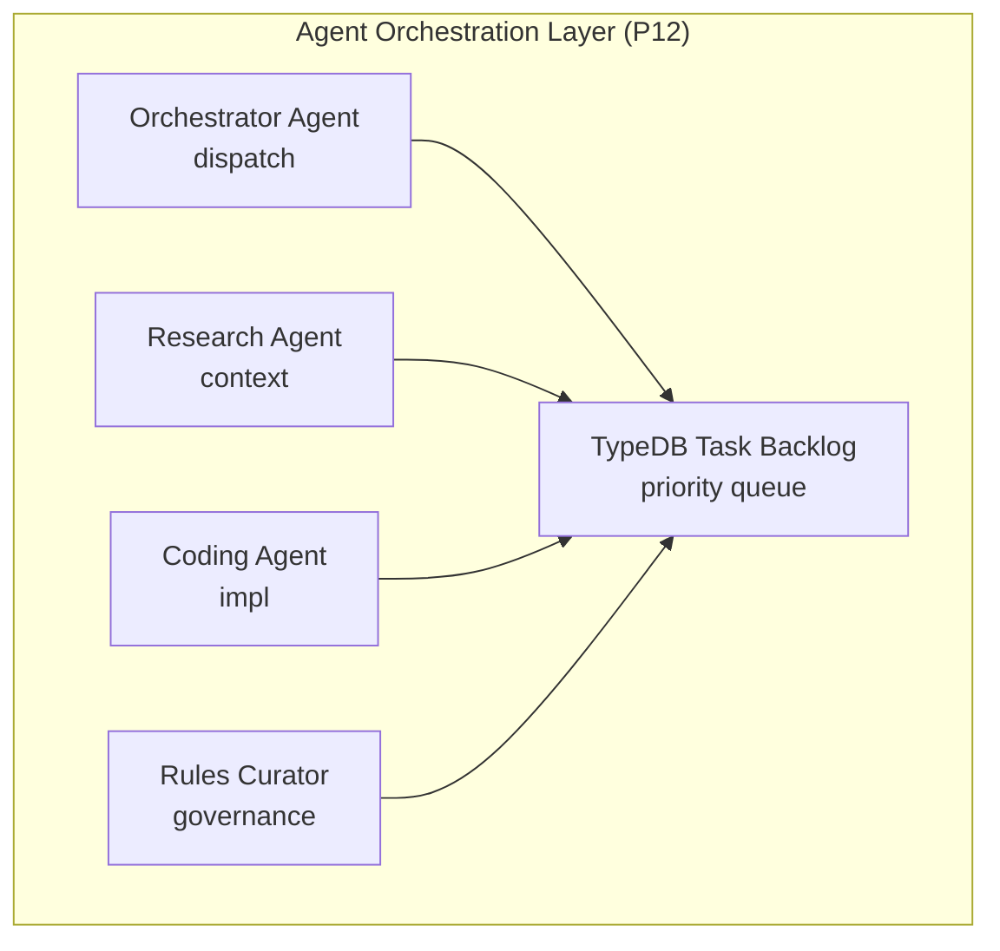

# Phase 12: Agent Orchestration

**Status:** ✅ COMPLETE (8/8 tasks)
**Priority:** CRITICAL
**Related Rules:** RULE-011 (Multi-Agent Governance), RULE-014 (Autonomous Task Sequencing)

---

## Strategic Goal

Enable agents to execute tasks autonomously per RULE-014. Agents must poll for tasks, claim/lock, execute, and report results. This is the **primary blocker** for agentic platform usability.

---

## Reference Gaps

- [GAP-UI-CHAT-001/002](../../gaps/GAP-INDEX.md): Agent command interface (CRITICAL)
- [GAP-AGENT-010-014](../../gaps/GAP-INDEX.md): Agent execution gaps (HIGH)
- [GAP-CTX-001-003](../../gaps/GAP-INDEX.md): Context awareness gaps (CRITICAL)

---

## Task List

| Task | Status | Description | Gap | Priority |
|------|--------|-------------|-----|----------|
| P12.1 | ✅ DONE | **Agent Task Polling**: TypeDBTaskPoller in agent/orchestrator/task_poller.py | GAP-AGENT-011 | **P0** |
| P12.2 | ✅ DONE | **Task Claim/Lock**: claim_task() in task_poller.py:162 | GAP-AGENT-012 | **P0** |
| P12.3 | ✅ DONE | **Agent Chat Backend**: DelegationProtocol wired in chat.py:31-145 | GAP-UI-CHAT-001 | **P0** |
| P12.4 | ✅ DONE | **Execution Logging**: 26/26 tests, UI timeline viewer, API endpoints | GAP-UI-CHAT-002 | **P1** |
| P12.5 | ✅ DONE | **Delegation Protocol**: DelegationProtocol in agent/orchestrator/delegation.py | GAP-AGENT-013 | **P1** |
| P12.6 | ✅ DONE | **Context Auto-Loading**: ContextPreloader in governance/context_preloader.py, 23/23 tests | GAP-CTX-002 | **P1** |
| P12.7 | ✅ DONE | **Rules Curator Agent**: RulesCuratorAgent in agent/orchestrator/curator_agent.py | GAP-AGENT-014 | **P2** |
| P12.8 | ✅ DONE | **Memory Consolidation**: DECISION-005 Hybrid Architecture approved | GAP-CTX-003 | **P2** |

### P12.3 Implementation Status (2026-01-03 - COMPLETE)

**Wiring Completed:**
- Chat UI: ✅ agent/governance_ui/views/chat_view.py
- Chat Controller: ✅ agent/governance_ui/controllers/chat.py
- Chat API: ✅ governance/routes/chat.py
- DelegationProtocol: ✅ Wired in chat.py:31-145
- OrchestratorEngine: ✅ Initialized in `_get_delegation_protocol()`
- Agent Selection: ✅ Trust-based selection in chat.py:310-316
- /delegate Command: ✅ Uses `_delegate_task_async()` via protocol

**Remaining for P12.4:**
- Stream execution events to UI via WebSocket or polling

### P12.6 Implementation Status (2026-01-03 - COMPLETE)

**Context Preloader Infrastructure:**
- ContextPreloader: `governance/context_preloader.py`
- Tests: `tests/test_context_preloader.py` (23/23 pass)
- Chat Integration: Wired in `governance/routes/chat.py`
- `/context` Command: Shows loaded strategic context

**Features:**
- Auto-loads DECISION-* files from evidence/
- Parses technology decisions from CLAUDE.md
- Detects active phase from backlog
- Counts open gaps from GAP-INDEX.md
- Caches context for 5 minutes
- Generates agent-friendly context prompt

### P12.8 Implementation Status (2026-01-03 - COMPLETE)

**Decision:** DECISION-005 Hybrid Architecture approved
- Evidence: `evidence/DECISION-005-MEMORY-CONSOLIDATION.md`
- Architecture: TypeDB for governance entities, ChromaDB for semantic search
- Migration Path: Hybrid now, evaluate TypeDB 3.x vectors in Q2 2026

**Key Points:**
- No code changes needed (hybrid already in place)
- Query router: `governance/hybrid/router.py`
- TypeDB stores: rules, decisions, tasks, sessions
- ChromaDB stores: cross-project memories, embeddings
- Future consolidation when TypeDB 3.x vector support matures

---

## Architecture

---

## Dependencies

- Phase 10 (Architecture Debt Resolution): ✅ Complete
- Phase 11 (Data Integrity Resolution): ✅ Complete
- ORCH-002 (Task Polling): ✅ agent/orchestrator/ module (31 tests)
- ORCH-003 (Task Claim/Lock): ✅ Included in orchestrator
- ORCH-004 (Delegation Protocol): ✅ agent/orchestrator/delegation.py (35 tests)
- ORCH-006 (Agent Chat UI): ✅ agent/governance_ui/views/chat_view.py (33 tests)

---

## Existing Infrastructure

| Component | Location | Status |
|-----------|----------|--------|
| Orchestrator module | agent/orchestrator/ | ✅ Ready |
| Delegation protocol | agent/orchestrator/delegation.py | ✅ Ready |
| Chat view UI | agent/governance_ui/views/chat_view.py | ✅ Ready |
| Chat controllers | agent/governance_ui/controllers/chat.py | ✅ Ready |
| Chat API endpoints | governance/routes/chat.py | ✅ Ready |
| Session memory | governance/session_memory.py | ✅ Ready |

---

## Success Criteria

- [ ] User can send commands to agents via chat UI
- [ ] Agents poll and pick up tasks from TypeDB backlog
- [ ] Tasks are claimed atomically (no duplicate execution)
- [ ] Execution events stream to UI in real-time
- [ ] Agents can delegate to Research Agent when lacking context
- [ ] DECISION-* files auto-loaded on session start

---

*Per RULE-012 DSP: Phase documentation created*
