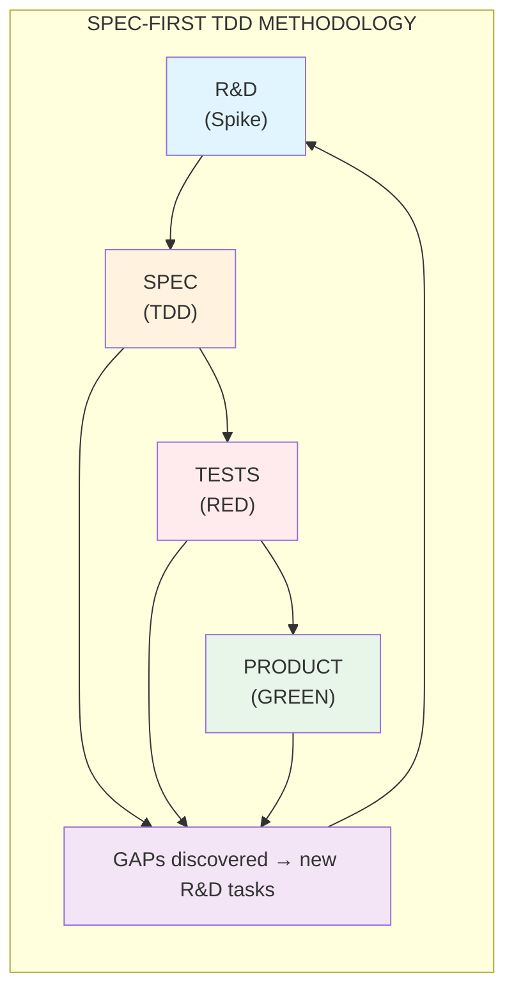

# R&D: Testing Strategy (TEST-001 to TEST-006)

**Status:** ✅ DONE
**Priority:** CRITICAL
**Vision:** Spec-First TDD - R&D produces specs, specs drive tests, tests drive product

---

## Core Principle

**Spec-First TDD Flow (Per User Directive 2024-12-27):**



**R&D Tasks = Spikes (Agile)**: Exploratory work that produces standard approaches/specs
- NOT standard tasks - they produce specs that enable standard work
- End with: documented spec, test cases, implementation guide

**Tests derive from Spec**: Tests are written BEFORE product code
- Each test traces to a spec requirement
- GAPs in tests = GAPs in spec = trigger for R&D

Tests are living contracts that evolve with business requirements. During active development, focus on functionality. During DSP cycles, restructure tests for long-term maintainability and strategic coherence.

---

## Task List

| ID | Task | Status | Priority | Notes |
|----|------|--------|----------|-------|
| TEST-001 | Refine testing rules for reusability | ✅ DONE | **HIGH** | tests/shared/factories.py, pages.py |
| TEST-002 | Evidence collection at trace level | ✅ DONE | **HIGH** | tests/evidence/trace_capture.py, pytest --trace-capture |
| TEST-003 | Debug workflow trace minimization | ✅ DONE | **HIGH** | tests/evidence/trace_minimizer.py, pytest --report-minimized (71% token reduction) |
| TEST-004 | Test restructuring for rules conformity | ✅ DONE | **HIGH** | tests/TEST_REGISTRY.md rule traceability |
| TEST-005 | GitHub milestone certification reporting | ✅ DONE | **HIGH** | tests/evidence/certification_report.py |
| TEST-006 | DevOps test strategy | ✅ DONE | HIGH | Makefile, .pre-commit-config.yaml |

---

## TEST-001: Test Framework Reusability

### Core Pattern

Tests REUSE implementation objects, not duplicate them:

```
IMPLEMENTATION (source of truth)     →     TESTS (consumers)
────────────────────────────────────────────────────────────
API Models (Pydantic):
  governance/models.py:
    • RuleResponse, RuleRequest
    • DecisionResponse, SessionResponse

  tests/ IMPORTS these:
    from governance.models import RuleResponse
────────────────────────────────────────────────────────────
UI Page Objects:
  agent/ui_components.py:
    • RulesTable, RuleForm, RuleDetail

  tests/ui/pages/rules_page.py:
    • Mirrors component structure
    • Locators match data-testid
```

### BDD Pattern

```
Given (Presets - Setup state):
  • Load test fixtures using SHARED factories
  • Navigate to known state

When (Actions - User interactions):
  • Use Page Object methods
  • Single responsibility per step

Then (Assertions - Verify outcomes):
  • Assertions use SAME models as implementation
  • Specific, measurable outcomes
```

### Anti-Patterns to AVOID

- ❌ Duplicating models in tests
- ❌ Hardcoding expected values
- ❌ Testing implementation details
- ❌ Mixing Given/When/Then in single step
- ❌ Generic assertions ("should work")

---

## DSP Test Hygiene Protocol

### Night Cycle (Strategic Preparation)

1. **TEST RESTRUCTURING (TEST-004)**
   - Align test files with RULE-* structure
   - Ensure each test traces to a rule or gap
   - Remove orphan tests

2. **RULES CONFORMITY CHECK**
   - RULE-004: All tests use POM pattern?
   - RULE-020: E2E tests generated via LLM exploration?
   - RULE-023: Test levels (L1-L4) defined?

3. **CERTIFICATION PREP**
   - Stage test artifacts for certification
   - Prepare GitHub issue template

### Day Cycle (Tactical Implementation)

1. Focus on GREEN phase (make tests pass)
2. Minimal test changes
3. Log insights but defer restructuring

---

## DevOps Test Strategy (TEST-006)

```yaml
devops_test_strategy:
  ci_cd_gates:
    - pre_commit: smoke tests (< 30s)
    - pr_merge: functional tests (< 5min)
    - release: full suite + certification (< 30min)

  reusable_patterns:
    - shared_fixtures: pytest fixtures, Robot keywords
    - test_data: factories, mock builders
    - environment_configs: dev, staging, prod configs

  parallel_execution:
    - pytest: -n auto (xdist)
    - robot: --parallel (pabot)

  reporting:
    - format: JUnit XML + HTML
    - destination: GitHub Actions artifacts
    - retention: 30 days
```

---

## Evidence

- Current tests: 827 passed, 28 TDD stubs
- Certification report: P11.7-READINESS-CERTIFICATION-2024-12-26.md
- RULE-023: Testing rules

*Per RULE-012 DSP: Testing strategy R&D documented*
