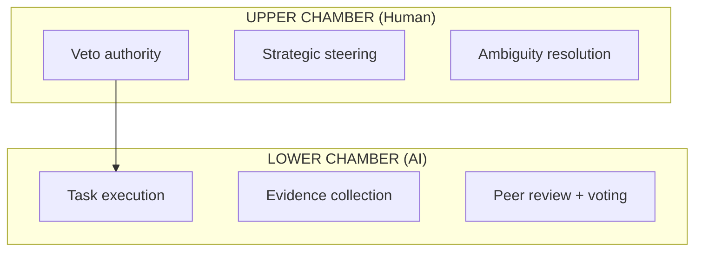

# Multi-Agent Governance Rules - Sim.ai

Rules governing multi-agent systems, trust, and UI/UX standards.

> **Parent:** [RULES-GOVERNANCE.md](../RULES-GOVERNANCE.md)
> **Rules:** RULE-011, RULE-013, RULE-019

---

## RULE-011: Multi-Agent Governance Protocol

**Category:** `governance` | **Priority:** CRITICAL | **Status:** ACTIVE | **Type:** REQUIRED

### Directive

Multi-agent systems MUST implement structured governance with human oversight, consensus mechanisms, and evidence-based conflict resolution.

### Governance Layers (Bicameral Model)



### Governance MCP Tools

| Tool | Responsibility |
|------|----------------|
| `governance_propose_rule` | Submit rule changes with evidence |
| `governance_vote` | Peer review voting on proposals |
| `governance_dispute` | Raise conflicts for resolution |
| `governance_get_trust_score` | Agent reliability scoring |
| `governance_escalate_to_human` | Trigger human oversight |

### Trust Score Algorithm

```python
Trust = (Compliance × 0.4) + (Accuracy × 0.3) + (Consistency × 0.2) + (Tenure × 0.1)
```

### Rule Quality (Category Theory)

| Signal | Action |
|--------|--------|
| Rule > 50 lines | Split by concern |
| Collateral docs | Extract to separate rule |
| Cross-cutting concern | Extract morphism |

**Quality Checklist:**
- [ ] Atomic? Single concern
- [ ] Composable? Combines cleanly
- [ ] Testable? Executable validation

### Anti-Patterns

| Don't | Do Instead |
|-------|------------|
| Let agents act without oversight | Use bicameral governance model |
| Skip consensus on rule changes | Use `governance_propose_rule` + voting |
| Ignore trust scores | Check agent trust before delegation |
| Resolve conflicts arbitrarily | Use evidence-based resolution |

---

## RULE-013: Rules Applicability Convention

**Category:** `governance` | **Priority:** HIGH | **Status:** ACTIVE | **Type:** REQUIRED

### Directive

All code comments, gaps, and TODOs MUST reference applicable rules:

```
{TYPE}({RULE-ID}): {Description}
```

### Examples

```python
# Good
# TODO(RULE-002): Extract to separate module
# GAP-020(RULE-005): Memory threshold exceeded

# Bad
# TODO: Fix this later
```

### Gap Format

```markdown
| ID | Gap | Priority | Rule |
|----|-----|----------|------|
| GAP-020 | Memory monitoring | HIGH | RULE-005 |
```

### Anti-Patterns

| Don't | Do Instead |
|-------|------------|
| `# TODO: Fix later` | `# TODO(RULE-XXX): Fix X` |
| `# FIXME` without rule | `# FIXME(RULE-002): Circular import` |
| Gap without rule reference | Link gaps to applicable rules |
| Orphan comments | Always reference governance rule |

---

## RULE-019: UI/UX Design Standards

**Category:** `governance` | **Priority:** HIGH | **Status:** ACTIVE | **Type:** REQUIRED

### Directive

All UI components MUST follow established design patterns:
1. Use Vuetify components (Trame environment)
2. Consistent spacing and typography
3. Accessible color contrast (WCAG AA)
4. Responsive layouts

### Component Patterns

| Component | Use Case | Pattern |
|-----------|----------|---------|
| VDataTable | Lists | Sortable, filterable |
| VCard | Details | Grouped information |
| VDialog | Modals | Confirmation, forms |
| VBtn | Actions | Primary/secondary variants |

### State Management

```python
# Use Trame state, NOT Vue refs
from trame.widgets import vuetify

with state:
    state.rules = []
    state.loading = False
```

### Validation
- [ ] Vuetify components used
- [ ] Color contrast ≥4.5:1
- [ ] Responsive breakpoints tested
- [ ] Loading states implemented

### Anti-Patterns

| Don't | Do Instead |
|-------|------------|
| Use raw HTML elements | Use Vuetify components (VBtn, VCard) |
| Use Vue refs for state | Use Trame `state` object |
| Skip loading states | Show VProgressLinear during fetch |
| Ignore accessibility | Maintain WCAG AA contrast ≥4.5:1 |

---

*Per RULE-012: DSP Semantic Code Structure*
