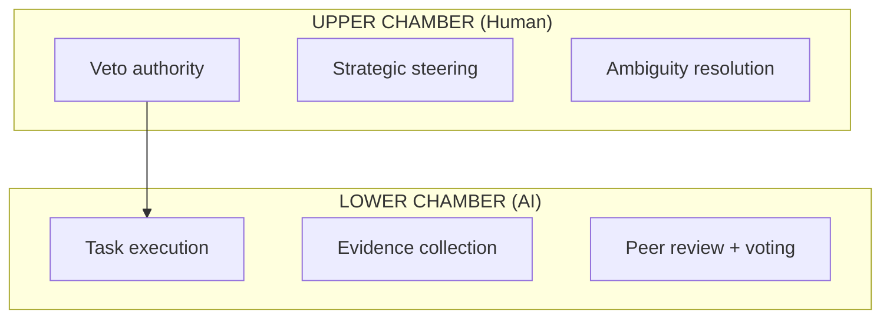

# GOV-BICAM-01-v1: Multi-Agent Governance Protocol

**Category:** `governance` | **Priority:** CRITICAL | **Status:** ACTIVE | **Type:** FOUNDATIONAL

> **Legacy ID:** RULE-011
> **Location:** [RULES-MULTI-AGENT.md](../governance/RULES-MULTI-AGENT.md)
> **Tags:** `governance`, `multi-agent`, `trust`, `consensus`

---

## Directive

Multi-agent systems MUST implement structured governance with human oversight, consensus mechanisms, and evidence-based conflict resolution.

---

## Governance Layers (Bicameral Model)



---

## Governance MCP Tools

| Tool | Responsibility |
|------|----------------|
| `governance_propose_rule` | Submit rule changes with evidence |
| `governance_vote` | Peer review voting on proposals |
| `governance_dispute` | Raise conflicts for resolution |
| `governance_get_trust_score` | Agent reliability scoring |
| `governance_escalate_to_human` | Trigger human oversight |

---

## Trust Score Algorithm

```python
Trust = (Compliance * 0.4) + (Accuracy * 0.3) + (Consistency * 0.2) + (Tenure * 0.1)
```

---

## Rule Quality (Category Theory)

| Signal | Action |
|--------|--------|
| Rule > 50 lines | Split by concern |
| Collateral docs | Extract to separate rule |
| Cross-cutting concern | Extract morphism |

**Quality Checklist:**
- [ ] Atomic? Single concern
- [ ] Composable? Combines cleanly
- [ ] Testable? Executable validation

---

## Anti-Patterns

| Don't | Do Instead |
|-------|------------|
| Let agents act without oversight | Use bicameral governance model |
| Skip consensus on rule changes | Use `governance_propose_rule` + voting |
| Ignore trust scores | Check agent trust before delegation |
| Resolve conflicts arbitrarily | Use evidence-based resolution |

## Test Coverage

**4 robot test file(s)** validate this rule:

| File | Scope |
|------|-------|
| `tests/robot/unit/agent_hybrid.robot` | unit |
| `tests/robot/unit/agent_trust.robot` | unit |
| `tests/robot/unit/kanren_trust.robot` | unit |
| `tests/robot/unit/trust_dashboard.robot` | unit |

```bash
# Run all tests validating this rule
robot --include GOV-BICAM-01-v1 tests/robot/
```

---

*Per SESSION-DSM-01-v1: DSP Semantic Code Structure*
