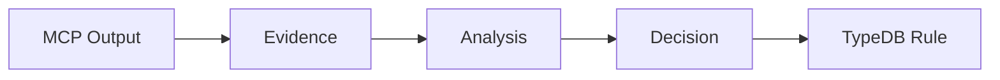

# GOV-RULE-01-v1: Evidence-Based Wisdom Accumulation

**Category:** `strategic` | **Priority:** CRITICAL | **Status:** ACTIVE | **Type:** FOUNDATIONAL

> **Legacy ID:** RULE-010
> **Location:** [RULES-STRATEGY.md](../technical/RULES-STRATEGY.md)
> **Tags:** `evidence`, `wisdom`, `learning`, `hypothesis`

---

## Directive

Every experiment MUST produce traceable evidence:
1. Use MCPs for detailed evidence
2. Hypothesis-based approach
3. Logical decision making
4. Test-caught failures = learning opportunities

---

## Evidence Pipeline



---

## MCP Usage for Evidence

| Evidence Type | MCP Tool |
|---------------|----------|
| API exploration | llm-sandbox |
| Version checks | powershell |
| Code patterns | OctoCode |
| Memory storage | claude-mem |

---

## Validation

- [ ] MCPs used instead of manual operations
- [ ] Hypothesis documented before testing
- [ ] Evidence collected in structured format

## Test Coverage

**11 robot test file(s)** validate this rule:

| File | Scope |
|------|-------|
| `tests/robot/e2e/governance_crud.robot` | e2e |
| `tests/robot/e2e/rules_api.robot` | e2e |
| `tests/robot/unit/curator_agent.robot` | unit |
| `tests/robot/unit/governance.robot` | unit |
| `tests/robot/unit/rule_fallback.robot` | unit |
| `tests/robot/unit/rule_impact.robot` | unit |
| `tests/robot/unit/rule_monitor.robot` | unit |
| `tests/robot/unit/rule_quality.robot` | unit |
| `tests/robot/unit/rules_archive.robot` | unit |
| `tests/robot/unit/rules_governance.robot` | unit |
| `tests/robot/unit/rules_integration.robot` | unit |

```bash
# Run all tests validating this rule
robot --include GOV-RULE-01-v1 tests/robot/
```

---

*Per SESSION-DSM-01-v1: DSP Semantic Code Structure*
