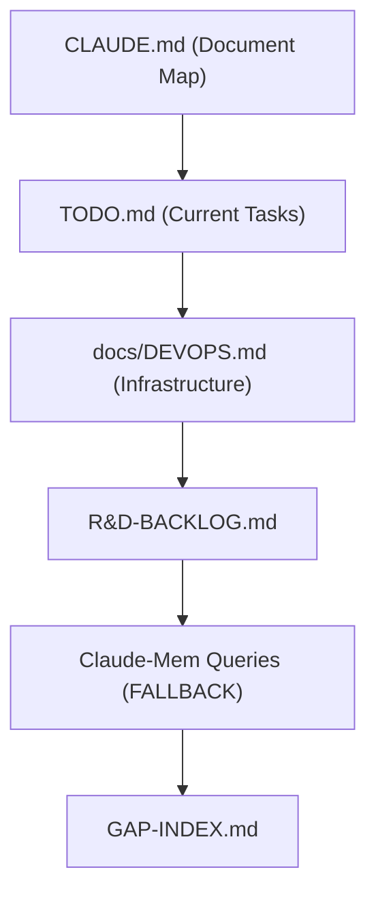

# RECOVER-AMNES-01-v1: AMNESIA Protocol

**Category:** `maintenance` | **Priority:** CRITICAL | **Status:** ACTIVE | **Type:** TECHNICAL

> **Legacy ID:** RULE-024
> **Location:** [RULES-WORKFLOW.md](../operational/RULES-WORKFLOW.md)
> **Tags:** `amnesia`, `recovery`, `context`, `memory`

---

## Directive

When context is lost or truncated, agents MUST autonomously recover using the AMNESIA Protocol.

**AMNESIA** = Autonomous Memory & Network Extraction for Session Intelligence and Awareness

---

## Recovery Hierarchy



---

## Pre-Action Exploration (CRITICAL)

**BEFORE taking ANY action (especially destructive ones), MUST:**

1. Read `CLAUDE.md` - Document map, architecture overview
2. Read `docs/DEVOPS.md` - Current infrastructure setup
3. Read `.mcp.json` - Available MCP servers
4. Query claude-mem - Recent session context: `["sim-ai {date} migration setup"]`
5. Check running services - `podman compose --profile cpu ps`

---

## Claude-Mem Fallback (MANDATORY)

When TypeDB/ChromaDB are unavailable:

```python
# Query recent sim-ai sessions
mcp__claude-mem__chroma_query_documents(["sim-ai 2026-01 migration infrastructure"])

# Query specific migration changes
mcp__claude-mem__chroma_query_documents(["sim-ai podman kubectl setup"])
```

---

## Save Prompts Before Transitions

| Transition | Trigger | Action |
|------------|---------|--------|
| User restart | "restart", "close" | Prompt /save |
| Context limit | >80% used | Prompt /save |
| Long pause | >30 min | Prompt /save |
| Milestone | Phase done | Prompt /save |

---

## Validation

- [ ] Context recovered autonomously
- [ ] No "what were we doing?" questions
- [ ] Save prompts issued before transitions

## Test Coverage

**1 robot test file(s)** validate this rule:

| File | Scope |
|------|-------|
| `tests/robot/unit/conflict_checker.robot` | unit |

```bash
# Run all tests validating this rule
robot --include RECOVER-AMNES-01-v1 tests/robot/
```

---

*Per SESSION-DSM-01-v1: DSP Semantic Code Structure*
