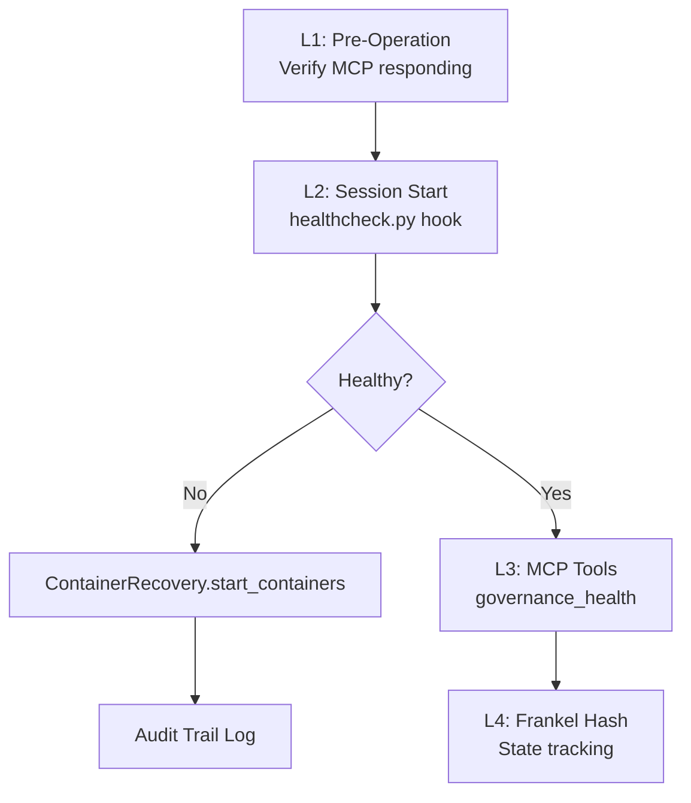

# SAFETY-HEALTH-01-v1: MCP Healthcheck Protocol

**Category:** `stability` | **Priority:** CRITICAL | **Status:** ACTIVE | **Type:** TECHNICAL

> **Legacy ID:** RULE-021
> **Location:** [RULES-STABILITY.md](../operational/RULES-STABILITY.md)
> **Tags:** `health`, `mcp`, `recovery`, `monitoring`

---

## Directive

Every MCP-dependent operation MUST verify health before execution. Failures must be logged and recovery attempted **automatically**.

**CRITICAL:** At session start, healthcheck hook auto-verifies container services and triggers recovery if DOWN.

---

## Healthcheck Hierarchy

---

## MCP Server Tiers

| Tier | Servers | Failure Impact |
|------|---------|----------------|
| **CRITICAL** | filesystem, git, powershell | Session blocked |
| **HIGH** | claude-mem, desktop-commander | Degraded |
| **MEDIUM** | playwright, octocode, llm-sandbox | Feature unavailable |
| **CONDITIONAL** | godot-mcp | Skip if not needed |

---

## Allowed Failures

- `godot-mcp` - Requires Godot Editor
- `llm-sandbox` - Requires Docker/Podman
- `octocode` - Requires GitHub PAT
- `context7` - May be disabled

---

## Auto-Recovery Actions

| State | Action |
|-------|--------|
| `PODMAN: DOWN` | Start podman socket |
| `typedb: DOWN` | `ContainerRecovery.start_containers(["typedb"])` |
| `chromadb: DOWN` | `ContainerRecovery.start_containers(["chromadb"])` |

---

## Anti-Patterns

| Don't | Do Instead |
|-------|------------|
| Skip health check at session start | Always call `governance_health` first |
| Assume services are running | Verify with healthcheck hook |
| Ignore DOWN status | Follow recovery actions table |
| Proceed without critical MCPs | Wait for recovery or notify user |

---

*Per SESSION-DSM-01-v1: DSP Semantic Code Structure*
