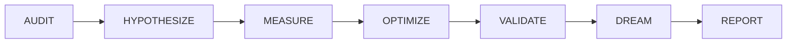

# SESSION-DSM-01-v1: Deep Sleep Protocol (DSP)

**Category:** `workflow` | **Priority:** HIGH | **Status:** ACTIVE | **Type:** OPERATIONAL

> **Legacy ID:** RULE-012
> **Location:** [RULES-WORKFLOW.md](../operational/RULES-WORKFLOW.md)
> **Tags:** `dsp`, `maintenance`, `hygiene`, `backlog`

---

## Directive

Periodically invoke DSP for deliberate technical backlog hygiene with MCP integration.

---

## DSP Phases



| Phase | Purpose | MCPs Required |
|-------|---------|---------------|
| **AUDIT** | Inventory gaps, orphans, rules entropy | claude-mem, governance-core |
| **HYPOTHESIZE** | Form theories | sequential-thinking |
| **MEASURE** | Quantify state | powershell, llm-sandbox |
| **OPTIMIZE** | Apply improvements | filesystem, git |
| **VALIDATE** | Run tests | pytest, llm-sandbox |
| **DREAM** | Explore, discover | playwright, docker |
| **REPORT** | Link to GitHub | git, governance-sessions |

---

## AUDIT Phase Checklist

| Check | Tool | Purpose |
|-------|------|---------|
| Rules sync | `governance_sync_status()` | Detect TypeDB-docs divergence |
| Rules count | `health_check()` | Verify rule count |
| Gap entropy | Check GAP-INDEX | Open gaps < 50 threshold |
| File sizes | Health alerts | Files < 300 lines |
| CLAUDE.md | Manual | Rules Atlas current |

---

## When to Invoke

| Trigger | Scope | Cadence |
|---------|-------|---------|
| Session End | Quick audit | Every session (5 min) |
| Milestone | Full backlog | Weekly (30 min) |
| Pre-Release | Deep review | Before releases (2+ hours) |

---

## DSP MCP Tools

- `dsm_start(batch_id)` - Begin DSP cycle
- `dsm_advance()` - Move to next phase
- `dsm_checkpoint()` - Record progress
- `dsm_complete()` - Generate evidence

## Test Coverage

**5 robot test file(s)** validate this rule:

| File | Scope |
|------|-------|
| `tests/robot/unit/dsm_tracker.robot` | unit |
| `tests/robot/unit/dsm_tracker_extended.robot` | unit |
| `tests/robot/unit/dsm_tracker_integration.robot` | unit |
| `tests/robot/unit/dsm_tracker_phases.robot` | unit |
| `tests/robot/unit/dsm_tracker_unit.robot` | unit |

```bash
# Run all tests validating this rule
robot --include SESSION-DSM-01-v1 tests/robot/
```

---

*Per SESSION-DSM-01-v1: DSP Semantic Code Structure*
