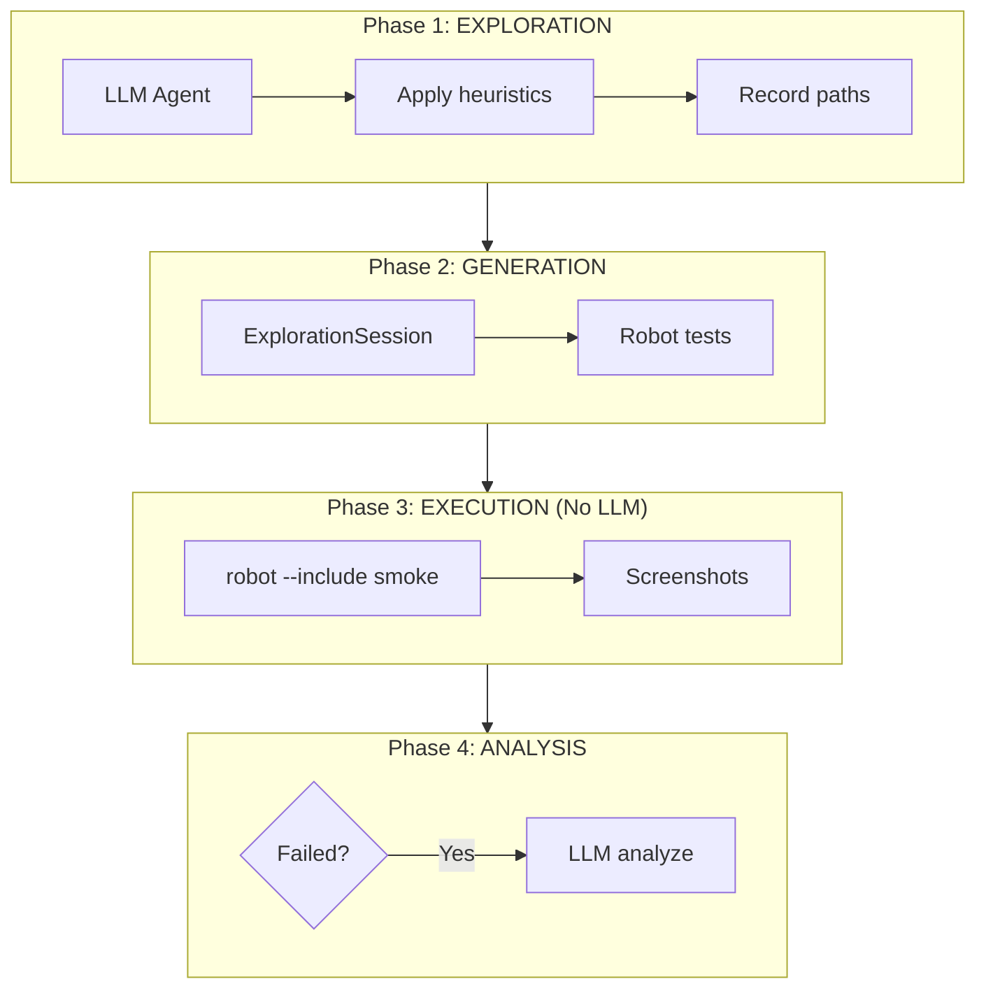

# TEST-COMP-01-v1: LLM-Driven E2E Test Generation

**Category:** `testing` | **Priority:** HIGH | **Status:** ACTIVE | **Type:** OPERATIONAL

> **Legacy ID:** RULE-020
> **Location:** [RULES-TESTING.md](../operational/RULES-TESTING.md)
> **Tags:** `testing`, `e2e`, `llm`, `playwright`

---

## Directive

E2E tests MUST be generated via LLM-driven exploratory sessions using Playwright MCP. LLM is used ONLY for:
1. **Exploration** - Discover UI paths via heuristics
2. **Generation** - Convert to deterministic Robot Framework tests
3. **Failure analysis** - Analyze why tests failed

LLM is NOT used during test execution.

---

## Workflow



---

## Anti-Patterns

| Don't | Do Instead |
|-------|-----------|
| Use LLM to decide pass/fail | Use deterministic assertions |
| Re-explore on each test run | Generate once, run many |
| Analyze every result with LLM | Only analyze failures |

## Test Coverage

**5 robot test file(s)** validate this rule:

| File | Scope |
|------|-------|
| `tests/robot/unit/benchmark.robot` | unit |
| `tests/robot/unit/heuristics_example.robot` | unit |
| `tests/robot/unit/journey_analyzer.robot` | unit |
| `tests/robot/unit/lacmus_benchmark.robot` | unit |
| `tests/robot/unit/platform_performance.robot` | unit |

```bash
# Run all tests validating this rule
robot --include TEST-COMP-01-v1 tests/robot/
```

---

*Per SESSION-DSM-01-v1: DSP Semantic Code Structure*
