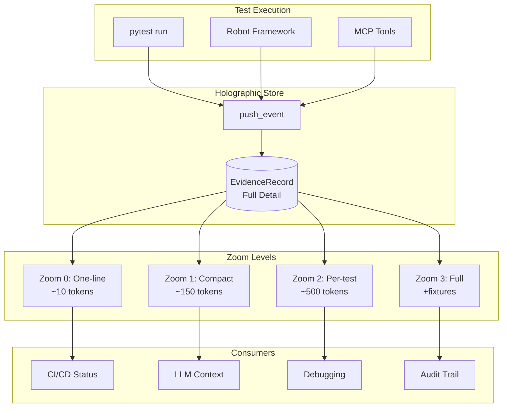
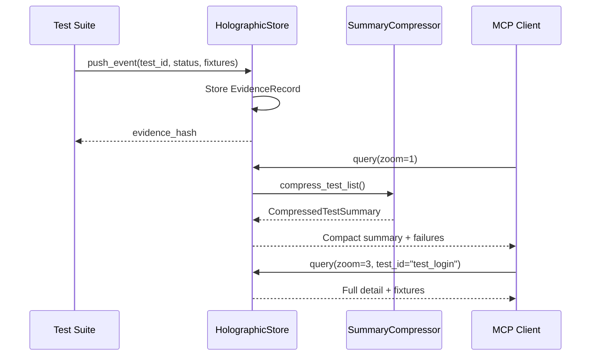

# TEST-HOLO-01-v1: Holographic Test Evidence

**Category:** `testing` | **Priority:** HIGH | **Status:** ACTIVE | **Type:** OPERATIONAL

> **Legacy ID:** N/A (new rule)
> **Location:** [RULES-OPERATIONAL.md](../operational/RULES-OPERATIONAL.md)
> **Tags:** `testing`, `evidence`, `compression`, `holographic`, `frankel-hash`
> **EPIC:** EPIC-TEST-COMPRESS-001

---

## Directive

Test evidence MUST be stored at full detail and queryable at multiple zoom levels (0-3) per the holographic principle: store once, query at any resolution.

---

## Architecture



---

## Data Flow



---

## Implementation

### Zoom Levels

| Level | Name | Tokens | Content | Use Case |
|-------|------|--------|---------|----------|
| 0 | One-line | ~10 | `Tests: 18/20 passed (90%)` | CI badges, progress |
| 1 | Compact | ~150 | Stats + category breakdown + failures | LLM context (default) |
| 2 | Per-test | ~500 | List of test_id, status, duration | Debugging which tests |
| 3 | Full | 2000+ | All fields + fixtures + request/response | Audit, reproduction |

### EvidenceRecord Structure

```python
@dataclass
class EvidenceRecord:
    # Level 0-1: Summary fields
    test_id: str
    name: str
    status: str  # passed, failed, skipped
    category: str  # unit, integration, e2e
    duration_ms: float

    # Level 2: Extended metadata
    intent: Optional[str]
    linked_rules: List[str]
    linked_gaps: List[str]
    error_message: Optional[str]

    # Level 3: Full fixtures
    fixtures: Dict[str, Any]
    request_data: Optional[Dict]
    response_data: Optional[Dict]

    # Metadata
    evidence_hash: str  # 16-char SHA256
    session_id: Optional[str]
    timestamp: str
```

### MCP Tools

| Tool | Purpose | Parameters |
|------|---------|------------|
| `test_evidence_push` | Push event to store | test_id, name, status, fixtures_json |
| `test_evidence_query` | Query at zoom level | zoom (0-3), test_id, category, status |
| `test_evidence_get` | Get by hash | evidence_hash |

---

## Usage

### Push Events During Test Run

```python
# Via pytest plugin (automatic)
pytest tests/ --report-compressed

# Via MCP tool
test_evidence_push(
    test_id="tests/unit/test_auth.py::test_login",
    name="test_login",
    status="passed",
    category="unit",
    duration_ms=150,
    fixtures_json='{"user": "admin", "request": {"method": "POST"}}'
)
```

### Query at Any Zoom Level

```python
# Zoom 0: One-line for CI
test_evidence_query(zoom=0)
# → "Tests: 18/20 passed (90%) in 3.2s"

# Zoom 1: Compact for LLM context (default)
test_evidence_query(zoom=1)
# → [FAIL] 18/20 (90%) | 3.2s
#     Failures (2):
#       - test_api: AssertionError

# Zoom 2: Per-test for debugging
test_evidence_query(zoom=2, status="failed")
# → List of failed test IDs with duration

# Zoom 3: Full detail for audit
test_evidence_query(zoom=3, test_id="test_login")
# → Full EvidenceRecord with fixtures
```

---

## Compression Statistics

| Scenario | Tests | Original | Compressed | Savings |
|----------|-------|----------|------------|---------|
| Small suite | 18 | 715 tokens | 6 tokens | **99%** |
| Medium suite | 100 | 4,352 tokens | 149 tokens | **97%** |
| Large suite | 500 | 21,199 tokens | 159 tokens | **99%** |
| High failures | 50 | 2,507 tokens | 145 tokens | **94%** |

---

## Related Rules

- TEST-EVID-01-v1: BDD Evidence Collection (extends with holographic)
- TEST-COMP-01-v1: Test Comprehensiveness
- SESSION-EVID-01-v1: Session Evidence (integrates with)
- FH-001: Frankel Hash zoom levels (same principle)

---

## Evidence

| File | Purpose | Lines |
|------|---------|-------|
| [holographic_store.py](../../../tests/evidence/holographic_store.py) | Core store implementation | 257 |
| [summary_compressor.py](../../../tests/evidence/summary_compressor.py) | Compression algorithms | 310 |
| [sessions_evidence.py](../../../governance/mcp_tools/sessions_evidence.py) | MCP tools | 160 |
| [test_holographic_store.py](../../../tests/unit/test_holographic_store.py) | Unit tests (18) | 272 |
| [test_summary_compressor.py](../../../tests/unit/test_summary_compressor.py) | Unit tests (18) | 220 |

---

## Validation Checklist

- [ ] All test runs use `--report-compressed` for LLM efficiency
- [ ] Zoom level 1 is default for MCP queries
- [ ] Full fixtures stored for audit trail (zoom 3)
- [ ] Compression ratio > 90% for typical runs
- [ ] Thread-safe for concurrent test execution

---

*Per EPIC-TEST-COMPRESS-001: Test results compression*
*Per FH-001: Frankel Hash zoom levels*
*Per DOC-SIZE-01-v1: Rule document < 200 lines*
