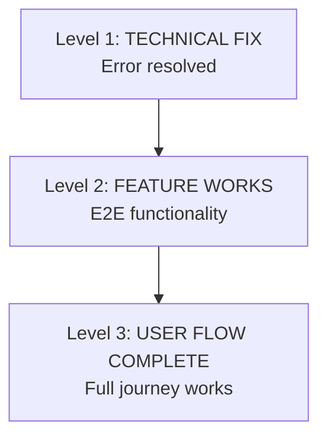

# WORKFLOW-SEQ-01-v1: Change Validation Protocol

**Category:** `testing` | **Priority:** HIGH | **Status:** ACTIVE | **Type:** OPERATIONAL

> **Legacy ID:** RULE-028
> **Location:** [RULES-TESTING.md](../operational/RULES-TESTING.md)
> **Tags:** `validation`, `testing`, `changes`, `verification`

---

## Directive

When code changes are implemented, agents MUST re-run exploratory validation before marking tasks complete.

---

## Validation Hierarchy (MANDATORY)

**VALIDATION IS NOT COMPLETE UNTIL LEVEL 3 IS VERIFIED**

---

## Origin

Created 2024-12-28: Bug fix declared "complete" when only Level 1 validated. Feature was still broken.

**Lesson**: A crash fix is not a feature fix. Always validate the full user flow.

---

## Validation

- [ ] Level 1 verified (technical fix)
- [ ] Level 2 verified (feature works)
- [ ] Level 3 verified (user flow complete)

---

*Per SESSION-DSM-01-v1: DSP Semantic Code Structure*
