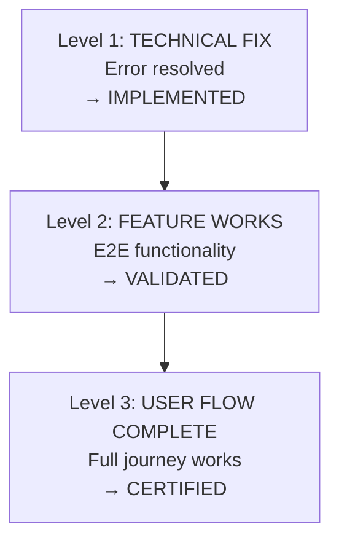

# WORKFLOW-SEQ-01-v1: Change Validation Protocol

**Category:** `testing` | **Priority:** HIGH | **Status:** ACTIVE | **Type:** OPERATIONAL

> **Legacy ID:** RULE-028
> **Location:** [RULES-TESTING.md](../operational/RULES-TESTING.md)
> **Tags:** `validation`, `testing`, `changes`, `verification`, `resolution`, `guardrails`

---

## Directive

When code changes are implemented, agents MUST re-run exploratory validation before marking tasks complete. The verification level determines the task's **resolution** outcome.

---

## Validation Hierarchy (MANDATORY)



**VALIDATION IS NOT COMPLETE UNTIL LEVEL 3 IS VERIFIED**

---

## Resolution Mapping

| Verification Level | Resolution | Evidence Required |
|-------------------|------------|-------------------|
| L1: Technical Fix | IMPLEMENTED | Error resolved, code compiles |
| L2: E2E Functionality | VALIDATED | Browser/API tests pass |
| L3: User Flow | CERTIFIED | Stakeholder acceptance |

---

## API Guardrails (2026-01-17)

### Complete Task with Verification
```bash
PUT /api/tasks/{task_id}/complete
  ?evidence=<description>
  &verification_level=L1|L2|L3
  &session_id=SESSION-XXX
```

### Promote Resolution After Verification
```bash
PUT /api/tasks/{task_id}/promote-resolution
  ?target_resolution=VALIDATED|CERTIFIED
  &evidence=<test results>
  &verification_level=L2|L3
```

### Create Verification Subtasks
```bash
POST /api/tasks/{task_id}/create-verification-subtasks
  ?include_l3=true
```

Creates: `{task_id}-L1-VERIFY`, `{task_id}-L2-VERIFY`, `{task_id}-L3-VERIFY`

### Check Verification Status
```bash
GET /api/tasks/{task_id}/verification-status
```

Returns resolution and completion status of each verification level.

---

## Origin

Created 2024-12-28: Bug fix declared "complete" when only Level 1 validated. Feature was still broken.

**Lesson**: A crash fix is not a feature fix. Always validate the full user flow.

---

## Validation Checklist

- [ ] Level 1 verified (technical fix) → IMPLEMENTED
- [ ] Level 2 verified (E2E works) → VALIDATED
- [ ] Level 3 verified (user flow) → CERTIFIED

---

*Per SESSION-DSM-01-v1: DSP Semantic Code Structure*
