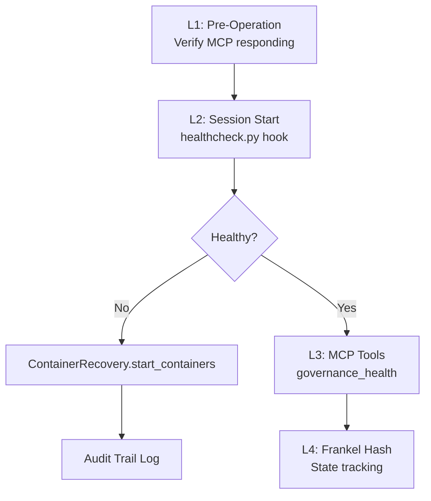

# Stability Rules - Sim.ai

Rules governing memory management, MCP health, and system integrity.

> **Parent:** [RULES-OPERATIONAL.md](../RULES-OPERATIONAL.md)
> **Rules:** RULE-005, RULE-021, RULE-022, RULE-041

---

## RULE-005: Memory & MCP Stability

**Category:** `stability` | **Priority:** HIGH | **Status:** ACTIVE | **Type:** REQUIRED

### Memory Thresholds

| Memory | Status | Action |
|--------|--------|--------|
| < 500 MB | HEALTHY | Normal operation |
| 500-1000 MB | NORMAL | Active development |
| 1000-1500 MB | WARNING | Monitor closely |
| 1500-2000 MB | HIGH | Consider closing files |
| > 2000 MB | CRITICAL | Restart soon |
| > 3000 MB | EMERGENCY | Restart immediately |

### MCP Stability Tiers

| Tier | MCPs | Risk |
|------|------|------|
| **STABLE** | claude-mem, sequential-thinking, filesystem, git | LOW |
| **PRODUCTIVE** | octocode, powershell, llm-sandbox | LOW |
| **MODERATE** | desktop-commander, playwright | MEDIUM |
| **CONDITIONAL** | godot-mcp | MEDIUM |

### Recovery Levels
1. **Soft**: Restart Claude Code
2. **Medium**: Disable heavy MCPs
3. **Hard**: Kill node processes
4. **Nuclear**: Full system restart

### Anti-Patterns

| Don't | Do Instead |
|-------|------------|
| Ignore memory warnings | Take action at WARNING threshold |
| Enable all MCPs simultaneously | Start with STABLE tier only |
| Wait until EMERGENCY to restart | Restart at CRITICAL threshold |
| Skip recovery levels | Follow escalation sequence |

---

## RULE-021: MCP Healthcheck Protocol

**Category:** `stability` | **Priority:** CRITICAL | **Status:** ACTIVE | **Type:** REQUIRED

### Directive

Every MCP-dependent operation MUST verify health before execution. Failures must be logged and recovery attempted **automatically**.

**CRITICAL:** At session start, healthcheck hook auto-verifies container services and triggers recovery if DOWN.

### Healthcheck Hierarchy



### MCP Server Tiers

| Tier | Servers | Failure Impact |
|------|---------|----------------|
| **CRITICAL** | filesystem, git, powershell | Session blocked |
| **HIGH** | claude-mem, desktop-commander | Degraded |
| **MEDIUM** | playwright, octocode, llm-sandbox | Feature unavailable |
| **CONDITIONAL** | godot-mcp | Skip if not needed |

### Allowed Failures

- `godot-mcp` - Requires Godot Editor
- `llm-sandbox` - Requires Docker/Podman
- `octocode` - Requires GitHub PAT
- `context7` - May be disabled

### Automated Implementation (EPIC-006)

**Hook:** [`.claude/hooks/healthcheck.py`](../../../.claude/hooks/healthcheck.py)

The healthcheck hook runs at **SessionStart** and:
1. Validates container runtime (podman/docker) is running
2. Checks TypeDB container health (port 1729)
3. Checks ChromaDB container health (port 8001)
4. **Auto-recovers DOWN containers** via `ContainerRecovery`
5. Generates Frankel Hash for service state tracking
6. Logs recovery attempts to audit trail
7. Injects status into conversation context

**Recovery Class:** [`.claude/hooks/recovery/containers.py`](../../../.claude/hooks/recovery/containers.py)

```python
# Runtime-agnostic container recovery (auto-detects podman/docker)
ContainerRecovery().start_containers(["typedb", "chromadb"])
```

**State File:** `.claude/hooks/.healthcheck_state.json`

```json
{
  "master_hash": "1E9A7840",
  "components": {"podman": "OK", "typedb": "OK", "chromadb": "OK"},
  "recovery_actions": ["STARTING containers (typedb, chromadb)"],
  "last_recovery": 1768218890.860033
}
```

**Audit Trail:** `~/.claude/recovery_logs/recovery-YYYY-MM-DD.jsonl`

```json
{"timestamp": "2026-01-12T13:54:49", "action": "start_containers",
 "success": true, "services": ["typedb", "chromadb"]}
```

**Auto-Recovery Actions:**
| State | Action |
|-------|--------|
| `PODMAN: DOWN` | Start podman socket |
| `typedb: DOWN` | `ContainerRecovery.start_containers(["typedb"])` |
| `chromadb: DOWN` | `ContainerRecovery.start_containers(["chromadb"])` |

**Documentation:** [.claude/HOOKS.md](../../../.claude/HOOKS.md)

### Anti-Patterns

| Don't | Do Instead |
|-------|------------|
| Skip health check at session start | Always call `governance_health` first |
| Assume services are running | Verify with healthcheck hook |
| Ignore DOWN status | Follow recovery actions table |
| Proceed without critical MCPs | Wait for recovery or notify user |

---

## RULE-022: Integrity Verification (Frankel Hash)

**Category:** `security` | **Priority:** HIGH | **Status:** DRAFT | **Type:** RECOMMENDED

### Directive

Critical files MUST have integrity verification via content hashing. Use Frankel Hash for similarity detection.

### Use Cases

| Use Case | Hash Type | Purpose |
|----------|-----------|---------|
| Config files | SHA-256 | Detect tampering |
| Rule files | Frankel | Track incremental changes |
| Session logs | SHA-256 | Audit trail |
| TypeDB schema | Frankel | Schema evolution |

### Files to Track

| Category | Files | Frequency |
|----------|-------|-----------|
| Governance | `schema.tql`, `data.tql` | On change |
| Rules | `docs/rules/*.md` | On change |
| Config | `docker-compose.yml`, `.env` | Session start |
| Evidence | `evidence/*.md` | On create |

### Anti-Patterns

| Don't | Do Instead |
|-------|------------|
| Trust files without verification | Hash critical files at session start |
| Ignore hash mismatches | Investigate and log discrepancies |
| Skip schema version tracking | Track TypeDB schema evolution |
| Commit without hash validation | Verify integrity before push |

---

## RULE-041: Crash Investigation Protocol

**Category:** `stability` | **Priority:** CRITICAL | **Status:** ACTIVE | **Type:** REQUIRED

### Directive

When Claude Code crashes with exit code 1, IMMEDIATELY investigate using log files before resuming work.

### Log File Locations (Linux)

```bash
# Claude Code Extension Logs
~/.config/Code/logs/<timestamp>/window1/exthost/Anthropic.claude-code/Claude\ VSCode.log

# VS Code Extension Host
~/.config/Code/logs/<timestamp>/exthost/exthost.log

# Find latest logs
ls -la ~/.config/Code/logs/ | tail -5
```

### Log File Locations (Windows)

```powershell
# Claude Code Extension Logs
%APPDATA%\Code\logs\<timestamp>\window1\exthost\Anthropic.claude-code\Claude VSCode.log

# VS Code Extension Host
%APPDATA%\Code\logs\<timestamp>\exthost\exthost.log
```

### Log File Locations (macOS)

```bash
# Claude Code Extension Logs
~/Library/Application\ Support/Code/logs/<timestamp>/window1/exthost/Anthropic.claude-code/Claude\ VSCode.log
```

### Investigation Commands

```bash
# Search for errors
grep -i "error\|crash\|exit\|fatal" "/path/to/Claude VSCode.log" | tail -50

# Check MCP failures
grep "MCP server" "Claude VSCode.log" | grep -i "error\|failed"

# Check API errors
grep -i "overloaded\|rate_limit\|timeout" "Claude VSCode.log" | tail -20

# Real-time monitoring
tail -f ~/.config/Code/logs/*/window1/exthost/Anthropic.claude-code/*.log
```

### Common Crash Causes

| Error | Cause | Fix |
|-------|-------|-----|
| `ModuleNotFoundError` | MCP module missing | Install/fix module |
| `MaxFileReadTokenExceededError` | File too large (>25000 tokens) | Use offset/limit or Grep |
| `overloaded_error` | API overload | Wait and retry |
| `Connection closed` | MCP server died | Restart VS Code |
| `Method not found` | MCP version mismatch | Update MCP server |

### Recovery Checklist

After any crash with exit code 1:

1. [ ] Read crash report: `grep -i error ~/.config/Code/logs/*/window1/exthost/Anthropic.claude-code/*.log | tail -20`
2. [ ] Check MCP health: `governance_health()`
3. [ ] Verify claude-mem: `chroma_health()`
4. [ ] Recover context: `chroma_recover_context(project="sim-ai")`
5. [ ] Check TODO.md for last work
6. [ ] Document findings in evidence/

### Anti-Patterns

| Don't | Do Instead |
|-------|------------|
| Resume work without investigating | Check logs first |
| Ignore repeated crashes | Find root cause |
| Skip MCP health check | Verify all servers running |
| Read large files directly | Use Grep or offset/limit |
| Ignore API overload errors | Implement retry with backoff |

### Evidence

- Crash reports: `evidence/CRASH-REPORT-*.md`
- Session logs: `evidence/SESSION-*.md`

---

*Per RULE-012: DSP Semantic Code Structure*
