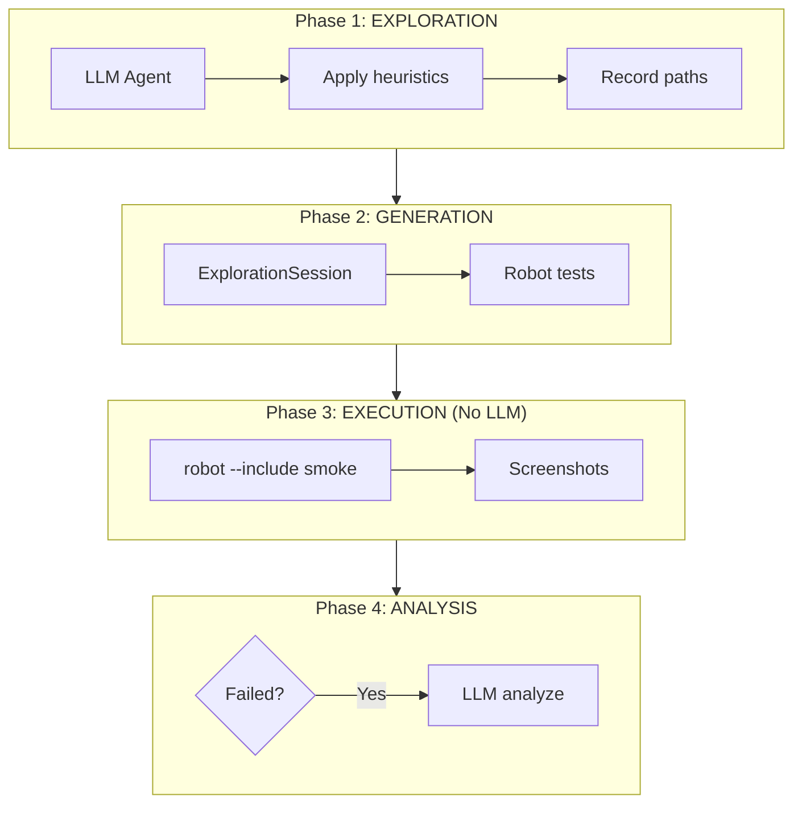
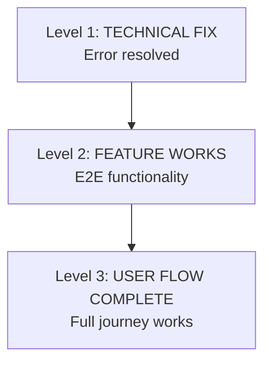

# Testing Rules - Sim.ai

Rules governing testing strategies, quality gates, and validation protocols.

> **Parent:** [RULES-OPERATIONAL.md](../RULES-OPERATIONAL.md)
> **Rules:** RULE-004, RULE-020, RULE-023, RULE-028

---

## RULE-004: Exploratory Test Automation

**Category:** `testing` | **Priority:** HIGH | **Status:** ACTIVE | **Type:** RECOMMENDED

### Directive

All components MUST be testable via domain-specific heuristics. Exploratory testing complements TDD cycle.

### Workflow Principles

| Principle | Directive | Gate |
|-----------|-----------|------|
| **Gaps Before Implementation** | Document all gaps BEFORE coding | No PR without GAP-* |
| **Page Object Model (POM)** | All UI tests use OOP page objects | Code review check |
| **Test What You Ship** | RULE-023 compliance | CI/CD gate |
| **Insight Capture** | Document insights during execution | Task description updated |

### Domain Heuristics Summary

| Domain | Key Heuristics | Priority |
|--------|---------------|----------|
| **UI** | BOUNDARY, NAVIGATION, STATE, ERROR | HIGH |
| **API** | CONTRACT, IDEMPOTENCY, AUTH, PAYLOAD | HIGH |
| **Shell** | EXIT_CODE, STDERR, PATH_SAFETY | HIGH |
| **Docker** | HEALTHCHECK, RESTART, VOLUME, NETWORK | CRITICAL |
| **Security** | INJECTION, SECRETS, AUDIT_TRAIL | CRITICAL |

### Validation
- [ ] 3+ heuristics per domain tested
- [ ] Evidence captured for all test runs
- [ ] Healthcheck suite < 30 seconds

---

## RULE-020: LLM-Driven E2E Test Generation

**Category:** `testing` | **Priority:** HIGH | **Status:** ACTIVE | **Type:** RECOMMENDED

### Directive

E2E tests MUST be generated via LLM-driven exploratory sessions using Playwright MCP. LLM is used ONLY for:
1. **Exploration** - Discover UI paths via heuristics
2. **Generation** - Convert to deterministic Robot Framework tests
3. **Failure analysis** - Analyze why tests failed

LLM is NOT used during test execution.



### Anti-Patterns

| Don't | Do Instead |
|-------|-----------|
| Use LLM to decide pass/fail | Use deterministic assertions |
| Re-explore on each test run | Generate once, run many |
| Analyze every result with LLM | Only analyze failures |

---

## RULE-023: Test Before Ship

**Category:** `quality` | **Priority:** CRITICAL | **Status:** ACTIVE | **Type:** REQUIRED

### Directive

All code, UIs, and components MUST be tested before claiming complete. No shipping untested code.

### Test Levels

| Level | What | When |
|-------|------|------|
| **L1: Import** | Module imports | After writing |
| **L2: Init** | Class instantiates | After writing |
| **L3: Smoke** | Basic happy path | Before claiming done |
| **L4: Edge** | Edge cases | Before merge/release |

### E2E Testing Mandate (Amendment 2026-01-02)

For UI gaps, marking RESOLVED requires **both**:
1. Unit tests passing
2. **E2E browser verification** via Playwright

Unit tests alone are INSUFFICIENT for UI claims.

### Playwright Browser Testing (Amendment 2026-01-10)

**Visual feedback during development and debugging.**

> **xubuntu Note**: Playwright MCP requires Node.js (`npx`). Use Python `playwright` library instead.

| Function | Python Method | Use Case |
|----------|---------------|----------|
| **Navigate** | `page.goto(url)` | Load dashboard at URL |
| **Screenshot** | `page.screenshot(path=...)` | Capture visual state |
| **Click** | `page.click(selector)` | Interact with elements |
| **Inspect** | `page.query_selector_all(...)` | Get DOM elements |
| **Debug** | `page.content()` | Check HTML output |

**When to Use:**
- Debugging UI rendering issues (like missing nav items)
- Validating visual changes before E2E tests
- Capturing evidence for session logs
- Exploratory testing before writing formal tests

**Workflow (Python):**
```python
from playwright.sync_api import sync_playwright

with sync_playwright() as p:
    browser = p.firefox.launch(headless=True)
    page = browser.new_page()
    page.goto("http://localhost:8081")
    page.wait_for_load_state("networkidle")

    # Inspect elements
    items = page.query_selector_all("[data-testid^='nav-']")

    # Screenshot
    page.screenshot(path=".playwright-mcp/evidence.png")

    browser.close()
```

---

## RULE-028: Change Validation Protocol

**Category:** `testing` | **Priority:** HIGH | **Status:** ACTIVE | **Type:** REQUIRED

### Directive

When code changes are implemented, agents MUST re-run exploratory validation before marking tasks complete.

### Validation Hierarchy (MANDATORY)



**VALIDATION IS NOT COMPLETE UNTIL LEVEL 3 IS VERIFIED**

### Origin

Created 2024-12-28: Bug fix declared "complete" when only Level 1 validated. Feature was still broken.

**Lesson**: A crash fix is not a feature fix. Always validate the full user flow.

---

*Per RULE-012: DSP Semantic Code Structure*
