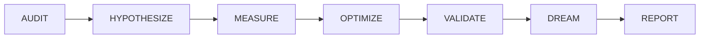
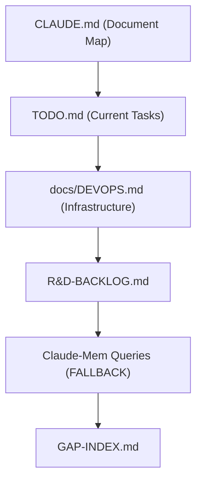
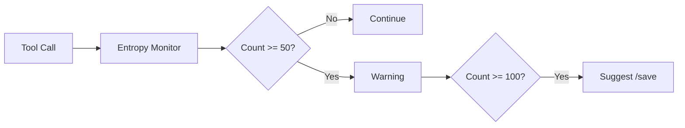

# Workflow Rules - Sim.ai

Rules governing task sequencing, autonomy, and context recovery.

> **Parent:** [RULES-OPERATIONAL.md](../RULES-OPERATIONAL.md)
> **Rules:** RULE-012, RULE-014, RULE-015, RULE-024, RULE-031

---

## RULE-012: Deep Sleep Protocol (DSP)

**Category:** `maintenance` | **Priority:** HIGH | **Status:** ACTIVE | **Type:** RECOMMENDED

### Directive

Periodically invoke DSP for deliberate technical backlog hygiene with MCP integration.

### DSP Phases



| Phase | Purpose | MCPs Required |
|-------|---------|---------------|
| **AUDIT** | Inventory gaps, orphans, rules entropy | claude-mem, governance-core |
| **HYPOTHESIZE** | Form theories | sequential-thinking |
| **MEASURE** | Quantify state | powershell, llm-sandbox |
| **OPTIMIZE** | Apply improvements | filesystem, git |
| **VALIDATE** | Run tests | pytest, llm-sandbox |
| **DREAM** | Explore, discover | playwright, docker |
| **REPORT** | Link to GitHub | git, governance-sessions |

### AUDIT Phase Checklist (GAP-CTX-006)

Per session 2026-01-04, AUDIT phase MUST include:

| Check | Tool | Purpose |
|-------|------|---------|
| Rules sync | `governance_sync_status()` | Detect TypeDB↔docs divergence |
| Rules count | `governance_health()` | Verify 36 rules (33 ACTIVE) |
| Gap entropy | Check GAP-INDEX | Open gaps < 50 threshold |
| File sizes | Health alerts | Files < 300 lines |
| CLAUDE.md | Manual | Rules Atlas current |

### When to Invoke

| Trigger | Scope | Cadence |
|---------|-------|---------|
| Session End | Quick audit | Every session (5 min) |
| Milestone | Full backlog | Weekly (30 min) |
| Pre-Release | Deep review | Before releases (2+ hours) |

### File Size Hygiene (MANDATORY)

Files >300 lines MUST be restructured during DSP cycles.

### Automated Tracking (EPIC-006)

**Hook:** [`.claude/hooks/entropy_monitor.py`](../../../.claude/hooks/entropy_monitor.py)

The entropy monitor tracks session state for DSP invocation:
- Tool call count (triggers at 50/100)
- Session duration
- Context usage estimation

**DSP MCP Tools:**
- `dsm_start(batch_id)` - Begin DSP cycle
- `dsm_advance()` - Move to next phase
- `dsm_checkpoint()` - Record progress
- `dsm_complete()` - Generate evidence

**Documentation:** [.claude/HOOKS.md](../../../.claude/HOOKS.md)

---

## RULE-014: Autonomous Task Sequencing

**Category:** `autonomy` | **Priority:** CRITICAL | **Status:** ACTIVE | **Type:** REQUIRED

### Directive

Agents MUST autonomously sequence tasks according to product strategy. Continue until explicit halt command.

### Halt Commands

| Command | Action |
|---------|--------|
| `STOP` | Immediate halt, save state |
| `HALT` | Immediate halt, save state |
| `STAI` | Immediate halt, save state |
| `RED ALERT` | Emergency stop |
| `ALERT` | Pause and await |

### Priority Matrix

| Priority | Criteria | Action |
|----------|----------|--------|
| **P0** | Blocking production | Execute immediately |
| **P1** | Strategic milestone | Execute in sequence |
| **P2** | Technical hygiene | Execute during DSP |
| **P3** | Nice-to-have | Queue for later |

---

## RULE-015: R&D Workflow with Human Approval

**Category:** `autonomy` | **Priority:** CRITICAL | **Status:** ACTIVE | **Type:** REQUIRED

### Directive

R&D tasks impacting budget, architecture, or strategy MUST require human approval unless DEEP autonomy is mandated.

### Autonomy Levels

| Level | Trigger | Approval |
|-------|---------|----------|
| **ROUTINE** | Default task | None |
| **STRATEGIC** | P1 milestone | Post-hoc review |
| **R&D** | Research needed | **Human required** |
| **DEEP** | Explicit mandate | Pre-approved |

### R&D Triggers

- New technology evaluation
- Architecture changes
- External dependency additions
- Budget-impacting decisions
- Infrastructure changes

---

## RULE-024: AMNESIA Protocol

**Category:** `maintenance` | **Priority:** CRITICAL | **Status:** ACTIVE | **Type:** REQUIRED

### Directive

When context is lost or truncated, agents MUST autonomously recover using the AMNESIA Protocol.

**AMNESIA** = Autonomous Memory & Network Extraction for Session Intelligence and Awareness

### Recovery Hierarchy



### CRITICAL: Pre-Action Exploration

**BEFORE taking ANY action (especially destructive ones), MUST:**

1. Read `CLAUDE.md` → Document map, architecture overview
2. Read `docs/DEVOPS.md` → Current infrastructure setup
3. Read `.mcp.json` → Available MCP servers
4. Query claude-mem → Recent session context: `["sim-ai {date} migration setup"]`
5. Check running services → `podman compose --profile cpu ps`

**Root Cause Lesson (2026-01-11):** CLI session failure occurred because agent skipped exploration and pattern-matched error message to wrong solution (storage wipe instead of investigating actual deployment).

### Claude-Mem Fallback (MANDATORY)

When TypeDB/ChromaDB are unavailable, use claude-mem for context recovery:

```bash
# Query recent sim-ai sessions
mcp__claude-mem__chroma_query_documents(["sim-ai 2026-01 migration infrastructure"])

# Query specific migration changes
mcp__claude-mem__chroma_query_documents(["sim-ai podman kubectl setup"])
```

**Claude-Mem Location:** Uses ChromaDB at localhost:8001 (same as governance)
**Fallback Archive:** `~/.claude-mem/archives/` (JSON backups)

### Save Prompts Before Transitions

| Transition | Trigger | Action |
|------------|---------|--------|
| User restart | "restart", "close" | Prompt /save |
| Context limit | >80% used | Prompt /save |
| Long pause | >30 min | Prompt /save |
| Milestone | Phase done | Prompt /save |

### Entropy Monitoring Automation (EPIC-006)

Per EPIC-006, automated entropy tracking prevents context loss:



| Metric | Low Threshold | High Threshold | Action |
|--------|--------------|----------------|--------|
| Tool calls | 50 | 100 | Warn / Suggest /save |
| Session duration | 30 min | 60 min | Time-based reminder |

**Implementation:**
- SessionStart hook: Resets entropy state (`.claude/hooks/entropy_monitor.py --reset`)
- UserPromptSubmit `/entropy`: Shows current entropy status
- Healthcheck: Displays entropy level in output

**Commands:**
- `/entropy` - Check current session entropy
- `/save` - Save context to claude-mem
- `/remember sim-ai {date}` - Restore from claude-mem

**Handoff Template:** `.claude/templates/session-handoff.md`

**Hook Implementation:** [.claude/HOOKS.md](../../../.claude/HOOKS.md)

---

## RULE-031: Autonomous Task Continuation

**Category:** `operational` | **Priority:** CRITICAL | **Status:** ACTIVE | **Type:** REQUIRED

### Directive

When executing multi-step tasks, agents MUST continue until ALL tasks are complete or explicit halt received.

### Continuation Requirements

| Trigger | Action |
|---------|--------|
| Pending items | Continue to next |
| Error during task | Log, recover, continue |
| Subtask complete | Start next immediately |
| All tasks complete | Generate summary |
| Explicit halt | Stop immediately |

### Anti-Patterns (PROHIBITED)

| Don't | Do Instead |
|-------|-----------|
| Stop after one issue | Fix all issues in sequence |
| Ask "should I continue?" | Continue automatically |
| Skip pending tasks | Complete all pending |

---

*Per RULE-012: DSP Semantic Code Structure*
