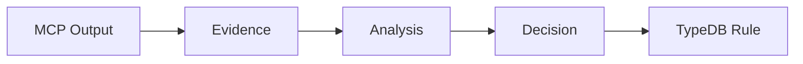

# Strategy Rules - Sim.ai

Rules governing technology selection, evidence accumulation, and cross-workspace patterns.

> **Parent:** [RULES-TECHNICAL.md](../RULES-TECHNICAL.md)
> **Rules:** RULE-008, RULE-010, RULE-017, RULE-025

---

## RULE-008: In-House Rewrite Principle

**Category:** `strategic` | **Priority:** CRITICAL | **Status:** ACTIVE | **Type:** REQUIRED

### Directive

When selecting technologies, prefer solutions with:
1. Comprehensive test suites (rewrite warranty)
2. Open-source with permissive licenses
3. Active development and community
4. Can be ported/rewritten in-house

### Technology Scorecard

| Criteria | Scale | Weight |
|----------|-------|--------|
| Test Coverage | 1-5 | HIGH |
| License Freedom | 1-5 | HIGH |
| Active Development | 1-5 | MEDIUM |
| Documentation | 1-5 | MEDIUM |
| Rewrite Feasibility | 1-5 | HIGH |

**Recommendation**: Total >= 20 = ADOPT | 15-19 = EVALUATE | <15 = REJECT

### Validation
- [ ] Technology scorecard completed before adoption
- [ ] Test suite reviewed and understood
- [ ] License verified compatible

---

## RULE-010: Evidence-Based Wisdom Accumulation

**Category:** `strategic` | **Priority:** CRITICAL | **Status:** ACTIVE | **Type:** REQUIRED

### Directive

Every experiment MUST produce traceable evidence:
1. Use MCPs for detailed evidence
2. Hypothesis-based approach
3. Logical decision making
4. Test-caught failures = learning opportunities

### Evidence Pipeline

### MCP Usage for Evidence

| Evidence Type | MCP Tool |
|---------------|----------|
| API exploration | llm-sandbox |
| Version checks | powershell |
| Code patterns | OctoCode |
| Memory storage | claude-mem |

### Validation
- [ ] MCPs used instead of manual operations
- [ ] Hypothesis documented before testing
- [ ] Evidence collected in structured format

---

## RULE-017: Cross-Workspace Pattern Reuse

**Category:** `strategic` | **Priority:** HIGH | **Status:** ACTIVE | **Type:** RECOMMENDED

### Directive

Before implementing new functionality, check cross-workspace wisdom index for existing patterns.

### Pattern Sources

| Source | Patterns |
|--------|----------|
| local-gai | EBMSF, DSM, MCP wrappers |
| agno-agi | Base Agno cluster |
| sim-ai | TypeDB hybrid, Governance MCP |

### Pattern Categories

| Category | Documents | Tools |
|----------|-----------|-------|
| MCP Wrappers | docker_wrapper.py | Dependency auto-start |
| Type-Safe Tools | pydantic_tools.py | Pydantic AI + FastMCP |
| State Machines | langgraph_workflow.py | LangGraph |
| Evidence Tracking | dsm_tracker.py | DSM phases |

### Validation
- [ ] Cross-workspace search performed
- [ ] Existing patterns leveraged
- [ ] New patterns documented for reuse

---

## RULE-025: Test Data Integrity Requirements

**Category:** `testing` | **Priority:** HIGH | **Status:** DRAFT | **Type:** RECOMMENDED

### Directive

All tests MUST include API data validation assertions. A test that passes with empty data is not valid.

### Requirements

1. **API Data Validation**: Verify API returns non-empty data
2. **Fail on Empty**: Empty data = test FAIL with diagnostic
3. **Realistic Mocks**: Mocks must return realistic data

### Anti-Patterns

| Don't | Do Instead |
|-------|------------|
| `assert isinstance(result, list)` | `assert len(result) > 0` |
| `mock.return_value = []` | `mock.return_value = [realistic_data]` |
| Test imports only | Test actual data display |

### Exploratory Test Heuristics

| Heuristic | Implementation |
|-----------|----------------|
| API Data Available | Query API, verify >0 items |
| Data Visible | If API returns data, UI displays it |
| Empty State Handled | UI shows "No data" message |
| CRUD Complete | Create-Read-Update-Delete works |

### Validation
- [ ] No tests with empty assertions pass
- [ ] All E2E tests verify data availability first
- [ ] Exploratory tests log findings to GAP-INDEX.md

---

*Per RULE-012: DSP Semantic Code Structure*
