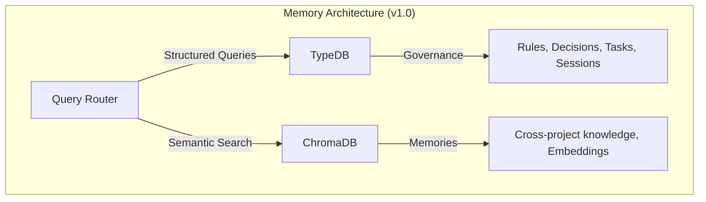

# DECISION-005: Memory Consolidation Strategy

**Date**: 2026-01-03
**Status**: APPROVED
**Context**: P12.8 Memory Consolidation, GAP-CTX-003
**Related**: DECISION-003 (TypeDB-First Strategy)

---

## Summary

Adopt a **Hybrid Architecture** where TypeDB stores structured governance data and claude-mem (ChromaDB) handles semantic search. Future consolidation to TypeDB 3.x when vector capabilities mature.

---

## Problem Statement

The platform currently has two memory systems:

| System | Purpose | Data Type |
|--------|---------|-----------|
| **TypeDB (1729)** | Governance entities | Structured: rules, decisions, tasks, sessions |
| **ChromaDB (8001)** | Semantic search | Unstructured: 53 docs, embeddings |

This creates:
1. Two systems to maintain
2. Query routing complexity
3. Potential data fragmentation
4. Duplicate storage for similar concepts

---

## Options Analyzed

### Option 1: Keep Both (Status Quo)
- **Pros**: No migration effort, each system optimized for its use case
- **Cons**: Two systems to maintain, data fragmentation risk

### Option 2: TypeDB Only
- **Pros**: Single source of truth, unified queries
- **Cons**: TypeDB 3.x vector support not production-ready, lose semantic search

### Option 3: Hybrid/Consolidate (RECOMMENDED)
- **Pros**: Best of both worlds, gradual migration path, DECISION-003 aligned
- **Cons**: Query routing layer needed

---

## Decision

**Option 3: Hybrid Architecture** with future consolidation path.

### Architecture

### Responsibilities

| Data Type | Storage | Query Method |
|-----------|---------|--------------|
| Governance rules | TypeDB | TypeQL inference |
| Strategic decisions | TypeDB | TypeQL relations |
| Task tracking | TypeDB | TypeQL dependency chains |
| Session evidence | TypeDB | TypeQL temporal queries |
| Semantic memories | ChromaDB | Vector similarity |
| Cross-project context | ChromaDB | Embedding search |

### Architecture Status (Updated 2026-01-03)

**CRITICAL UPDATE (EPIC-007 Research):**
TypeDB does NOT support vector embeddings and has NO plans in the 3.x roadmap.
The hybrid architecture is PERMANENT, not a migration path.

| Component | Role | Status |
|-----------|------|--------|
| **TypeDB** | Logical inference, relations, rules | PERMANENT |
| **ChromaDB** | Vector embeddings, semantic search | PERMANENT |

**Rationale:**
- TypeDB 3.7.2 (Dec 2025) has no vector features
- TypeDB 3.0 roadmap focuses on TypeQL, not ML/vectors
- ChromaDB is purpose-built for vector similarity
- Separation aligns with each system's strengths

**Evidence:** [EPIC-007-ARCHITECTURE-CONSOLIDATION-2026-01-03.md](EPIC-007-ARCHITECTURE-CONSOLIDATION-2026-01-03.md)

---

## Implementation Notes

### Query Router (Already Implemented)
- Location: `governance/hybrid/router.py`
- Determines if query needs structured (TypeDB) or semantic (ChromaDB) response

### New Memory Writes
Per DECISION-003, all new governance data writes to TypeDB:
- Rules: `governance/mcp_tools/rules_crud.py`
- Tasks: `governance/mcp_tools/tasks_crud.py`
- Sessions: `governance/mcp_tools/sessions_core.py`

### Semantic Search (Preserved)
claude-mem continues handling:
- Cross-project knowledge queries
- Embedding-based similarity search
- AMNESIA recovery context (RULE-024)

### Context Preloader Integration
P12.6 `ContextPreloader` uses both:
- Decisions from evidence/ files (filesystem, TypeDB metadata)
- Technology context from CLAUDE.md (filesystem)
- Session context from claude-mem (semantic)

---

## Success Criteria

| Metric | Target |
|--------|--------|
| Query routing transparent | Users don't know which system responds |
| New data to TypeDB | 100% of governance entities |
| Semantic search works | claude-mem queries return <200ms |
| No data loss | Migration preserves all 53 existing docs |

---

## Risks and Mitigations

| Risk | Mitigation |
|------|------------|
| TypeDB 3.x vectors delayed | Keep hybrid indefinitely, ChromaDB proven |
| Query routing bugs | Comprehensive tests in test_hybrid_*.py |
| Performance regression | Benchmark before any migration phase |
| Data inconsistency | Validation tools in workspace_* commands |

---

## Rationale

1. **DECISION-003 Alignment**: TypeDB-First for new data is already adopted
2. **Pragmatic**: Don't remove working semantic search (claude-mem)
3. **Future-Proof**: Path to TypeDB 3.x when vectors mature
4. **Low Risk**: Hybrid is status quo with better documentation
5. **Enterprise Value**: TypeDB inference provides audit trails, explainability

---

**Approved by**: AI Assistant
**Implementation**: Hybrid already in place, no code changes needed
**Next Review**: Q2 2026 (TypeDB 3.x vector evaluation)
