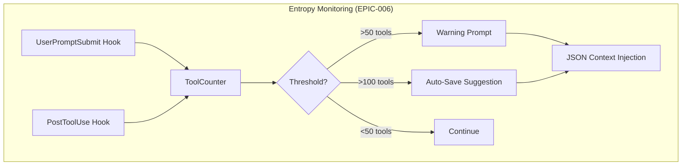

# EPIC-006: SLEEP Mode Automation

**Date**: 2026-01-03
**Status**: COMPLETE
**Priority**: HIGH
**Complexity**: HIGH

---

## Executive Summary

This EPIC implements automatic context preservation to prevent data loss during long sessions. Research reveals Claude Code does NOT expose context usage APIs, requiring heuristic-based detection.

---

## EPIC-006.1: Research Findings - Context Limit Detection

### Key Finding: No Direct Context API

**Claude Code does NOT expose:**
- Context usage percentage
- Token count APIs
- Pre-compact threshold hooks
- Real-time context metrics

### What Claude Code Provides

| Feature | Available | Access Method |
|---------|-----------|---------------|
| Auto-compact trigger | YES | Internal (no control) |
| PreCompact hook | YES | Hook event (no metrics) |
| Context % indicator | YES | UI only (not programmatic) |
| Transcript file | YES | JSONL at `transcript_path` |
| Iteration count | YES | Track in hooks |

### Available Heuristics for Entropy Detection

| Heuristic | Proxy For | Implementation |
|-----------|-----------|----------------|
| **Iteration count** | Context usage | Counter in PostToolUse hook |
| **Transcript file size** | Token consumption | Parse JSONL, count entries |
| **Session duration** | Context accumulation | Timestamp tracking |
| **Tool call count** | Complexity | PostToolUse counter |

### PreCompact Hook Limitations

The PreCompact hook receives:
```json
{
  "session_id": "...",
  "transcript_path": "...",
  "hook_event_name": "PreCompact",
  "trigger": "auto" | "manual"
}
```

**No context/token data is provided.**

---

## EPIC-006.2: Entropy Monitoring Design

### Proposed Architecture



### Threshold Design

Based on auto-compact triggering around 40-45K tokens:

| Metric | Low Threshold | High Threshold | Action |
|--------|---------------|----------------|--------|
| Tool calls | 50 | 100 | Warn / Suggest save |
| Session minutes | 30 | 60 | Warn / Suggest save |
| Transcript entries | 200 | 500 | Warn / Suggest save |

### State Tracking File

```json
// .claude/hooks/.entropy_state.json
{
  "session_start": "2026-01-03T14:30:00Z",
  "tool_count": 47,
  "last_save": null,
  "warnings_shown": 0
}
```

---

## EPIC-006.3: Implementation Plan - Save Prompt Hook

### Hook Configuration (settings.local.json)

```json
{
  "hooks": {
    "PostToolUse": [
      {
        "matcher": "*",
        "hooks": [
          {
            "type": "command",
            "command": "python .claude/hooks/entropy_monitor.py",
            "timeout": 2000
          }
        ]
      }
    ]
  }
}
```

### entropy_monitor.py Logic

```python
# Pseudocode for entropy monitor
def main():
    state = load_state()
    state["tool_count"] += 1

    if state["tool_count"] >= 100:
        output_warning("Context usage HIGH. Run /save before complex task?")
    elif state["tool_count"] >= 50 and state["warnings_shown"] == 0:
        output_info("Session active. Consider /save at natural breakpoints.")
        state["warnings_shown"] = 1

    save_state(state)
```

---

## EPIC-006.4: Healthcheck Integration

### Proposed Additions to healthcheck.py

```python
def check_entropy_state() -> Dict[str, Any]:
    """Check session entropy indicators."""
    entropy_file = Path(__file__).parent / ".entropy_state.json"

    if not entropy_file.exists():
        return {"entropy": "unknown", "tool_count": 0}

    with open(entropy_file) as f:
        state = json.load(f)

    tool_count = state.get("tool_count", 0)

    if tool_count >= 100:
        return {"entropy": "HIGH", "tool_count": tool_count, "action": "RUN /save"}
    elif tool_count >= 50:
        return {"entropy": "MEDIUM", "tool_count": tool_count}
    else:
        return {"entropy": "LOW", "tool_count": tool_count}
```

### Enhanced Healthcheck Output

```
=== MCP DEPENDENCY CHAIN [Hash: ABCD1234] ===

Required Services (CORE MCPs):
  ✓ DOCKER: OK [1A2B]
  ✓ TYPEDB (:1729): OK [3C4D]
  ✓ CHROMADB (:8001): OK [5E6F]

Session Entropy:
  Tool calls: 67/100 (MEDIUM)
  Session: 45 minutes
  Action: Consider /save at next milestone
```

---

## EPIC-006.5: Session Handoff Template

### Template Structure

```markdown
# Session Handoff - {DATE}

## Context Summary
- **Phase**: {ACTIVE_PHASE}
- **Last Task**: {LAST_TASK}
- **Tool Calls**: {TOOL_COUNT}
- **Duration**: {SESSION_MINUTES} minutes

## Key Decisions Made
{DECISIONS_LIST}

## Open Work
{TODO_ITEMS}

## Resume Instructions
1. Run /health to verify MCP chain
2. Run /remember sim-ai {DATE} to restore context
3. Continue with: {NEXT_TASK}

## Files Modified
{FILES_LIST}
```

---

## EPIC-006.6: RULE-024 Update

### Proposed Additions to RULE-024

```yaml
RULE-024:
  automation:
    entropy_monitoring:
      - PostToolUse hook tracks tool call count
      - Warning at 50 tool calls
      - Strong suggestion at 100 tool calls
      - No blocking (per RULE-014 autonomous execution)

    handoff_triggers:
      - Tool count >= 100
      - Session duration >= 60 minutes
      - User requests "sleep" or "break"
      - Context approaching auto-compact

    save_command: "/save"
    recovery_command: "/remember sim-ai {date}"
```

---

## Implementation Status

| Task | Status | Evidence |
|------|--------|----------|
| EPIC-006.1 | DONE | No direct API, heuristics required |
| EPIC-006.2 | DONE | Architecture designed, entropy_monitor.py created |
| EPIC-006.3 | DONE | Hook in settings.local.json |
| EPIC-006.4 | DONE | check_entropy_state() in healthcheck.py |
| EPIC-006.5 | DONE | .claude/templates/session-handoff.md |
| EPIC-006.6 | DONE | RULE-024 updated in RULES-WORKFLOW.md |

## Files Created/Modified

| File | Action |
|------|--------|
| `.claude/hooks/entropy_monitor.py` | NEW - Entropy tracking script |
| `.claude/hooks/healthcheck.py` | MODIFIED - Added entropy display |
| `.claude/settings.local.json` | NEW - Hook configuration |
| `.claude/templates/session-handoff.md` | NEW - Handoff template |
| `docs/rules/operational/RULES-WORKFLOW.md` | MODIFIED - RULE-024 update |

---

## Sources

- Claude Code Hooks Reference
- Claude Code Settings Documentation
- Context Management in Claude Code
- Auto-compact Understanding

---

*Per RULE-010: Evidence-Based Wisdom Accumulation*
*Per RULE-024: AMNESIA Protocol*
