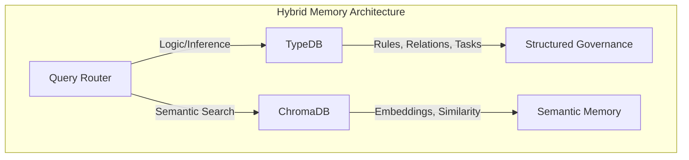

# EPIC-007: Architecture Consolidation R&D

**Date**: 2026-01-03
**Status**: IN PROGRESS
**Priority**: CRITICAL
**Complexity**: HIGH

---

## Executive Summary

This EPIC consolidates four interrelated architecture decisions:
1. **TypeDB Vector Capability** - Can TypeDB handle semantic search?
2. **Pydantic/OpenAPI Compatibility** - Schema generation issues and solutions
3. **Streamlit UI Evaluation** - Alternative to Trame for shared Pydantic models
4. **Bottom-Up Object Specification** - Common schema shared across layers

---

## EPIC-007.1: TypeDB Vector Embedding Analysis

### What Are Vector Embeddings? (Layman Explanation)

**Analogy**: Imagine you have a library with millions of books. Traditional databases are like an index card system - you can find books by exact title, author, or ISBN. But what if you want to find "books similar to this one" or "books about lonely robots"?

**Vector embeddings** solve this by converting text (or any data) into a list of numbers (a "vector") that captures its *meaning*. Similar concepts get similar numbers.

```
"happy dog playing" → [0.8, 0.2, 0.9, 0.1, ...]
"joyful puppy running" → [0.79, 0.21, 0.88, 0.12, ...]  ← Similar!
"sad cat sleeping" → [0.1, 0.7, 0.2, 0.8, ...]  ← Different
```

**Why We Use Vector Embeddings in sim-ai:**

| Use Case | Without Embeddings | With Embeddings |
|----------|-------------------|-----------------|
| Find related rules | Exact keyword match only | "Find rules about security" finds RULE-011 (governance) even if word "security" not present |
| Session recovery | Search by date/ID only | "What was I working on yesterday?" finds relevant context by meaning |
| Cross-project knowledge | Manual tagging | Automatic semantic grouping |

**Why ChromaDB (not TypeDB)?**
- ChromaDB is purpose-built for vector similarity search
- TypeDB is purpose-built for logical inference and relations
- Each tool does what it does best

### Research Finding: TypeDB Does NOT Support Vector Embeddings

**Evidence Sources:**
- [TypeDB GitHub Repository](https://github.com/typedb/typedb) - No vector features documented
- [TypeDB 3.0 Roadmap (GitHub #6764)](https://github.com/typedb/typedb/issues/6764) - No vector plans
- [TypeDB Wikipedia](https://en.wikipedia.org/wiki/TypeDB) - Confirms no unstructured data support

### Current TypeDB Capabilities

| Feature | Supported | Notes |
|---------|-----------|-------|
| Entity-Relation modeling | YES | Core strength |
| Type inheritance | YES | Polymorphic queries |
| Rule inference | YES | Automated reasoning |
| TypeQL queries | YES | Declarative language |
| **Vector embeddings** | **NO** | Not in roadmap |
| **Similarity search** | **NO** | No "near" operator |
| **Semantic queries** | **NO** | Logic only, no ML |

### Why DECISION-005 Called TypeDB Vectors "Immature"

**Reason**: TypeDB 3.x does NOT have vector support at all.

The DECISION-005 statement was incorrect - TypeDB doesn't have "immature" vector support; it has **NO vector support**. The roadmap (TypeDB 3.0, 3.7.2 released Dec 2025) focuses on:
- TypeQL enhancements (functions, struct types)
- API changes (driver improvements)
- Schema restructuring

**No plans for vector/embedding features are documented.**

### Recommendation: Hybrid Architecture (Confirmed)

Since TypeDB lacks vector capabilities, the hybrid architecture from DECISION-005 remains valid:



### Alternative Solutions Researched

| Solution | Approach | Effort | Risk |
|----------|----------|--------|------|
| **Keep Hybrid** | TypeDB + ChromaDB | NONE | LOW |
| PostgreSQL + pgvector | Replace ChromaDB | MEDIUM | MEDIUM |
| Qdrant | Replace ChromaDB | MEDIUM | MEDIUM |
| Custom TypeDB plugin | Extend TypeDB | HIGH | HIGH |
| Wait for TypeDB vectors | Future release | UNKNOWN | HIGH |

**Decision**: Keep hybrid (TypeDB + ChromaDB) per DECISION-005.

---

## EPIC-007.2: Pydantic/OpenAPI Compatibility Issues

### User-Provided Research (Validated)

The user identified specific Pydantic v2 / OpenAPI compatibility issues:

| Issue | Description | Impact |
|-------|-------------|--------|
| **Discriminated Unions** | OpenAPI expects `oneOf`, Pydantic generates `anyOf` | Validation errors |
| **v1/v2 Mixing** | Can't mix Pydantic v1 and v2 models | Schema generation breaks |
| **Invalid Fields** | `Field(..., const=True)` not supported | OpenAPI validation fails |
| **Recursive Models** | v2 changes to JSON schema generation | Inefficient/invalid schemas |
| **Multiple Examples** | v2 generates multiple when spec expects one | Validation failure |

### Current Project State

```python
# governance/models.py - Using Pydantic v2
from pydantic import BaseModel, Field

# FastAPI generates OpenAPI at /docs - WORKS
# MCP tools use simple types - OK (by design)
# UI uses Dict[str, Any] - OK (Trame requirement)
```

### Solutions (Ranked)

| Solution | Effort | Impact | Recommendation |
|----------|--------|--------|----------------|
| **1. Pin Pydantic v2** | LOW | Keep current | CURRENT |
| **2. Use openapi-pydantic** | MEDIUM | Explicit OpenAPI schemas | IF NEEDED |
| **3. FastAPI 0.115+** | LOW | Latest fixes | UPDATE |
| **4. pydantic-ai** | MEDIUM | OpenAI API compat | FOR AI FEATURES |

### Validation Steps

```bash
# Check current Pydantic version
pip show pydantic  # Should be v2.x

# Test OpenAPI generation
curl http://localhost:8000/openapi.json | jq '.components.schemas'

# Validate with OpenAPI spec
npx @apidevtools/swagger-cli validate openapi.json
```

---

## EPIC-007.3: Streamlit UI Evaluation

### Comparison: Trame vs Streamlit

| Criteria | Trame (Current) | Streamlit | Winner |
|----------|-----------------|-----------|--------|
| **Ease of Use** | Medium (Vue.js knowledge needed) | High (script-based) | Streamlit |
| **Enterprise Scale** | Medium | Medium (Snowflake integration) | TIE |
| **3D Visualization** | Excellent (VTK/ParaView) | Basic | Trame |
| **Pydantic Integration** | Manual (Dict types) | [streamlit-pydantic](https://github.com/lukasmasuch/streamlit-pydantic) | Streamlit |
| **OpenAPI Forms** | Not native | [Form Generator](https://github.com/gerardrbentley/streamlit_form_generator) | Streamlit |
| **Performance** | Good (selective updates) | Script re-runs on interaction | Trame |
| **Community** | Smaller | Large | Streamlit |

### Streamlit-Pydantic Capabilities

From [streamlit-pydantic](https://github.com/lukasmasuch/streamlit-pydantic):
- Auto-generate UI elements from Pydantic models
- Data validation built-in
- Nested models support
- Field limitations

### Streamlit Form Generator (OpenAPI)

From [Streamlit blog](https://blog.streamlit.io/build-a-streamlit-form-generator-app-to-avoid-writing-code-by-hand/):
- Generate Pydantic BaseModel classes from OpenAPI specs
- Create UI forms from JSON schema
- Export generated code

### Recommendation

| Scenario | Use | Reason |
|----------|-----|--------|
| **Current project** | Trame | Invested infrastructure, works |
| **New admin dashboards** | Streamlit | Faster development, Pydantic native |
| **3D visualization** | Trame | VTK/ParaView integration |
| **Form generation** | Streamlit | OpenAPI → Pydantic → UI pipeline |

### Migration Path (If Needed)

```
Phase 1: Keep Trame for governance_ui/
Phase 2: Add Streamlit for new admin tools
Phase 3: Evaluate migration ROI after 6 months
Phase 4: Gradual migration if justified
```

---

## EPIC-007.4: Bottom-Up Object Specification

### Hypothesis

**"We should go bottom-up in object specification and try to use common ones"**

### Validation

The audit from EPIC-001 shows we already have this architecture:

```
BOTTOM (TypeDB Schema)
    ↓
governance/models.py (26 Pydantic models)
    ↓
governance/routes/*.py (API) - imports models
    ↓
governance/mcp_tools/*.py (MCP) - simple types (FastMCP constraint)
    ↓
agent/governance_ui/*.py (UI) - Dict types (Trame constraint)
    ↓
TOP (User Interface)
```

### Current Implementation Status

| Layer | Uses Shared Models? | Constraint |
|-------|---------------------|------------|
| TypeDB Schema | Source of truth | TypeQL definitions |
| Pydantic Models | YES - governance/models.py | 26 models, 311 lines |
| API Routes | YES - import from models | FastAPI OpenAPI |
| MCP Tools | NO - simple types | FastMCP limitation |
| UI State | NO - Dict types | Trame limitation |

### Why MCP Tools Use Simple Types (Not Pydantic)

**User Question**: "Why are we using Pydantic models for API but simple types for MCP?"

**Clarification**: FastMCP and Pydantic are **NOT alternatives** - they serve different purposes:

| Library | Purpose | What It Does |
|---------|---------|--------------|
| **[Pydantic](https://github.com/pydantic/pydantic)** | Data validation | Validates and serializes Python objects with type hints |
| **FastMCP** | MCP server framework | Creates MCP servers with tools (like FastAPI but for MCP protocol) |

**We use BOTH in our project:**
- Pydantic for data models (`governance/models.py`)
- FastMCP for MCP server implementation (`governance/mcp_server.py`)

**The real question is**: Why don't MCP tools accept Pydantic models in their function signatures?

**Answer**: This is a **technical constraint of FastMCP**, not a design choice.

#### How FastMCP Works

```python
# FastMCP uses Python function signature introspection
@mcp.tool()
def governance_create_rule(
    rule_id: str,        # ✅ Simple type - works
    name: str,           # ✅ Simple type - works
    priority: str = "MEDIUM"  # ✅ Optional with default - works
) -> str:
    ...

# This would NOT work:
@mcp.tool()
def governance_create_rule(
    rule: RuleCreate      # ❌ Pydantic model - breaks FastMCP
) -> RuleResponse:        # ❌ Pydantic return - breaks FastMCP
    ...
```

#### Technical Reasons

| Constraint | Explanation |
|------------|-------------|
| **MCP Protocol is JSON-based** | Tool parameters are sent as JSON objects. FastMCP auto-converts simple Python types to JSON Schema. |
| **Signature Introspection** | FastMCP's `@mcp.tool()` decorator reads the function signature to generate the tool schema. It expects primitive types. |
| **No Pydantic Support** | FastMCP doesn't have built-in Pydantic model → JSON Schema conversion like FastAPI does. |
| **Return Values** | MCP tools return strings (JSON-serialized). FastMCP doesn't auto-serialize Pydantic models. |

#### Comparison with FastAPI

| Framework | Pydantic Support | How |
|-----------|-----------------|-----|
| **FastAPI** | YES - native | Uses `pydantic.schema_of()` internally |
| **FastMCP** | NO | Expects primitive types in signature |

#### Why This Is Acceptable

1. **Internal Conversion**: MCP tools internally use Pydantic models for validation, then return serialized JSON strings
2. **API Uses Pydantic**: REST API (`/api/rules`) uses full Pydantic models for rich OpenAPI docs
3. **MCP is Low-Level**: MCP tools are meant to be simple, atomic operations - not complex object graphs
4. **No Duplication**: The same business logic exists in one place; only the interface differs

#### Example Pattern (Current Implementation)

```python
# governance/mcp_tools/rules_crud.py
@mcp.tool()
def governance_create_rule(
    rule_id: str, name: str, category: str,
    priority: str, directive: str, status: str = "DRAFT"
) -> str:
    """MCP tool - simple types for FastMCP compatibility."""
    # Internally can use Pydantic for validation if needed
    result = create_rule_in_typedb(rule_id, name, category, priority, directive, status)
    return json.dumps(result)  # Return JSON string

# governance/routes/rules.py
@router.post("/rules", response_model=RuleResponse)
async def create_rule(rule: RuleCreate):
    """REST API - full Pydantic for OpenAPI docs."""
    # Uses Pydantic models for request/response
    return RuleResponse(**result)
```

**Conclusion**: Using simple types for MCP is the correct approach given FastMCP's constraints. The architecture correctly separates concerns:
- **Pydantic** for API layer (rich validation, OpenAPI docs)
- **Simple types** for MCP layer (protocol compatibility)
- **Dict types** for UI layer (Trame reactivity)

### Gap Analysis

| Gap | Severity | Solution |
|-----|----------|----------|
| MCP tools not using Pydantic | LOW | FastMCP constraint, acceptable |
| UI not using Pydantic | LOW | Trame constraint, acceptable |
| No TypeDB ↔ Pydantic sync | MEDIUM | Manual sync (DECISION-003 scope) |

### Architecture Validation: CONFIRMED

The bottom-up approach is already implemented:
1. TypeDB schema defines entity types
2. Pydantic models mirror TypeDB entities
3. API routes use Pydantic for validation
4. MCP/UI have justified exceptions

---

## Consolidated Decision Matrix

| Question | Answer | Evidence |
|----------|--------|----------|
| **TypeDB for vectors?** | NO - Keep hybrid | No vector support in TypeDB |
| **Pydantic v2 OK?** | YES - With precautions | Known issues documented |
| **Switch to Streamlit?** | NO - Keep Trame for now | Investment already made |
| **Add Streamlit for new tools?** | YES - Consider | Better Pydantic integration |
| **Bottom-up architecture valid?** | YES - Already implemented | EPIC-001 audit confirmed |

---

## Updated DECISION-005 Rationale

### Original Statement (Incorrect)
> "Future consolidation to TypeDB 3.x when vector capabilities mature"

### Corrected Statement
> "TypeDB does NOT support vector embeddings and has NO plans in the 3.x roadmap. The hybrid architecture (TypeDB + ChromaDB) is the PERMANENT architecture, not a migration path. TypeDB handles logical inference; ChromaDB handles semantic search. This separation aligns with their respective strengths."

### Action Required

Update DECISION-005-MEMORY-CONSOLIDATION.md to reflect this finding.

---

## Tasks

| ID | Task | Status | Evidence |
|----|------|--------|----------|
| EPIC-007.1 | TypeDB vector capability analysis | DONE | No vector support confirmed |
| EPIC-007.2 | Pydantic/OpenAPI compatibility doc | DONE | Issues and solutions documented |
| EPIC-007.3 | Streamlit UI evaluation | DONE | Comparison table, keep Trame |
| EPIC-007.4 | Bottom-up architecture validation | DONE | EPIC-001 confirms, FastMCP constraint documented |
| EPIC-007.5 | Update DECISION-005 | DONE | Hybrid architecture marked PERMANENT |

---

## Sources

### TypeDB Research
- [TypeDB GitHub](https://github.com/typedb/typedb)
- [TypeDB 3.0 Roadmap](https://github.com/typedb/typedb/issues/6764)
- [TypeDB Wikipedia](https://en.wikipedia.org/wiki/TypeDB)

### Vector Database Research
- [Pinecone Vector Database Guide](https://www.pinecone.io/learn/vector-database/)
- [pgvector PostgreSQL Extension](https://github.com/pgvector/pgvector)
- [DataCamp Best Vector Databases 2026](https://www.datacamp.com/blog/the-top-5-vector-databases)

### Streamlit/Pydantic Research
- [streamlit-pydantic GitHub](https://github.com/lukasmasuch/streamlit-pydantic)
- [Streamlit Form Generator](https://github.com/gerardrbentley/streamlit_form_generator)
- [Streamlit Blog: Form Generator](https://blog.streamlit.io/build-a-streamlit-form-generator-app-to-avoid-writing-code-by-hand/)
- [Streamlit Alternatives Comparison](https://uibakery.io/blog/best-streamlit-alternatives)

### Framework Comparisons
- [Trame Documentation](https://kitware.github.io/trame/news.html)
- [Streamlit vs Dash](https://uibakery.io/blog/streamlit-vs-dash)
- [Python Frameworks Survey](https://ploomber.io/blog/survey-python-frameworks/)

---

*Per RULE-010: Evidence-Based Wisdom Accumulation*
*Per RULE-012: DSP Semantic Code Structure*
