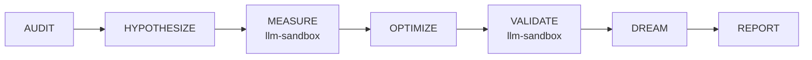
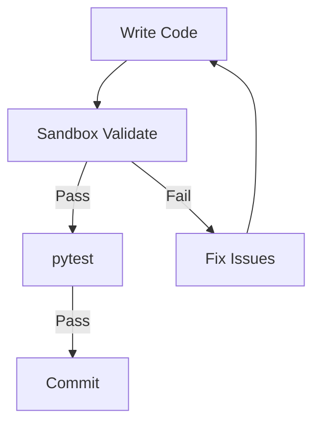

# LLM-Sandbox MCP Analysis Report

> **Date**: 2026-01-04
> **Per**: R&D TOOL-001 (llm-sandbox usage audit)
> **Status**: Analysis Complete

---

## Executive Summary

**LLM-Sandbox** is an MCP server providing sandboxed code execution across 7 languages. Current project usage is minimal despite documented integration points in DSP phases. This analysis evaluates its potential for Python error reduction.

| Metric | Value |
|--------|-------|
| Impact Score | 1.80 (OPTIONAL) |
| Risk Level | MEDIUM |
| Current Usage | Documentation only |
| Recommendation | **Increase usage for TDD validation** |

---

## Technical Capabilities

### Supported Languages

| Language | Version | Package Manager |
|----------|---------|-----------------|
| Python | 3.11 | pip |
| Java | - | maven |
| JavaScript | - | npm |
| C++ | - | - |
| Go | - | go mod |
| Ruby | - | gem |
| R | - | CRAN |

### Python Pre-installed Libraries

```python
# Available without installation
numpy, pandas, matplotlib, pillow, seaborn,
scikit-learn, scipy, scikit-image, plotly
```

### Key Features

| Feature | Description |
|---------|-------------|
| **Docker Isolation** | Zero risk to host system |
| **Visualization** | Matplotlib/Plotly plots returned as images |
| **Library Install** | On-demand pip install in sandbox |
| **Timeout Control** | Configurable execution timeout |
| **Multi-file Support** | Can import from code snippets |

---

## Current Project References

### Documentation Mentions (17 files)

| File | Context |
|------|---------|
| [RULES-WORKFLOW.md](../docs/rules/operational/RULES-WORKFLOW.md) | DSP MEASURE + VALIDATE phases |
| [RULES-TOOLING.md](../docs/rules/technical/RULES-TOOLING.md) | Implementation secondary tool |
| [RULES-STABILITY.md](../docs/rules/operational/RULES-STABILITY.md) | PRODUCTIVE tier MCP |
| [R&D-BACKLOG.md](../docs/backlog/R&D-BACKLOG.md) | TOOL-001 usage audit |
| [MCP-LANDSCAPE.md](../docs/MCP-LANDSCAPE.md) | Impact 1.80, OPTIONAL |
| [SPEC-DSP-ENHANCED.md](../docs/SPEC-DSP-ENHANCED.md) | Phase execution tool |

### DSP Phase Integration



| Phase | llm-sandbox Role |
|-------|------------------|
| **MEASURE** | Quantify current state via code execution |
| **VALIDATE** | Run isolated tests to verify no regression |

---

## Python Error Reduction Analysis

### Potential Use Cases

| Use Case | Error Type Prevented | Example |
|----------|---------------------|---------|
| **Import validation** | ModuleNotFoundError | Test `import chromadb` before requirements |
| **Logic validation** | RuntimeError | Validate algorithm before committing |
| **API exploration** | AttributeError | Test API responses before integration |
| **Data analysis** | ValueError | Quick data validation without filesystem |
| **TypeQL patterns** | QueryError | Validate TypeDB query syntax |

### Tested Example: TypeQL Validation

```python
# Sandbox execution validated query pattern syntax
def validate_typeql_pattern(query: str) -> dict:
    errors = []
    if "match" not in query.lower():
        errors.append("Missing 'match' clause")
    if "fetch" not in query.lower() and "get" not in query.lower():
        errors.append("Missing 'fetch' or 'get' clause")
    return {"valid": len(errors) == 0, "errors": errors}

# Result: Detected potential issues before TypeDB execution
```

### Limitations

| Limitation | Impact | Workaround |
|------------|--------|------------|
| **No local file access** | Cannot test project files | Copy code snippets |
| **No network access** | Cannot test API calls | Mock responses |
| **Stateless execution** | No persistence | Re-create state each call |
| **Docker dependency** | Requires Docker running | Use powershell fallback |

---

## Recommendations

### 1. TDD Integration (HIGH Priority)

Add llm-sandbox to test workflow:



### 2. Pre-commit Hook (MEDIUM Priority)

Validate import statements before commit:

```python
# .claude/hooks/precommit_validate.py
def validate_imports(file_path: str) -> bool:
    # Extract imports
    # Execute in llm-sandbox
    # Return True if all resolve
    pass
```

### 3. DSP Phase Activation (MEDIUM Priority)

Actually use llm-sandbox in MEASURE/VALIDATE phases:

| Phase | Current | Target |
|-------|---------|--------|
| MEASURE | Reference only | Execute metric calculations |
| VALIDATE | Reference only | Run isolated unit tests |

### 4. Healthcheck Integration (LOW Priority)

Add llm-sandbox to session start validation:

```python
# Check sandbox available
result = mcp__llm-sandbox__execute_code(code="print('OK')")
if result.exit_code != 0:
    log_warning("llm-sandbox unavailable")
```

---

## Comparison with Alternatives

| Tool | Isolation | Local Files | Speed | Best For |
|------|-----------|-------------|-------|----------|
| **llm-sandbox** | Full (Docker) | No | Slow | Pure logic validation |
| **PowerShell MCP** | None | Yes | Fast | Windows scripts |
| **Bash tool** | Partial | Yes | Fast | Docker/git commands |
| **pytest** | None | Yes | Medium | Full test suites |

### When to Use llm-sandbox

- Testing library compatibility before install
- Validating algorithm logic in isolation
- Quick data analysis with visualization
- Exploring API patterns before integration

### When NOT to Use llm-sandbox

- Testing code that reads project files
- Running full pytest suites
- Long-running processes
- Network-dependent tests

---

## Evidence Artifacts

| Artifact | Description |
|----------|-------------|
| This report | TOOL-001 completion evidence |
| [MCP-LANDSCAPE.md](../docs/MCP-LANDSCAPE.md) | Impact scoring context |
| [RULES-TOOLING.md](../docs/rules/technical/RULES-TOOLING.md) | Usage protocol |

---

## Conclusion

**LLM-Sandbox has untapped potential** for Python error reduction through:
1. Pre-commit import validation
2. Algorithm prototyping before implementation
3. DSP phase execution for metrics and validation

**Recommended next step**: Implement sandbox validation in TDD workflow (TOOL-001.1).

---

*Generated via RULE-001 Session Evidence Protocol*
